# Agent 开发实战指南
## 从 Claude Code 源码学习如何构建生产级 AI Agent

> 本指南以 Claude Code (v2.1.88) 源码为实战案例，系统讲解 AI Agent 开发的核心模式和设计原则。
> 面向有编程经验但 Agent 开发经验较少的开发者。
>
> **学完你能掌握：** Agent 循环设计、工具系统、多代理协作、上下文管理、Prompt 工程化、安全架构、扩展机制

---

## 目录

1. [Agent 到底是什么？（概念建模）](#第1章agent-到底是什么概念建模)
2. [核心循环 -- Agent 的心跳](#第2章核心循环--agent-的心跳)
3. [工具系统 -- 给 Agent 装上手脚](#第3章工具系统--给-agent-装上手脚)
4. [Prompt 工程化 -- 不是写一段话是搭一个系统](#第4章prompt-工程化--不是写一段话是搭一个系统)
5. [上下文管理 -- Agent 最难的技术问题](#第5章上下文管理--agent-最难的技术问题)
6. [多 Agent 架构 -- 一个不够就用一群](#第6章多-agent-架构--一个不够就用一群)
7. [安全架构 -- 不能跳过的一课](#第7章安全架构--不能跳过的一课)
8. [扩展机制 -- 让你的 Agent 能无限进化](#第8章扩展机制--让你的-agent-能无限进化)
9. [学习路径总结](#学习路径总结)

---

## 第1章：Agent 到底是什么？（概念建模）

### 一句话定义

**Agent 不是聊天机器人。** 聊天机器人只回答问题；Agent 能自主行动，感知环境、做出决策、使用工具完成任务，而且能根据结果调整下一步行动。

### Agent 的三要素

把 Agent 想象成一个实习生：

| 要素 | 比喻 | 技术对应 |
|------|------|---------|
| **大脑** | 思考能力 | LLM（大语言模型） |
| **手脚** | 做事能力 | 工具（Tools）-- 读文件、执行命令、搜索等 |
| **记忆** | 记住上下文 | 消息历史 + 持久记忆 |

### Agent 的最小架构

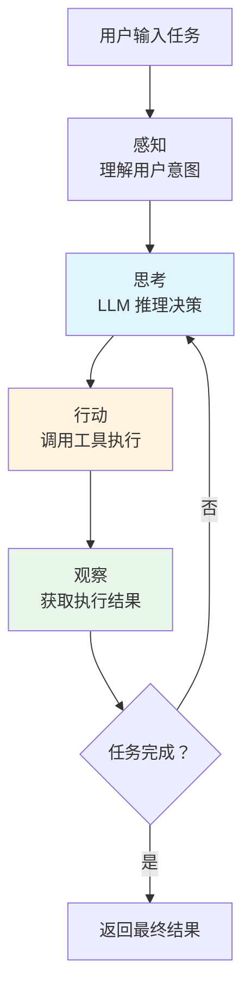

这个 **感知-思考-行动-观察** 的循环，就是所有 Agent 的核心骨架。不管你的 Agent 多复杂，剥开外壳，都是这个循环在跑。

### Claude Code 的定位

Claude Code 就是这个模式的工业级实现。它把一个简单的循环，做到了：
- 40+ 内置工具
- 6 层上下文压缩
- 多代理协作（Coordinator / Swarm）
- 4 层安全防御
- MCP 协议扩展

接下来我们一层层拆解。

---

## 第2章：核心循环 -- Agent 的心跳

**这是 Agent 开发的第一课：循环。** 理解了循环，你就理解了 Agent 的灵魂。

### 2.1 最简 Agent 循环

如果你要造一个最小的 Agent，核心代码只需要 20 行：

```typescript
// 最简 Agent 循环 -- 伪代码
async function agentLoop(userMessage: string) {
  const messages = [{ role: 'user', content: userMessage }]

  while (true) {
    // 1. 调用 LLM
    const response = await callLLM(messages)

    // 2. 检查是否有工具调用
    if (response.hasToolCalls) {
      // 3. 执行工具，收集结果
      const results = await executeTools(response.toolCalls)
      // 4. 把结果追加到消息历史
      messages.push(response.assistantMessage)
      messages.push({ role: 'user', content: results })
      continue  // 继续循环
    } else {
      // 5. 没有工具调用 = 任务完成
      return response.text
    }
  }
}
```

用一张图表示：

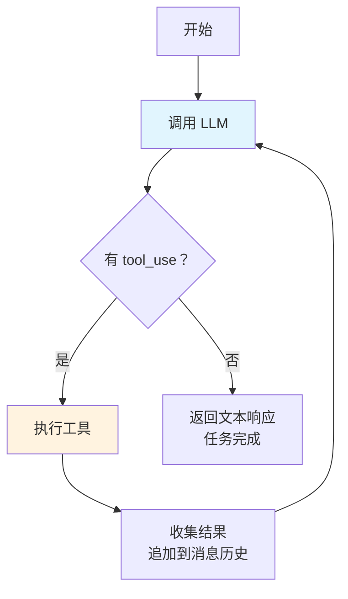

**关键洞察：** Agent 的「智能」不在于单次调用 LLM 有多聪明，而在于 **循环**。通过多轮「思考 -> 行动 -> 观察结果 -> 再思考」，Agent 能完成远超单次推理能力的复杂任务。

### 2.2 Claude Code 的实现

Claude Code 的核心循环在 `src/query.ts` 的 `queryLoop()` 函数中。它在最简循环基础上加了大量生产级机制：

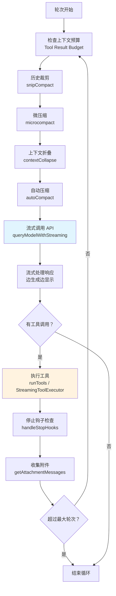

对比最简版本，Claude Code 的循环多了这些能力：

| 能力 | 作用 | 为什么需要 |
|------|------|-----------|
| 上下文压缩（5 层） | 每轮开始前检查 token 预算 | 长对话会超出 LLM 上下文窗口 |
| 流式输出 | 边生成边显示给用户 | 减少用户等待感 |
| 停止钩子 | 检查是否需要提前终止 | 外部系统可能要求中止 |
| 附件收集 | 收集队列命令、记忆预取 | 多 Agent 协作时的通知传递 |
| 错误恢复 | 9 种错误处理 + 7 种恢复路径 | 生产环境各种异常层出不穷 |
| 依赖注入 | 核心依赖可被替换 | 方便写测试 |

**参考源码：** `src/query.ts`（核心循环）、`src/QueryEngine.ts`（会话生命周期管理）

### 2.3 设计决策解析

**Q：为什么用 `while(true)` 而不是递归？**

递归每次调用都会在调用栈上加一层。Agent 可能跑几百轮（Claude Code 的 Fork Agent 最大轮次是 200），递归会导致栈溢出。`while(true)` 是平坦的循环，不吃栈空间。

**Q：为什么用显式 State 对象而不是闭包变量？**

Claude Code 定义了一个 `State` 类型来管理循环内的可变状态：

```typescript
type State = {
  messages: Message[]
  autoCompactTracking: AutoCompactTrackingState
  maxOutputTokensRecoveryCount: number
  hasAttemptedReactiveCompact: boolean
  turnCount: number
  transition: Continue | undefined
  // ...
}
```

好处：可测试（State 可以序列化/反序列化）、可调试（打印 State 就能看到完整状态）、可恢复（出错后可以从某个 State 继续）。

**Q：为什么循环内要反复检查上下文大小？**

每执行一次工具，消息历史就会增长。一个 `grep` 结果可能就有几千 token。如果不在每轮开始前检查并压缩，很快就会超出 LLM 的上下文窗口限制，导致 API 返回 413 错误。

### 2.4 你自己造的时候

**建议的渐进式实现路径：**

```
第 1 步：实现 20 行最简版本（上面的伪代码）
    |
第 2 步：加上流式输出（边生成边显示）
    |
第 3 步：加上错误重试（API 超时/限流时自动重试）
    |
第 4 步：加上上下文管理（消息太多时截断最旧的）
    |
第 5 步：加上停止条件（最大轮次、用户中止）
```

最小 TypeScript 实现骨架：

```typescript
import Anthropic from '@anthropic-ai/sdk'

const client = new Anthropic()

async function minimalAgent(task: string, tools: Tool[]) {
  const messages: Message[] = [{ role: 'user', content: task }]
  const MAX_TURNS = 50

  for (let turn = 0; turn < MAX_TURNS; turn++) {
    const response = await client.messages.create({
      model: 'claude-sonnet-4-20250514',
      max_tokens: 4096,
      system: 'You are a helpful coding assistant.',
      tools: tools.map(t => t.schema),
      messages,
    })

    messages.push({ role: 'assistant', content: response.content })

    const toolUses = response.content.filter(b => b.type === 'tool_use')
    if (toolUses.length === 0) break // 没有工具调用，任务完成

    const toolResults = await Promise.all(
      toolUses.map(async (tu) => ({
        type: 'tool_result' as const,
        tool_use_id: tu.id,
        content: await executeTool(tools, tu.name, tu.input),
      }))
    )
    messages.push({ role: 'user', content: toolResults })
  }

  return messages.at(-1) // 返回最后一条消息
}
```

---

## 第3章：工具系统 -- 给 Agent 装上手脚

**Agent 的能力 = 它有什么工具。** 没有工具的 Agent 就是一个只能聊天的机器人。有了工具，它才能读文件、写代码、执行命令、搜索信息。

### 3.1 工具的本质

一个工具本质上就是三样东西：

```
名称 (name)        → LLM 看到的标识符，比如 "Read"
参数定义 (schema)  → LLM 需要填什么参数，比如 { file_path: string }
执行函数 (call)    → 拿到参数后实际干什么，比如 fs.readFile(path)
```

数据流如下：

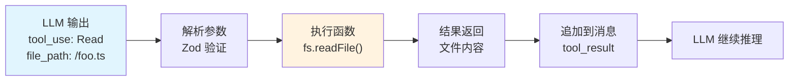

### 3.2 Claude Code 的工具设计模式

Claude Code 没有用类继承（`class ReadTool extends BaseTool`），而是用 **工厂函数 + 对象字面量**。为什么？因为组合优于继承，而且更容易做到 fail-closed 默认值。

核心模式 -- `buildTool()` 工厂函数：

```typescript
// src/Tool.ts 简化版
const TOOL_DEFAULTS = {
  isEnabled: () => true,
  isConcurrencySafe: () => false,  // 默认不并发安全（保守策略）
  isReadOnly: () => false,         // 默认假设有写操作
  checkPermissions: (input) =>
    Promise.resolve({ behavior: 'allow', updatedInput: input }),
}

function buildTool(def) {
  return { ...TOOL_DEFAULTS, ...def }  // 用户定义覆盖默认值
}
```

**设计要点：**
- **fail-closed 原则**：`isConcurrencySafe` 默认 `false`，宁可串行也不要并发出 bug；`isReadOnly` 默认 `false`，宁可多检查权限也不要漏掉危险操作
- 工具的完整类型定义包含约 20 个字段，涵盖执行、权限、UI 渲染、结果映射等

**参考源码：** `src/Tool.ts`（类型定义与工厂函数）

### 3.3 工具注册和发现

Claude Code 的工具注册分三层，目的是平衡启动速度和功能完整性：

| 层级 | 方式 | 用途 |
|------|------|------|
| 静态导入 | `import { BashTool } from '...'` | 核心工具，每次都加载 |
| 条件编译 | `feature('PROACTIVE') ? require(...) : null` | 功能开关控制的工具 |
| 延迟导入 | `() => require(...)` | 解决循环依赖 + 按需加载 |

还有一个巧妙的设计 -- **ToolSearch 机制**：当工具数量超过 LLM 的 tool schema 上限时，不常用的工具只注册名称，不发送完整 schema。LLM 需要某个工具时，先调用 `ToolSearch` 获取 schema，再调用实际工具。

**参考源码：** `src/tools.ts`（工具注册表）

### 3.4 工具执行流水线

这是工具系统最核心的部分。一次工具调用要经过 11 步：

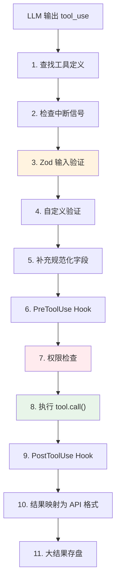

**并发编排**（`src/services/tools/toolOrchestration.ts`）：

当 LLM 一次返回多个工具调用时，Claude Code 会智能分组：
- `isReadOnly = true` 的工具（如 Read、Glob、Grep）可以**并行执行**（最多 10 个并发）
- 有写操作的工具**必须串行**，保证执行顺序

**参考源码：** `src/services/tools/toolExecution.ts`（执行流水线）、`src/services/tools/toolOrchestration.ts`（并发编排）

### 3.5 你自己造的时候

**先定义 Tool 接口：**

```typescript
interface Tool {
  name: string                              // 工具名称
  description: string                       // 工具描述（给 LLM 看）
  inputSchema: ZodSchema                    // 输入参数 schema
  call: (input: any) => Promise<string>     // 执行函数
  isReadOnly: () => boolean                 // 是否只读
}
```

**先实现 3 个核心工具：**
1. **ReadFile** -- 读文件内容
2. **WriteFile** -- 写/创建文件
3. **Bash** -- 执行 Shell 命令

**关键建议：**
- 输入验证用 Zod，不要手写。Zod 的 `.safeParse()` 同时做类型检查和运行时验证
- 工具结果截断要从第一天就做。一个 `cat` 大文件可能返回几 MB 内容，直接传给 LLM 会超 token
- 权限检查从第一天就要有，不要后补。至少实现「危险命令需要用户确认」

---

## 第4章：Prompt 工程化 -- 不是写一段话，是搭一个系统

### 4.1 System Prompt 不是静态文本

新手写 Agent 时，System Prompt 通常是一个硬编码的字符串。但在生产级 Agent 里，**Prompt 是动态组装的**，由多个模块拼接而成。

Claude Code 的 System Prompt 由 20+ 个模块组成：

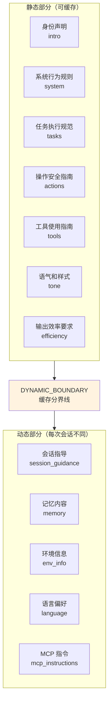

**三层注入机制（对应 API 调用的不同位置）：**

| 注入层 | 位置 | 内容示例 |
|--------|------|---------|
| `systemPrompt` | API 的 `system` 参数 | 身份、行为规则、工具说明 |
| `systemContext` | 追加到 system 末尾 | git status、环境信息 |
| `userContext` | 注入到 messages[0] | CLAUDE.md 项目指令、当前日期 |

**参考源码：** `src/constants/prompts.ts`（prompt 生成）、`src/context.ts`（上下文构建）、`src/utils/queryContext.ts`（组装入口）

### 4.2 Prompt Cache 经济学

为什么 Claude Code 要把 Prompt 分成「静态」和「动态」两部分？**因为钱。**

Anthropic 的 API 支持 Prompt Caching：如果两次请求的 system prompt 前缀相同，缓存命中时只收 1/10 的 token 费用。所以 Claude Code 用一个 `SYSTEM_PROMPT_DYNAMIC_BOUNDARY` 标记把 prompt 切成两半：

- 上半部分（身份、规则、工具说明）每个用户都一样，**跨会话共享缓存**
- 下半部分（环境信息、记忆、语言偏好）每个会话不同，**每次重新计算**

**实际影响：** 对于高频使用场景，这个设计可以节省 50% 以上的 API 费用。

### 4.3 CLAUDE.md 的分层设计

CLAUDE.md 是 Claude Code 的「项目记忆」，但它不是一个文件，而是一个 **4 层文件体系**：

```
优先级从低到高：

1. Managed Memory  -- /etc/claude-code/CLAUDE.md
   （企业管理员统一下发的指令）

2. User Memory     -- ~/.claude/CLAUDE.md
   （个人偏好，如"我喜欢函数式编程风格"）

3. Project Memory  -- 项目根目录/CLAUDE.md
   （项目规范，如"使用 pnpm，测试用 vitest"）

4. Local Memory    -- CLAUDE.local.md
   （个人的项目偏好，不提交到 git）
```

**为什么分层？** 因为不同角色有不同的关注点：
- 企业管控：「所有 Agent 不允许访问 /etc/passwd」
- 个人偏好：「代码注释用中文」
- 项目规范：「用 ESLint flat config」
- 本地覆盖：「我本地的 API key 在 .env.local」

### 4.4 你自己造的时候

**System Prompt 从第一天就要模块化。** 不要写一大段字符串。至少分成 4 个模块：

```typescript
function buildSystemPrompt(context: AgentContext): string[] {
  return [
    getIdentitySection(),      // "你是一个编码助手..."
    getBehaviorRules(),        // "使用工具前先确认..."
    getToolDescriptions(),     // 工具说明
    getDynamicContext(context), // 当前环境、项目信息
  ]
}
```

**上下文注入要可插拔：**

```typescript
// 好的设计：插件可以注入上下文
const contextProviders: ContextProvider[] = [
  gitStatusProvider,
  projectConfigProvider,
  // 新增一个就注册一个，不改核心代码
]
```

---

## 第5章：上下文管理 -- Agent 最难的技术问题

### 5.1 为什么上下文管理是最难的

**LLM 的上下文窗口是有限的。** 即使是 200k token 的模型，一个复杂编码任务也可能在 20 轮内用完。原因：

- 每次 `grep` 结果可能几千 token
- 每次读文件几百到几千 token
- 助手的思考过程也占 token
- System Prompt 本身就占几千 token

超出窗口的后果：API 返回 413 错误，Agent 直接挂掉。简单截断呢？可能丢失关键上下文，Agent 开始「忘事」。

### 5.2 Claude Code 的 6 层压缩策略

Claude Code 实现了一个渐进式压缩体系。就像清理房间：先扔垃圾，再整理抽屉，最后才搬家具。

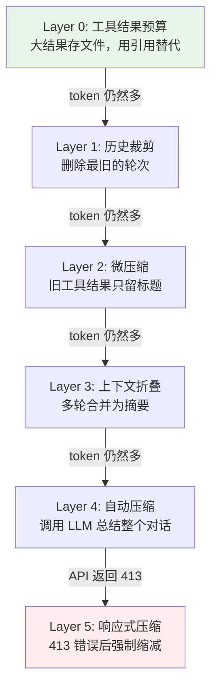

**每层策略详解：**

| 层 | 触发条件 | 做什么 | 是否调用 LLM |
|----|---------|--------|-------------|
| L0 | 每轮自动 | 超大工具结果存盘，用文件引用替代 | 否 |
| L1 | 每轮自动 | 裁剪最早的消息 | 否 |
| L2 | 每轮自动 | 旧工具结果替换为 `[Old tool result cleared]` | 否 |
| L3 | 上下文 90%+ | 将旧轮次折叠为摘要 | 是（小模型） |
| L4 | 超过阈值 | 调用 LLM 总结全部对话 | 是 |
| L5 | API 返回 413 | 强制缩减后重试 | 可能 |

**参考源码：** `src/services/compact/`（压缩实现）、`src/query.ts:365-467`（执行编排）

### 5.3 Token 预算管理

Claude Code 有一个 `TokenBudgetTracker`，在每次 API 调用前计算剩余预算：

```
有效上下文窗口 = 模型上下文窗口 - min(maxOutputTokens, 20000)
自动压缩阈值 = 有效上下文窗口 - 13000 (缓冲)
```

还有两个防御机制：
- **递减收益检测**：如果连续压缩但释放的 token 越来越少，说明已经没什么可压缩的了，停止重试
- **断路器模式**：连续 3 次压缩失败，直接放弃，避免无限循环

### 5.4 记忆系统

上下文压缩解决了「当前会话」的问题。但 Agent 还需要**跨会话的记忆** -- 上次聊过什么、用户的偏好、项目的约定。

Claude Code 的记忆分三种：

| 类型 | 存储位置 | 生命周期 | 检索方式 |
|------|---------|---------|---------|
| 会话记忆 | 会话目录/session-memory/ | 单次会话 | 自动注入 |
| 自动记忆 | ~/.claude/projects/{slug}/memory/ | 跨会话持久 | Sonnet 语义检索 |
| 团队记忆 | memory/team/ | 团队共享 | API 同步 |

**亮点：** 记忆检索用的是 **Sonnet 模型驱动的语义选择**，不是向量搜索。系统把所有记忆文件的 frontmatter 发给 Sonnet，让它选最多 5 个相关的。简单、有效、不需要额外的向量数据库。

**参考源码：** `src/memdir/`（记忆目录管理）、`src/services/extractMemories/`（记忆提取）、`src/memdir/findRelevantMemories.ts`（语义检索）

### 5.5 你自己造的时候

**渐进式实现：**

```
第 1 步：消息数超过 N 就截断最旧的（最简单的方案）
    |
第 2 步：工具结果截断（超过 X 字符就截断，附上 "[truncated]"）
    |
第 3 步：摘要压缩（调用 LLM 总结旧对话）
    |
第 4 步：持久记忆（把重要信息存到文件系统）
```

**关键提示：** 上下文预算要在**每次 API 调用前**检查，而不是出错后才处理。提前预防远比事后恢复靠谱。

---

## 第6章：多 Agent 架构 -- 一个不够就用一群

### 6.1 为什么需要多 Agent

单个 Agent 有三个瓶颈：
1. **上下文有限**：一个任务读了 50 个文件，上下文就满了
2. **专注度不够**：一个 Agent 同时处理调研 + 编码 + 测试，容易顾此失彼
3. **速度瓶颈**：复杂任务只用一个 Agent 串行处理太慢

多 Agent 就像一个团队：有人负责调研，有人负责编码，有人负责测试。

### 6.2 Claude Code 的多 Agent 模式

Claude Code 支持四种多 Agent 模式：

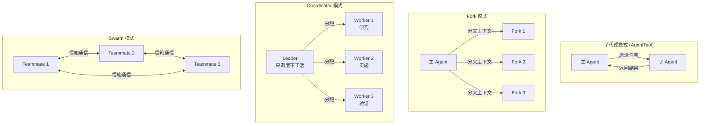

**各模式对比：**

| 模式 | 上下文 | 适用场景 | 复杂度 |
|------|--------|---------|--------|
| 子代理 | 全新（需详细 briefing） | 单一子任务 | 低 |
| Fork | 继承父级（共享 Prompt Cache） | 并行探索 | 中 |
| Coordinator | Leader 调度，Worker 执行 | 复杂多步任务 | 高 |
| Swarm | 各自独立 | 大规模并行 | 最高 |

### 6.3 关键设计细节

**Agent 不是子进程！** 这一点很多人会搞错。Claude Code 的所有 Agent 都运行在**同一个 Node.js 进程**内。每个 Agent 只是一个独立的 `query()` 循环，拥有自己的消息历史和工具池。

为什么不用子进程？
- 进程间通信（IPC）开销大
- 共享 Prompt Cache 需要在同一进程内
- 资源管理更简单（一个 AbortController 就能终止）

**Fork 的 Prompt Cache 优化：** 当主 Agent 分叉出多个子 Agent 时，所有 Fork 共享父级的消息前缀。Claude Code 通过让所有 `tool_result` 使用相同的占位文本，确保前缀字节完全相同，从而命中 Prompt Cache。

**参考源码：** `src/tools/AgentTool/`（Agent 工具）、`src/tools/AgentTool/forkSubagent.ts`（Fork 机制）、`src/coordinator/coordinatorMode.ts`（Coordinator 模式）

### 6.4 Agent 间通信

| 通信方式 | 适用场景 | 实现 |
|---------|---------|------|
| 消息队列 | 本地 Agent | `queuePendingMessage()` 写入 AppState |
| 文件信箱 | Teammate（Swarm） | `writeToMailbox()` 写磁盘 JSON |
| Unix Domain Socket | 跨会话 | UDS 本地 socket |
| Remote Control | 跨机器 | Bridge API |

### 6.5 你自己造的时候

- **从单 Agent 开始**。够用就不要上多 Agent。多 Agent 的调试难度是指数级增长的
- 如果需要多 Agent：**先实现子代理模式**。一个 Agent 能调用另一个 Agent 就行，不需要复杂的调度
- Coordinator 模式适合「调研 + 实现 + 验证」这类**分工明确**的任务
- **注意内存管理**：每个 Agent 都有独立的消息历史。10 个并行 Agent，内存可能 200MB+（Claude Code 的分析显示 500+ 轮会话时每个 Agent 约 20MB RSS）

---

## 第7章：安全架构 -- 不能跳过的一课

### 7.1 为什么 Agent 安全特别重要

Agent 和普通程序的最大区别：**Agent 能自主决定执行什么操作**。这意味着：

- 一条 Prompt Injection 可能让 Agent 执行 `rm -rf /`
- 一个恶意的 CLAUDE.md 可能让 Agent 泄露 SSH 密钥
- 一个错误的工具调用可能 `git push --force` 覆盖生产分支

**规则一：永远假设 LLM 的输出不可信。** 即使 System Prompt 说了「不要删除文件」，也不能依赖 LLM 一定遵守。

### 7.2 Claude Code 的四层防御

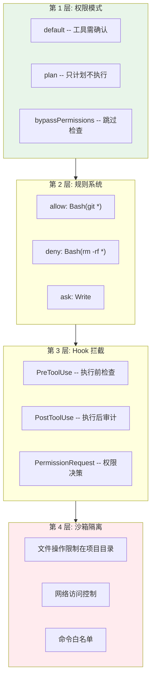

### 7.3 权限决策的四路竞速

当工具请求权限时，Claude Code 用 **ResolveOnce 模式** 并行发起四个检查，谁先返回用谁的结果：

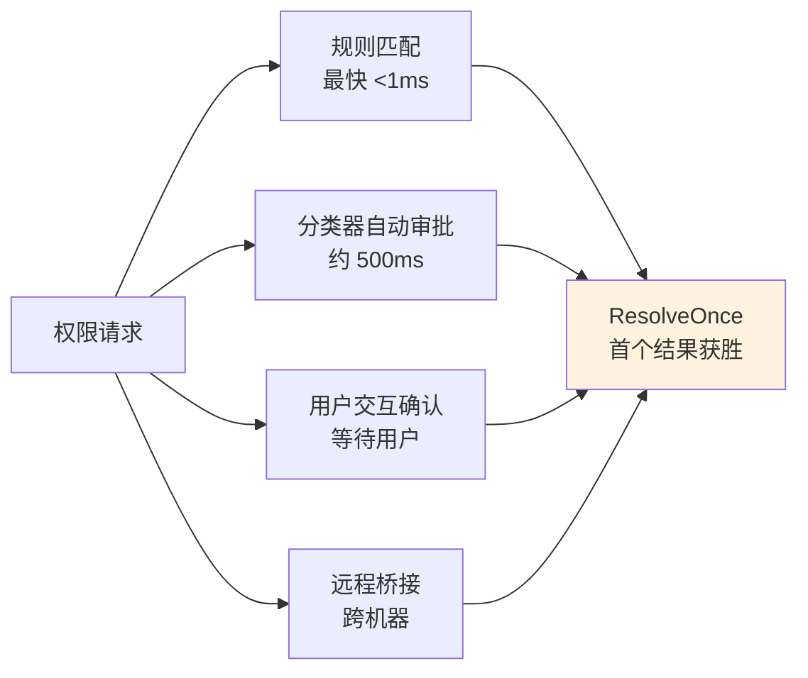

**拒绝追踪：** 如果分类器连续 3 次或累计 20 次拒绝请求，系统自动回退到交互模式（让用户手动决定），防止分类器误判导致 Agent 卡死。

**参考源码：** `src/hooks/toolPermission/`（权限处理）、`src/utils/permissions/`（权限规则和模式）

### 7.4 你自己造的时候

**从第一天就设计权限系统，不要后补。** 这是血的教训。

最小可用权限系统：

```typescript
// 工具级权限检查
async function checkPermission(tool: Tool, input: any): Promise<boolean> {
  // 1. 只读工具直接放行
  if (tool.isReadOnly()) return true

  // 2. 黑名单检查
  if (isDenied(tool.name, input)) return false

  // 3. 白名单检查
  if (isAllowed(tool.name, input)) return true

  // 4. 其他情况：询问用户
  return await askUser(`允许执行 ${tool.name}？`)
}
```

**四条安全底线：**
1. 文件操作限制在项目目录内（不允许读写 `~/.ssh`、`/etc/passwd` 等）
2. 永远不要自动执行 `rm -rf`、`git push --force`、`chmod 777` 等危险命令
3. 网络请求要有白名单或至少要用户确认
4. LLM 的输出要经过参数验证（Zod），不要直接 `eval()`

---

## 第8章：扩展机制 -- 让你的 Agent 能无限进化

### 8.1 三种扩展模式

| 模式 | 机制 | 复杂度 | 能力 |
|------|------|--------|------|
| **Skills** | Prompt 注入 | 最低 | 给 Agent 注入新的行为指令 |
| **Plugins** | 代码扩展 | 中等 | 添加工具、命令、配置、Hook |
| **MCP** | 协议桥接 | 最高 | 连接任意外部服务 |

### 8.2 MCP 详解

**Model Context Protocol (MCP)** 是 Anthropic 推出的开放协议，目标是标准化 LLM 与外部工具/服务的交互方式。简单说，它就是 Agent 世界的「USB 接口」-- 只要服务实现了 MCP 协议，任何 Agent 都能调用。

MCP 提供三种能力：
1. **Tools** -- 工具调用（最常用）
2. **Resources** -- 资源读取（文件、数据库等）
3. **Prompts** -- 预定义的 Prompt 模板

Claude Code 支持 7 种 MCP 传输方式，最常用的是 **stdio**（标准输入输出，适合本地命令行工具）和 **SSE**（Server-Sent Events，适合远程服务）。

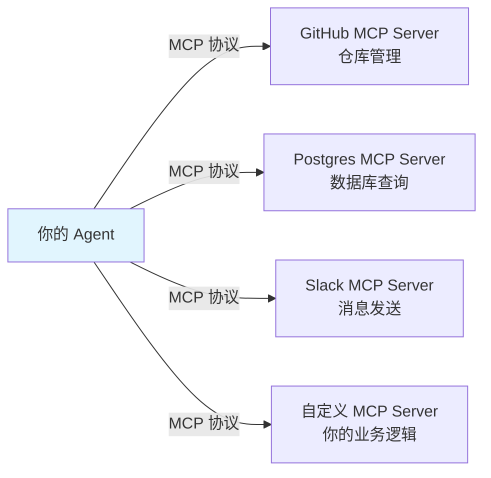

**参考源码：** `src/services/mcp/`（MCP 客户端实现）

### 8.3 你自己造的时候

- **从 MCP 开始，不要自己发明协议。** MCP 生态已经有大量现成的 server（GitHub、Slack、PostgreSQL、文件系统等），拿来即用
- 先支持 **stdio 传输**（最简单）：启动一个子进程，通过 stdin/stdout 通信
- Skills 用 **Markdown + YAML Frontmatter** 格式就够了。Claude Code 的 Skills 就是带 frontmatter 的 Markdown 文件，指定触发条件和行为指令

---

## 学习路径总结

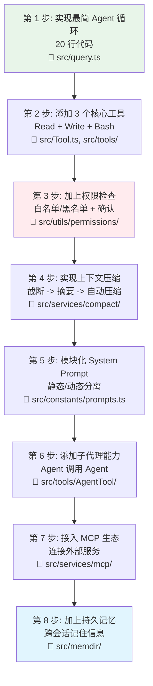

**每一步的参考实现都在 Claude Code 源码中。** 你不需要从零开始，可以对照着工业级实现来设计自己的 Agent。

**最后的建议：**

1. **先跑起来，再优化。** 20 行代码的 Agent 就能做很多事。不要一开始就追求完美架构
2. **安全从第一天开始。** 后补安全机制的成本是设计阶段的 10 倍
3. **上下文管理是核心竞争力。** 两个 Agent 用相同的 LLM 和工具，上下文管理做得好的那个，能力会强一个数量级
4. **多 Agent 不是银弹。** 单 Agent 能搞定的事情，不要上多 Agent。复杂度是有代价的
5. **拥抱 MCP 生态。** 不要重复造轮子，社区已经有大量现成的 MCP server

---

> 本指南基于 Claude Code v2.1.88 源码分析，所有源码路径均为相对于项目根目录的路径。
> 完整架构分析文档见 `docs/architecture/` 目录。
