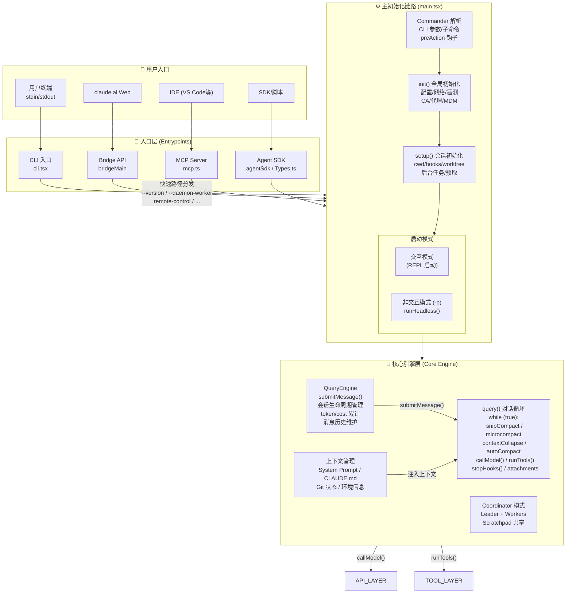
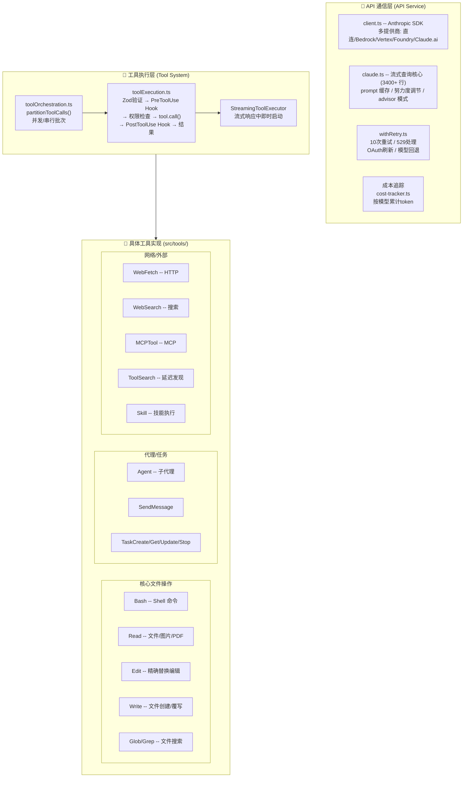
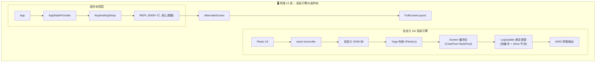
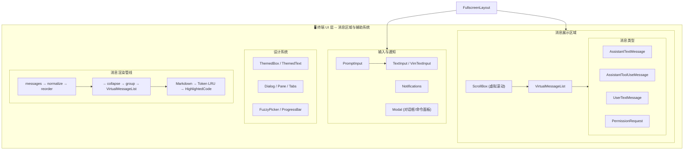
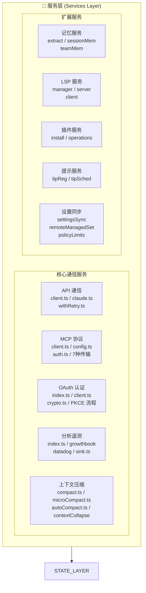
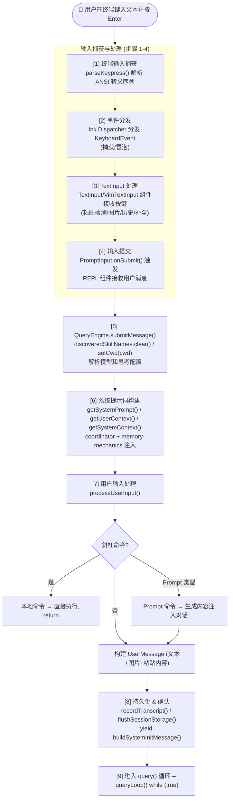
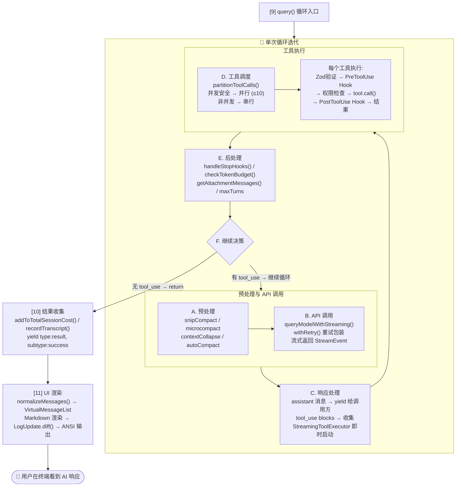
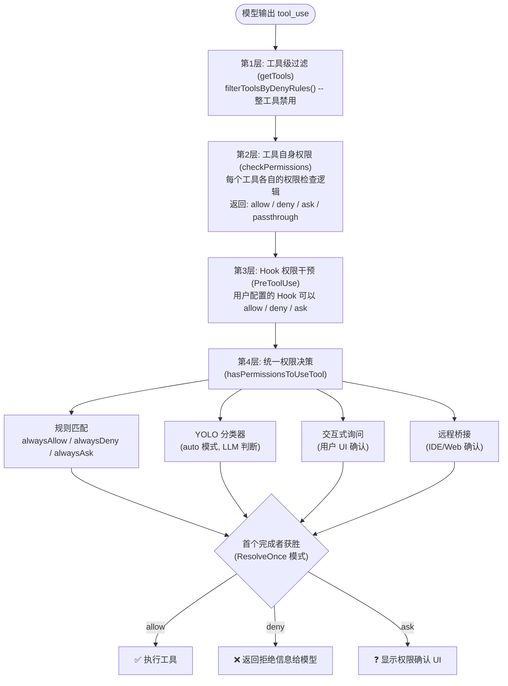
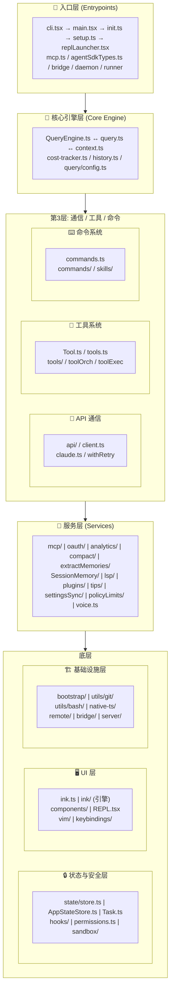

# Claude Code CLI -- 架构全景总览

> 基于 Claude Code v2.1.88 源码分析
> 本文档是所有模块分析文档的顶层索引与架构概览，适合第一次接触代码库的开发者阅读。

---

## 目录

1. [项目概述](#1-项目概述)
2. [整体架构图](#2-整体架构图)
3. [核心数据流](#3-核心数据流)
4. [模块依赖关系](#4-模块依赖关系)
5. [开发者快速指南](#5-开发者快速指南)
6. [关键设计决策](#6-关键设计决策)
7. [文档索引](#7-文档索引)

---

## 1. 项目概述

### 1.1 Claude Code 是什么

Claude Code 是 Anthropic 官方推出的 CLI 工具，允许开发者在终端中与 Claude AI 进行交互式对话，实现代码编写、文件操作、Shell 命令执行、代码审查、Git 操作等开发任务。它不仅是一个聊天客户端，更是一个完整的 AI 驱动开发环境。

### 1.2 版本与技术栈

| 项目 | 说明 |
|------|------|
| **版本** | v2.1.88 |
| **运行时** | Bun (主要) / Node.js 18+ (兼容) |
| **语言** | TypeScript (TSX) |
| **UI 框架** | React 19 + 自定义 Ink 框架 (终端 UI) |
| **布局引擎** | Yoga (Flexbox, WASM / 纯 TS 回退) |
| **构建工具** | Bun bundler (主要) / esbuild (替代) |
| **API 客户端** | Anthropic SDK (支持直连 / Bedrock / Vertex / Foundry) |
| **协议** | MCP (Model Context Protocol), OAuth 2.0 + PKCE, LSP |
| **原生模块** | Rust NAPI (语法高亮、Diff、音频) + 纯 TS 回退 |
| **遥测** | OpenTelemetry (Metrics / Logs / Traces) |
| **包管理** | npm / Bun |

### 1.3 核心能力

- **交互式终端 REPL** -- 完整的终端 UI，支持虚拟滚动、Vim 模式、语法高亮
- **AI 对话引擎** -- 多轮对话循环，支持工具调用、上下文压缩、流式输出
- **40+ 内置工具** -- 文件读写编辑、Shell 执行、搜索、子代理、网络请求等
- **MCP 协议集成** -- 连接外部工具服务器，扩展 AI 能力边界
- **多模式权限** -- 6 种权限模式 + 规则系统 + Hook 拦截 + 分类器自动审批
- **多代理协作** -- Coordinator 模式、子代理、后台代理、Swarm 团队
- **远程执行** -- CCR 远程会话、IDE 桥接、Server 模式
- **持久化记忆** -- CLAUDE.md 项目记忆、会话记忆、记忆目录
- **90+ 斜杠命令** -- 丰富的命令系统，支持技能、插件、工作流扩展
- **SDK 接口** -- 编程式 API，支持 query/tool/session 等操作

---

## 2. 整体架构图

<!-- 整体架构全景图 -- 第 1 部分: 入口层 + 初始化链路 + 核心引擎层 -->



<!-- 整体架构全景图 -- 第 2 部分: API 通信层 + 工具执行层 -->



<!-- 整体架构全景图 -- 第 3 部分: 终端 UI 层 -->



以下继续展示 FullscreenLayout 之下的组件结构、设计系统与消息渲染管线：



<!-- 整体架构全景图 -- 第 4 部分: 服务层 + 状态与安全层 + 特殊功能层 -->



以下继续展示状态与安全层以及特殊功能层的详细结构：

```mermaid
graph TD
    subgraph STATE_LAYER["🔒 状态与安全层 (State & Security)"]
        subgraph STATE_ROW1["状态管理"]
            direction LR
            STORE["AppState Store<br/>自研响应式 Store<br/>不可变更新 / 发布-订阅<br/>React 集成 (useSyncExternal)"]
            GLOBAL_STATE["全局可变状态<br/>bootstrap/state.ts<br/>sessionId/cwd/<br/>cost/meter/hooks"]
            TASK["Task 系统<br/>7种任务类型:<br/>local_bash / local_agent /<br/>remote_agent / in_process_mate /<br/>local_workflow / monitor_mcp / dream"]
        end
        subgraph STATE_ROW2["安全与扩展"]
            direction LR
            PERM["权限系统<br/>6种模式 / 多源规则<br/>YOLO 分类器 / 拒绝追踪"]
            HOOKS["Hooks 系统<br/>27种事件 / 4种类型<br/>command/prompt/http/agent"]
            SANDBOX["沙箱安全<br/>文件系统限制<br/>网络域名限制<br/>settings.json 保护"]
        end
        subgraph STATE_ROW3["插件与记忆"]
            direction LR
            PLUGINS["插件系统<br/>builtin + marketplace<br/>MCP/LSP/Hooks 扩展"]
            SKILLS["Skills 系统<br/>bundled/disk/plugin/MCP<br/>Frontmatter 语法"]
            MEMDIR["记忆系统 (Memdir)<br/>MEMORY.md 索引<br/>四类记忆分类<br/>智能检索 (sideQuery)"]
        end
    end

    subgraph SPECIAL["⚡ 特殊功能层 (Special Features)"]
        subgraph SPEC_ROW1["交互与远程"]
            direction LR
            VOICE["语音交互<br/>CoreAudio / WebSocket<br/>三层门控"]
            REMOTE["远程Agent<br/>CCR 会话 / WebSocket<br/>HTTP POST"]
            IDE_BRIDGE["IDE 桥接<br/>Remote Control / REST API"]
            SERVER["Server<br/>Direct Connect / HTTP/WS"]
        end
        subgraph SPEC_ROW2["基础设施"]
            direction LR
            BUDDY["Buddy<br/>伴侣系统 / 确定性生成<br/>RPG 属性"]
            GIT["Git 集成<br/>直读.git / ref 解析<br/>watcher"]
            UPSTREAM["上游代理<br/>CONNECT over WS<br/>prctl 防调"]
            NATIVE_TS["原生 TS<br/>file-index / yoga-layout<br/>color-diff"]
            BASH_PARSE["Bash 解析<br/>递归下降 / 安全分析"]
            BUILD["构建系统<br/>Bun/esbuild / feature()"]
        end
    end

    STATE_LAYER --> SPECIAL
```



---

## 3. 核心数据流

### 3.1 从用户输入到 AI 响应 -- 完整链路

以下是一条用户消息从键入到收到 AI 响应的完整数据流，一笔到底：



以下继续展示 query() 循环内部的处理流程直到 AI 响应返回给用户：



### 3.2 工具权限决策链路

当 AI 模型决定调用某个工具时，权限检查经过以下层级：



---

## 4. 模块依赖关系

### 4.1 模块层次图



### 4.2 关键依赖关系说明

| 依赖方向 | 说明 |
|---------|------|
| 入口层 --> 核心引擎 | `main.tsx` 创建 `QueryEngine`，启动 `query()` 循环 |
| 核心引擎 --> API 通信 | `query.ts` 调用 `queryModelWithStreaming()` 发起 API 请求 |
| 核心引擎 --> 工具系统 | `query.ts` 调用 `runTools()` 执行 AI 返回的工具调用 |
| 核心引擎 --> 命令系统 | `processUserInput()` 解析斜杠命令，分发到 `commands.ts` |
| 工具系统 --> 服务层 | MCPTool 调用 MCP 客户端；AgentTool 创建子会话 |
| 工具系统 --> 状态层 | 工具执行前检查权限；执行后通过 Hook 拦截 |
| UI 层 --> 核心引擎 | REPL 组件调用 `QueryEngine.submitMessage()` |
| UI 层 --> 状态层 | 组件通过 `useSyncExternalStore` 订阅 `AppState` |
| 服务层 --> 基础设施 | OAuth 使用 keychain；MCP 使用网络传输；压缩使用 API |

---

## 5. 开发者快速指南

### 5.1 建议阅读顺序

如果你是第一次接触这个代码库，建议按以下顺序阅读：

```
第 1 步: 理解全景
  --> 本文档 (00-overview.md)
  --> 快速浏览整体架构图和核心数据流

第 2 步: 理解启动流程
  --> 01-entrypoints-bootstrap.md
  --> 关注: cli.tsx -> main.tsx -> init.ts -> setup.ts -> REPL
  --> 关键文件: src/entrypoints/cli.tsx, src/main.tsx

第 3 步: 理解对话引擎
  --> 02-core-engine.md
  --> 关注: QueryEngine.submitMessage() -> query() -> queryLoop()
  --> 关键文件: src/QueryEngine.ts, src/query.ts

第 4 步: 理解工具系统
  --> 03-tool-system.md
  --> 关注: Tool 类型定义 -> buildTool() -> 工具执行流程
  --> 关键文件: src/Tool.ts, src/tools.ts, src/services/tools/toolExecution.ts

第 5 步: 理解 UI 渲染
  --> 04-ui-components.md
  --> 关注: 自定义 Ink -> REPL 组件 -> 消息渲染管线
  --> 关键文件: src/screens/REPL.tsx, src/ink/ink.tsx

第 6 步: 理解命令和服务
  --> 05-commands-services.md
  --> 关注: 命令注册 -> API 通信 -> MCP 连接
  --> 关键文件: src/commands.ts, src/services/api/claude.ts

第 7 步: 理解状态和权限
  --> 06-state-permissions.md
  --> 关注: Store 设计 -> 权限模式 -> Hooks 系统
  --> 关键文件: src/state/store.ts, src/types/permissions.ts

第 8 步: 按需深入特殊功能
  --> 07-special-features.md
  --> 按兴趣选择: 语音 / 远程 / 安全 / 构建 等
```

### 5.2 关键入口文件速查

| 场景 | 从哪个文件开始 |
|------|-------------|
| 理解启动过程 | `src/entrypoints/cli.tsx` |
| 理解全局初始化 | `src/entrypoints/init.ts` |
| 理解会话初始化 | `src/setup.ts` |
| 理解 CLI 参数 | `src/main.tsx` (第 902 行起) |
| 理解对话循环 | `src/query.ts` (queryLoop 函数) |
| 理解会话管理 | `src/QueryEngine.ts` |
| 理解工具定义 | `src/Tool.ts` (Tool 类型 + buildTool) |
| 理解工具注册 | `src/tools.ts` (getAllBaseTools) |
| 理解工具执行 | `src/services/tools/toolExecution.ts` |
| 理解 REPL UI | `src/screens/REPL.tsx` |
| 理解渲染引擎 | `src/ink/ink.tsx` |
| 理解命令系统 | `src/commands.ts` |
| 理解 API 调用 | `src/services/api/claude.ts` |
| 理解 MCP 客户端 | `src/services/mcp/client.ts` |
| 理解状态管理 | `src/state/store.ts` + `src/state/AppStateStore.ts` |
| 理解权限模型 | `src/types/permissions.ts` |
| 理解 Hook 系统 | `src/schemas/hooks.ts` + `src/types/hooks.ts` |
| 理解系统提示词 | `src/constants/prompts.ts` |
| 理解上下文管理 | `src/context.ts` |

### 5.3 代码量级参考

| 模块 | 核心文件 | 约代码行数 | 复杂度 |
|------|---------|----------|--------|
| API 查询 | `claude.ts` | 3400+ | 极高 |
| MCP 客户端 | `mcp/client.ts` | 3300+ | 极高 |
| REPL 界面 | `REPL.tsx` | 5000+ | 极高 |
| 对话循环 | `query.ts` | 1700+ | 高 |
| 命令注册 | `commands.ts` | 755+ | 中 |
| 工具执行 | `toolExecution.ts` | 500+ | 高 |
| 重试逻辑 | `withRetry.ts` | 500+ | 中 |
| 压缩服务 | `compact.ts` | 500+ | 中 |

---

## 6. 关键设计决策

### 6.1 对话循环: while(true) 而非递归

早期版本使用递归调用 `query()`，在长对话中导致栈溢出。当前版本重构为 `while (true)` + 显式 `State` 结构：
- 栈深度恒定，不随对话轮次增长
- 所有继续决策通过 `state.transition` 显式化
- 10+ 种恢复路径（reactive compact、max_output_tokens escalation 等）全部在循环内处理

### 6.2 工具系统: 对象字面量 + 工厂函数，而非类继承

所有工具通过 `buildTool()` 工厂函数创建，使用对象字面量而非抽象类。这个选择带来：
- `buildTool()` 自动注入 fail-closed 安全默认值（`isConcurrencySafe: false`，`isReadOnly: false`）
- MCP 工具可以通过对象展开（spread）从模板创建，避免类继承复杂性
- 每个工具都是独立的值对象，无隐式状态

### 6.3 UI: 自定义 Ink 框架

Claude Code 没有直接使用社区版 Ink，而是 fork 并大幅改造：
- **自定义 React reconciler** 适配 React 19
- **双缓冲帧渲染** + 16ms 节流，避免终端闪烁
- **Screen 缓冲区** 使用 CharPool/StylePool 字符串驻留，降低 GC 压力
- **硬件滚动提示** (DECSTBM + SU/SD)，利用终端原生滚动能力
- **仿浏览器事件系统**，支持捕获/冒泡两阶段分发

### 6.4 权限: 多源竞速 + ResolveOnce

权限系统支持多个并发审批源（本地 UI、远程桥接、Hook、YOLO 分类器）同时运行，首个完成者获胜：
- `ResolveOnce` 模式通过原子 `claim()` 确保单次解析
- 避免用户在本地确认后远程又弹出确认
- 分类器可以在后台静默审批，减少用户交互

### 6.5 启动优化: 极致的并行化和延迟加载

启动流程精心设计了多处并行化：
- 模块 import 期间并行启动 MDM 子进程 + Keychain 预读取（利用 ~135ms 的 import 窗口）
- `setup()` 与命令加载/Agent 定义加载并行执行
- MCP 配置解析与 trust dialog 重叠
- OpenTelemetry (~400KB) 延迟到遥测初始化时才加载
- React 组件（App、REPL）延迟到 `launchRepl()` 时才 import
- `--bare` 模式跳过 hooks/LSP/插件/记忆等全部非核心初始化

### 6.6 上下文管理: 多层渐进式压缩

为了在有限的上下文窗口内维持长对话，系统采用 5 层压缩策略：

| 层级 | 策略 | 触发时机 | 特性门控 |
|------|------|---------|---------|
| 1 | Snip Compact | 每轮循环开始 | HISTORY_SNIP |
| 2 | Microcompact | 每轮循环开始 | 默认启用 |
| 3 | Context Collapse | 每轮循环开始 | CONTEXT_COLLAPSE |
| 4 | Auto Compact | token 超阈值时 | 默认启用 |
| 5 | Reactive Compact | API 返回 prompt_too_long 时 | REACTIVE_COMPACT |

### 6.7 编译时特性门控

通过 Bun 的 `feature()` 内联函数实现零开销功能开关：
- 外部构建将 `feature('X')` 替换为 `false`，esbuild 进行死代码消除
- 内部功能（语音、Coordinator、YOLO 分类器等）不会出现在外部构建产物中
- 条件导入的模块在编译时被彻底移除

### 6.8 安全纵深防御

安全机制贯穿多个层面：
- **沙箱**: 基于 `@anthropic-ai/sandbox-runtime`，限制文件系统和网络访问
- **权限**: 6 种模式 + 多源规则 + 危险模式自动剥离 + 拒绝追踪回退
- **Git 安全**: ref 名称验证（防路径遍历）、Bridge ID 校验
- **上游代理安全**: `prctl(PR_SET_DUMPABLE, 0)` 防 ptrace，token 文件删除
- **Bash 解析**: 50ms 超时 + 50000 节点上限防 DoS
- **文件操作**: 路径规范化、O_NOFOLLOW、O_EXCL
- **Settings 保护**: 沙箱始终拒绝写入 `settings.json`

### 6.9 运行时兼容

关键模块同时支持 Bun 和 Node.js：
- WebSocket: Bun 原生 WebSocket vs Node.js ws 包
- TCP 服务器: `Bun.listen` vs `net.createServer`
- 布局引擎: Yoga WASM vs 纯 TypeScript 移植
- 原生模块: Rust NAPI vs 纯 TypeScript 回退（file-index、color-diff、bash-parser）

---

## 7. 文档索引

| 文档 | 路径 | 内容 |
|------|------|------|
| 架构全景总览 | [`00-overview.md`](./00-overview.md) | 本文档 -- 项目概述、架构图、数据流、依赖关系、快速指南 |
| 文档目录索引 | [`00-index.md`](./00-index.md) | 所有文档的摘要与快速查找指南 |
| 入口与启动流程 | [`01-entrypoints-bootstrap.md`](./01-entrypoints-bootstrap.md) | CLI 入口、初始化链路、启动性能 |
| 核心引擎与对话循环 | [`02-core-engine.md`](./02-core-engine.md) | QueryEngine、对话循环、上下文管理、压缩策略 |
| 工具系统 | [`03-tool-system.md`](./03-tool-system.md) | 工具定义、注册、执行、权限、MCP 工具 |
| UI 渲染与组件系统 | [`04-ui-components.md`](./04-ui-components.md) | Ink 框架、组件树、消息渲染、Vim 模式 |
| 命令系统与服务层 | [`05-commands-services.md`](./05-commands-services.md) | 斜杠命令、API/MCP/OAuth 服务 |
| 状态管理、权限与 Hooks | [`06-state-permissions.md`](./06-state-permissions.md) | Store、Task、Hooks、权限、插件、Skills |
| 特殊功能模块 | [`07-special-features.md`](./07-special-features.md) | 语音、远程、安全、Git、遥测、构建 |
| System Prompt 与消息压缩 | [`08-system-prompt-and-compression.md`](./08-system-prompt-and-compression.md) | Prompt 三层注入、CLAUDE.md 四层加载、6层压缩策略 |
| Settings 配置与 Agent 系统 | [`09-settings-and-agent-system.md`](./09-settings-and-agent-system.md) | 六层配置优先级、Agent 进程内隔离、Coordinator、Swarm |
| Memory 与数据持久化 | [`10-memory-and-persistence.md`](./10-memory-and-persistence.md) | Memdir 记忆系统、Sonnet 语义检索、JSONL 持久化 |

---

> 本文档基于 Claude Code v2.1.88 反编译源码分析。所有文件路径均相对于项目根目录。
