# Claude Code 全景架构图解（通俗完整版）

> 本文用最通俗的语言和详细的图解，完整呈现 Claude Code 的架构全貌。
> 信息量等同于技术文档，但不需要编程背景就能理解。
> 遇到必须使用的技术名词，会用「」标注并立刻解释。

---

## 目录

1. [第1章：全景总览 — Claude Code 的全身像](#第1章全景总览--claude-code-的全身像)
2. [第2章：一次完整对话的旅程 — 从你打字到看到回复](#第2章一次完整对话的旅程--从你打字到看到回复)
3. [第3章：工具箱详解 — AI 能做的所有事情](#第3章工具箱详解--ai-能做的所有事情)
4. [第4章：指令系统 — 90+ 个快捷操作](#第4章指令系统--90-个快捷操作)
5. [第5章：记忆系统 — AI 怎么记住你和你的项目](#第5章记忆系统--ai-怎么记住你和你的项目)
6. [第6章：安全体系 — 四层保护你的电脑](#第6章安全体系--四层保护你的电脑)
7. [第7章：多助手协作 — AI 团队怎么配合](#第7章多助手协作--ai-团队怎么配合)
8. [第8章：配置系统 — 六层设置谁说了算](#第8章配置系统--六层设置谁说了算)
9. [第9章：对外连接 — 插件、技能和外部工具](#第9章对外连接--插件技能和外部工具)
10. [第10章：启动到关闭 — 完整生命周期](#第10章启动到关闭--完整生命周期)

---

## 第1章：全景总览 — Claude Code 的全身像

这是最重要的一张图。Claude Code 像一栋七层大楼，每一层负责不同的工作。
从最上面（你能看到的部分）到最下面（幕后保障），层层支撑。

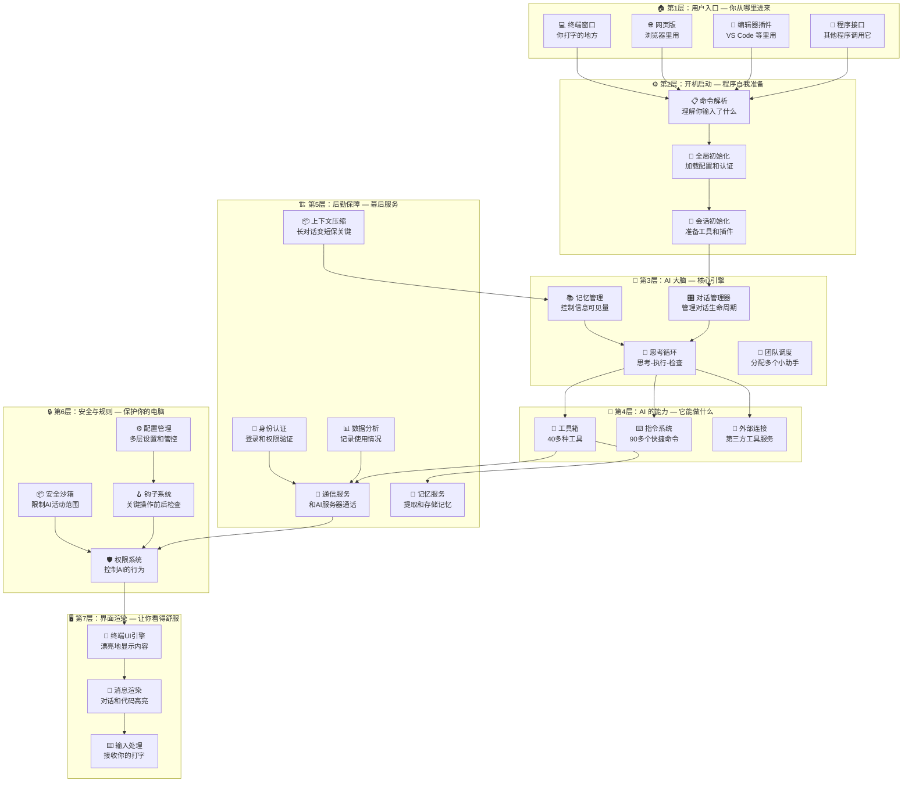

**通俗解读：**

想象 Claude Code 是一栋七层办公大楼。你从大门（终端/网页/编辑器）走进来，前台（开机启动层）帮你登记，然后引导你进入核心会议室（AI 大脑层）。
大脑层里有一个"思考循环"，它会不断地想办法、用工具干活、检查结果，直到把你的要求完成。
整栋楼有安保系统（安全层）保护你的电脑，有后勤团队（服务层）确保一切顺畅，还有装修团队（界面层）让你看到漂亮的输出。

---

## 第2章：一次完整对话的旅程 — 从你打字到看到回复

每一条你发送的消息，都会经历一条完整的流水线。就像工厂里的产品从原料到成品要经过多道工序。

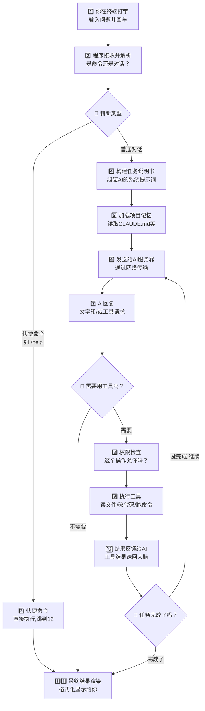

**通俗解读：**

你说一句话，程序先判断是快捷命令还是普通对话。如果是对话，就会组装一份"任务说明书"（包括你的话、项目背景、之前的记忆等），然后发送给远端的 AI 服务器。
AI 回复后，如果它觉得需要做某些操作（比如读文件、改代码），就会先过"安检"（权限检查），通过后执行操作，把结果再送回给 AI。
AI 可能会继续思考、继续用工具，这个"思考-执行"的循环会一直转，直到 AI 觉得任务完成了，最终把结果漂漂亮亮地显示在你的屏幕上。

---

## 第3章：工具箱详解 — AI 能做的所有事情

Claude Code 内置了 40 多种工具，就像一个超级工具箱。这些工具按用途分成八大类。

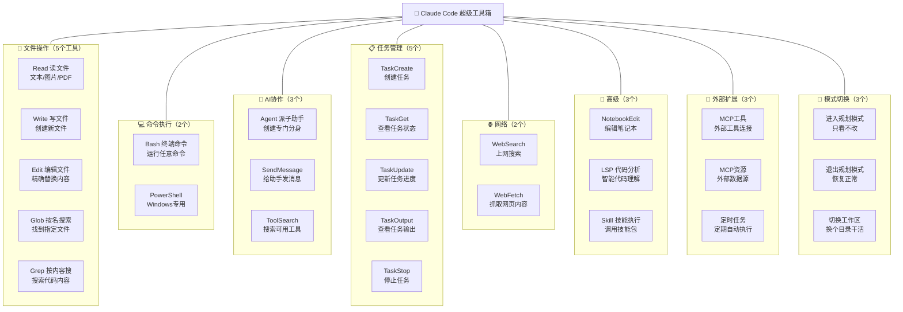

### 工具的执行流程 — 从决定用到用完

每次 AI 决定使用一个工具，都要经过六个步骤：

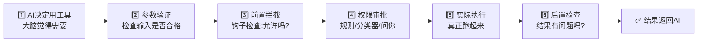

**通俗解读：**

工具箱里装着 40 多种工具，覆盖了文件操作、命令执行、代码搜索、AI 分身、网络查询、任务管理、外部插件、模式切换八大类。
每次 AI 想用某个工具，都要经过严格的"六道工序"：先验证参数是否合格，然后过两道安检（钩子检查和权限审批），审批通过才真正执行，执行完还要做后置检查，最后把结果送回 AI 大脑。

---

## 第4章：指令系统 — 90+ 个快捷操作

Claude Code 有 90 多个以 `/` 开头的快捷命令，就像手机上的快捷方式。你不用说一大段话，只需输入短短几个字就能触发特定操作。

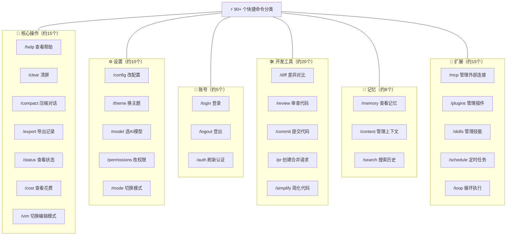

**通俗解读：**

快捷命令分为六大类：核心操作（日常使用）、设置（调整偏好）、账号（登录登出）、开发工具（代码相关）、记忆（管理 AI 的记忆）、扩展（安装插件和连接外部工具）。
输入 `/help` 就能看到所有可用命令。这些命令和普通对话不同——它们直接由程序执行，不需要 AI 参与思考，所以响应速度非常快。

---

## 第5章：记忆系统 — AI 怎么记住你和你的项目

AI 的"脑容量"是有限的，就像一张书桌——桌面空间有限，不能把所有文件都摊开。
Claude Code 用三种"记忆"来解决这个问题。

### 5.1 短期记忆 — 书桌上的文件

「上下文窗口」（AI 一次能看到的信息量上限）就像书桌的大小。桌面快满时，Claude Code 有六层渐进式清理策略：

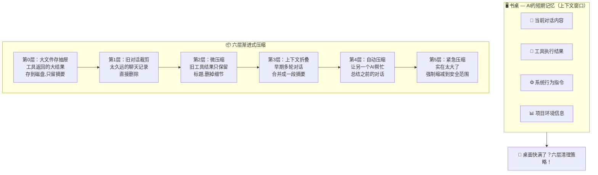

**通俗解读：** 压缩策略像整理书桌——先把大文件存进抽屉（第0层），再扔掉过期文件（第1层），然后把厚文件换成便签摘要（第2、3层），再让助手帮你写会议纪要替代所有原始记录（第4层），最后实在不行就强制清理（第5层）。

### 5.2 项目记忆 — 贴在墙上的便签纸

「CLAUDE.md」是一种特殊文件，相当于贴在 AI 工位墙上的便签纸。每次 AI 开始工作时都会先看看便签上写了什么。

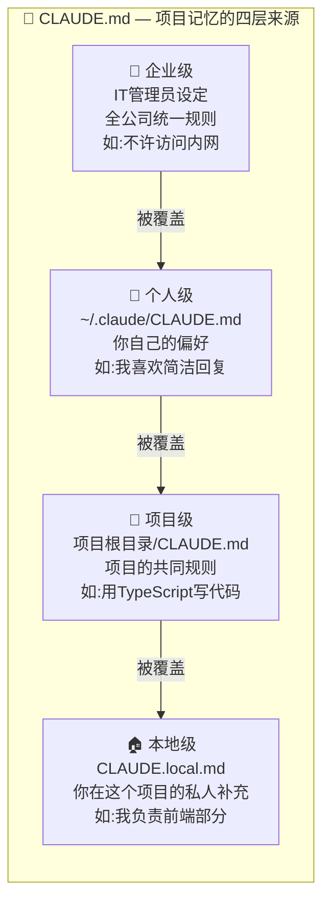

**通俗解读：** CLAUDE.md 像便签纸一样简单直接。四层来源从宏观到微观：公司的大政方针 → 你个人的习惯 → 项目的规矩 → 你在这个项目的特殊要求。它们层层叠加，越具体的层级越优先。

### 5.3 长期记忆 — 大脑里的笔记本

「Memory 系统」（长期记忆系统）就像 AI 随身带的笔记本，跨会话记住重要信息。

```mermaid
graph TD
    subgraph MEMORY["📒 长期记忆系统 — 笔记本"]
        INDEX["📇 MEMORY.md 索引<br/>目录页,列出所有记忆"]

        subgraph TYPES["四种记忆类型"]
            MT1["👤 用户记忆<br/>你的角色和偏好<br/>如:资深数据科学家"]
            MT2["💡 反馈记忆<br/>你纠正AI的记录<br/>如:别用mock测试"]
            MT3["📁 项目记忆<br/>项目上下文<br/>如:正在重写认证模块"]
            MT4["🔗 参考记忆<br/>外部资源链接<br/>如:Grafana面板地址"]
        end

        INDEX --> TYPES
    end

    subgraph LIFECYCLE["🔄 记忆的一生"]
        LC1["✏️ 创建<br/>你主动说:记住这个<br/>或AI自动提取"]
        LC2["💾 存储<br/>写入Markdown文件<br/>带YAML描述头"]
        LC3["🔍 检索<br/>下次对话时<br/>AI智能搜索相关记忆"]
        LC4["♻️ 更新<br/>记忆过时了<br/>自动标记并更新"]
        LC1 --> LC2 --> LC3 --> LC4
    end

    subgraph AUTO["🤖 自动提取机制"]
        AE1["每轮对话结束后<br/>后台子助手分析"]
        AE2["用AI判断是否有<br/>值得长期记住的信息"]
        AE3["自动写入记忆文件<br/>并更新索引"]
        AE1 --> AE2 --> AE3
    end

    subgraph TEAM["👥 团队共享记忆"]
        TM1["个人记忆<br/>只有你能看"]
        TM2["团队记忆<br/>同事也能看"]
        TM3["服务器同步<br/>推送和拉取"]
        TM1 --- TM2 --- TM3
    end
```

**通俗解读：**

长期记忆像一个有索引的笔记本。AI 把值得记住的东西分成四类写入笔记本：你是谁（用户记忆）、你纠正过它什么（反馈记忆）、项目在做什么（项目记忆）、有用的链接（参考记忆）。
每次新对话开始，AI 会翻翻笔记本，找出和当前话题相关的记忆。
记忆不是手动管理的——AI 会在每轮对话后自动分析、提取值得保存的信息。
团队成员还可以共享记忆，比如"项目冻结了，别提交代码"这种信息，一个人记住了所有人都能看到。

---

## 第6章：安全体系 — 四层保护你的电脑

Claude Code 操作的是你的真实文件和代码，安全至关重要。它的安全体系就像银行保险库，有四层防护。

### 第1层：权限模式 — 门卫决定谁能进

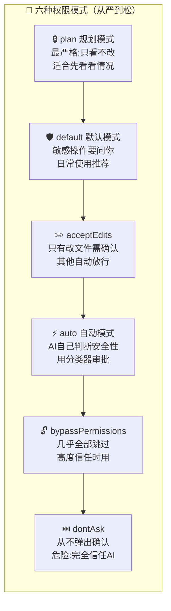

### 第2层：规则系统 — 白名单和黑名单

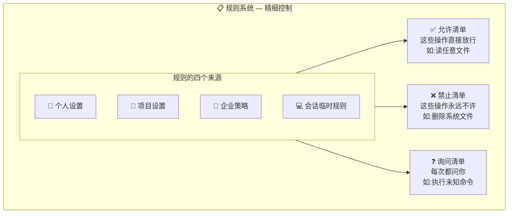

### 第3层：钩子拦截 — 在关键时刻插入检查

「钩子」（Hook）就像在 AI 每个动作的前后安装了探测器，可以在关键操作前后自动触发检查。

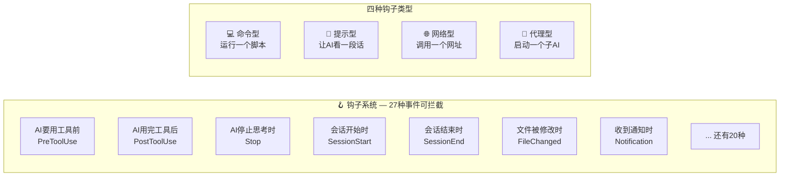

### 第4层：沙箱隔离 — 给 AI 画一个活动圈

「沙箱」（Sandbox）就像给 AI 画了一个圈，它只能在圈里活动，出不去。

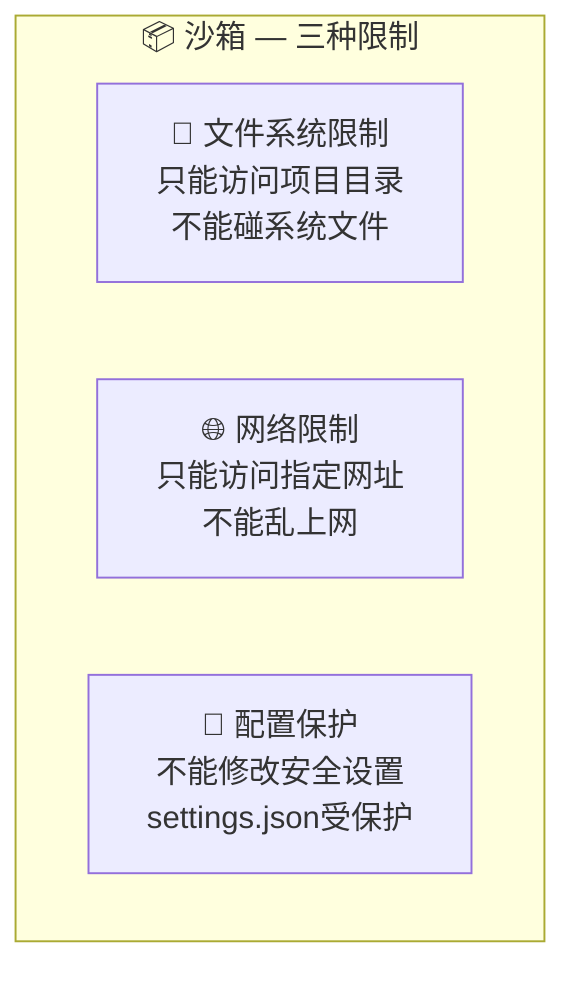

**通俗解读：**

四层防护形成纵深防御。第一层是门卫，决定整体严不严格。第二层是黑白名单，对具体操作做精细控制。第三层是在每个关键动作前后安装了探测器，可以拦截或修改。第四层是给 AI 画了个活动范围，它物理上就出不去。
这四层像套娃一样层层嵌套，即使某一层出了问题，其他层依然能保护你的电脑。

---

## 第7章：多助手协作 — AI 团队怎么配合

当任务比较复杂时，Claude 不是一个人在战斗——它可以组建项目团队，像公司里的团队分工一样协作。

### 7.1 四种协作模式

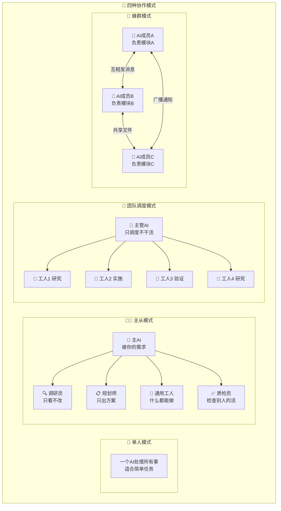

### 7.2 团队的通信方式和隔离级别

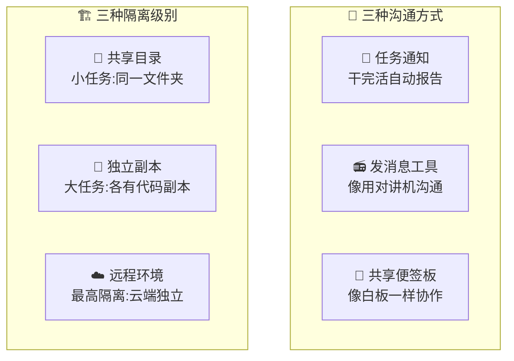

**通俗解读：**

单人模式就是一个 AI 独自干活。主从模式是主 AI 派出专门的分身（调研员只负责看代码，工人负责改代码，质检员负责检查质量）。
团队调度模式更进一步——主管 AI 自己不干活，只负责分配任务和汇总结果，多个工人 AI 并行干活。蜂群模式最自由——多个 AI 各自负责一块，通过消息和共享文件协作。
为了防止 AI 们互相干扰，系统提供了三种隔离级别，大任务时每个 AI 都有自己的代码副本。

---

## 第8章：配置系统 — 六层设置谁说了算

Claude Code 的配置就像穿衣服——一层套一层，外面的会遮住里面的。

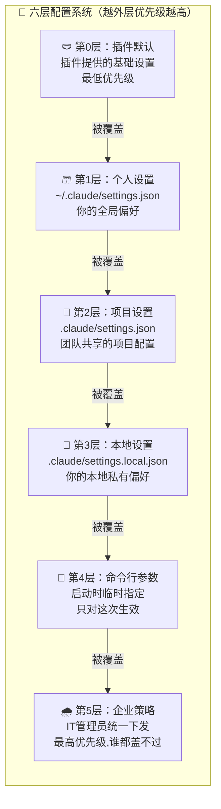

### 每一层能配什么

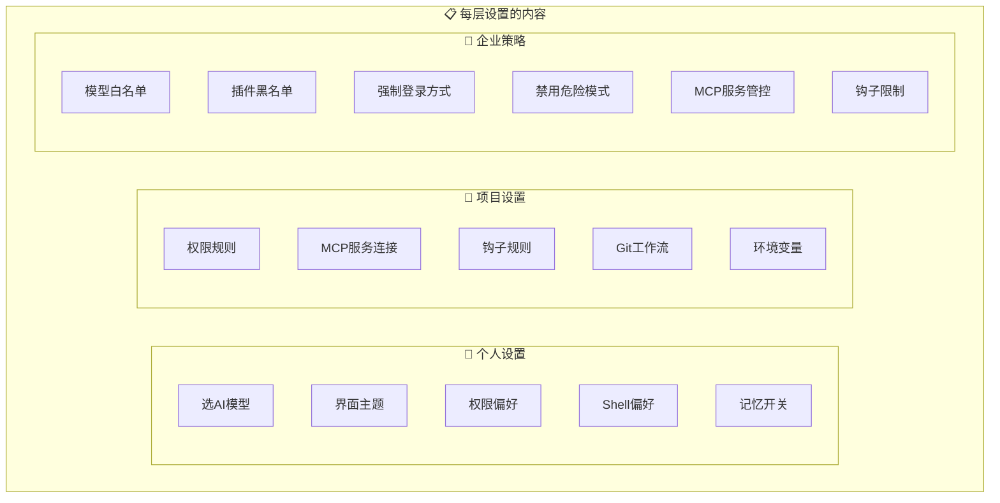

**通俗解读：**

配置系统分六层，就像穿衣服——内衣是插件默认值，然后是你的个人习惯、项目规矩、本地私人调整、启动时临时参数，最外面是企业策略。
规则很简单：同一个设置项，谁在最外层就听谁的。你设了模型 A，但企业策略说只能用模型 B，那最终就是模型 B。
企业策略有四种下发渠道：远程 API、系统管理软件（MDM）、管理员文件、和 Windows 注册表。企业策略永远不可被覆盖，这是安全设计的基石。

---

## 第9章：对外连接 — 插件、技能和外部工具

Claude Code 不是一个封闭的工具，它像智能手机一样有自己的"应用生态"。

```mermaid
graph TD
    subgraph ECOSYSTEM["📱 Claude Code 的扩展生态"]
        subgraph BUILTIN["📦 内置工具 — 出厂自带"]
            BI1["40多种核心工具<br/>文件/命令/搜索<br/>网络/AI协作/任务"]
        end

        subgraph SKILLS["⚡ 技能包 — 可学的新能力"]
            SK_SRC["三种来源"]
            SK1["📂 本地文件技能<br/>从磁盘加载"]
            SK2["🧩 插件技能<br/>插件附带的"]
            SK3["📦 官方捆绑<br/>内置的斜杠命令"]
            SK_SRC --> SK1
            SK_SRC --> SK2
            SK_SRC --> SK3
        end

        subgraph PLUGINS["🧩 插件 — 第三方扩展"]
            PL1["从市场安装"]
            PL2["可带工具/命令/配置"]
            PL3["有完善的错误处理"]
            PL4["企业可管控白名单"]
        end

        subgraph MCP_SYS["🔌 MCP协议 — 外部工具连接器"]
            MCP_DESC["像USB接口一样<br/>连接各种外部服务"]
            MCP1["stdio 标准输入输出"]
            MCP2["SSE 服务器推送"]
            MCP3["HTTP 流式传输"]
            MCP4["npx 自动安装运行"]
            MCP5["Docker 容器运行"]
            MCP6["node 直接运行"]
            MCP7["bun 快速运行"]
            MCP_DESC --> MCP1
            MCP_DESC --> MCP2
            MCP_DESC --> MCP3
            MCP_DESC --> MCP4
            MCP_DESC --> MCP5
            MCP_DESC --> MCP6
            MCP_DESC --> MCP7
        end

        subgraph SCHEDULE["⏰ 定时任务"]
            SCH1["按时间表<br/>自动执行任务"]
            SCH2["远程运行<br/>不需要你在线"]
        end

        BUILTIN --> SKILLS
        SKILLS --> PLUGINS
        PLUGINS --> MCP_SYS
        MCP_SYS --> SCHEDULE
    end
```

**通俗解读：**

Claude Code 的扩展能力分五层。最底层是 40 多种内置工具，开箱即用。技能包像"学了一个新技能"，让 AI 掌握更多快捷操作。插件是第三方做的完整扩展，可以从市场安装。
「MCP」（模型上下文协议）是最强大的扩展方式——它像一个标准化的 USB 接口，让 Claude Code 可以连接任何外部服务（GitHub、数据库、Slack 等），理论上可以连接无限多的工具。
MCP 支持七种连接方式，从简单的命令行管道到复杂的 Docker 容器都能用。
最后，定时任务可以让 AI 按照设定的时间表自动执行任务，不需要你在场。

---

## 第10章：启动到关闭 — 完整生命周期

从你输入 `claude` 命令到最终关闭，程序经历了完整的生命周期。

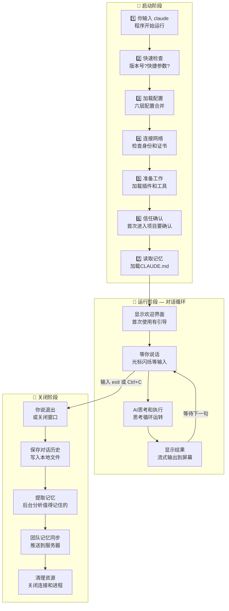

### 启动阶段的并行优化

Claude Code 的启动经过精心优化，很多步骤是同时进行的，就像一个高效的厨房——洗菜、烧水、预热烤箱同时开始：

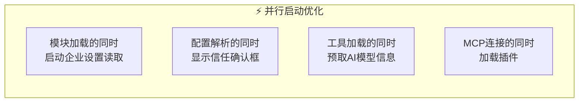

**通俗解读：**

整个生命周期像一天的营业——早上开店（启动阶段，加载配置、连网、装工具、读记忆），白天接待客人（运行阶段，你问一句 AI 回一句，循环往复），晚上打烊（关闭阶段，保存记录、提取记忆、清理资源）。
启动阶段做了大量并行优化，很多准备工作同时进行，所以即使步骤很多，启动速度依然很快。
关闭时最重要的事是保存对话记录和提取长期记忆——这样下次开张时，AI 还能记得你之前说过什么。

---

## 全文总结

> **一句话概括 Claude Code：**
>
> Claude Code 是一间七层智能大楼——你从任意入口走进来（终端/网页/编辑器/API），AI 大脑用 40 多种工具帮你干活，
> 四层安全系统保护你的电脑，记忆系统让 AI 越用越懂你，多助手团队处理复杂任务，
> 六层配置让个人和企业都能灵活管控，插件和 MCP 生态让能力无限扩展。
