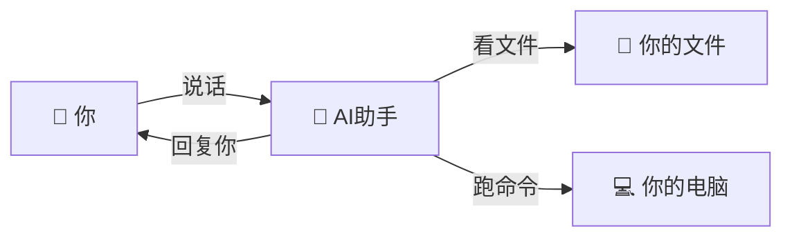
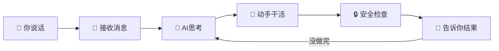
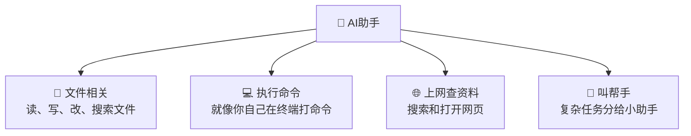
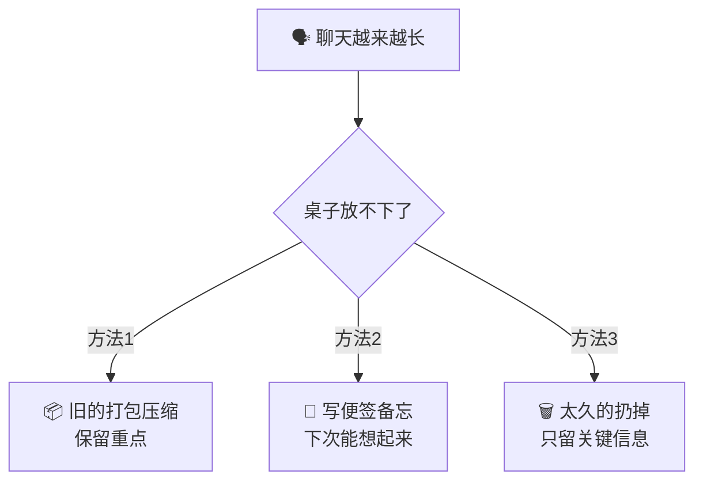
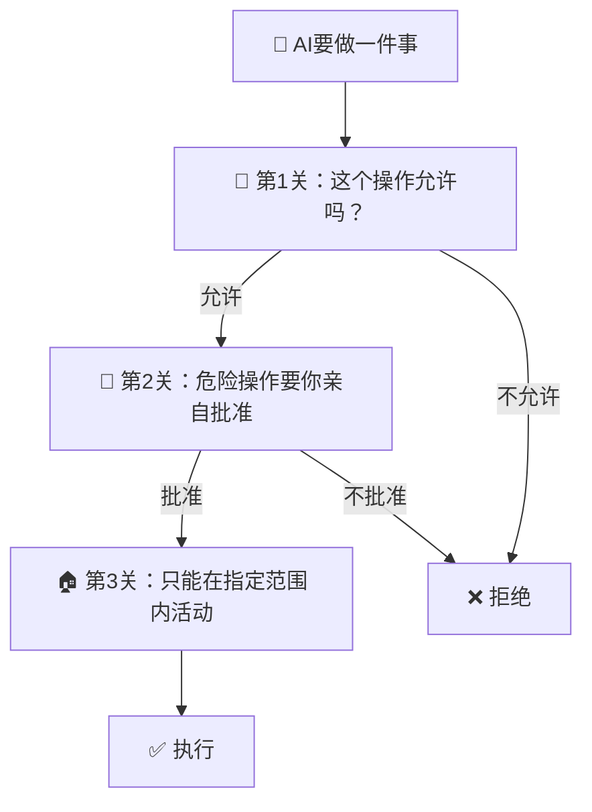
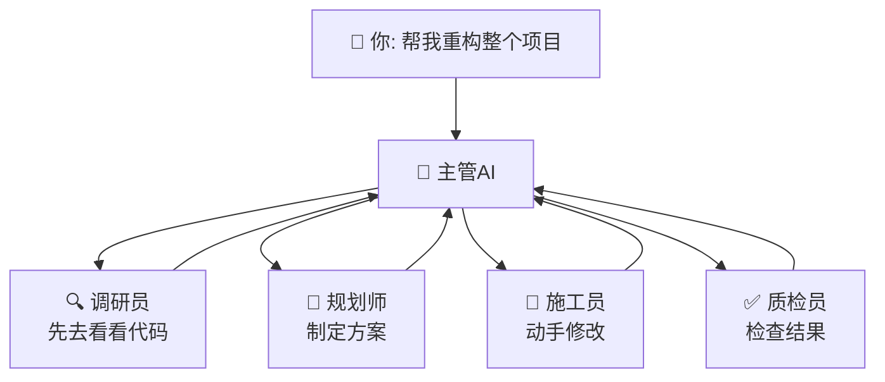

# 🎯 Claude Code 极简图解（小白版）

> 看完这 6 张图，你就知道 Claude Code 是什么、怎么工作的。
>
> 不需要任何编程知识。你奶奶也能看懂。

---

## 图1: 它是什么？

你坐在电脑前，打开一个黑色窗口，跟一个AI助手聊天。你说"帮我改一下代码"，它就真的去改了。

> Claude Code 就像一个住在你电脑终端里的AI程序员。你用文字告诉它要做什么，它就会动手帮你做——能读文件、改代码、执行命令，然后告诉你结果。

---

## 图2: 你说一句话，它做了什么？

你说"帮我修一下这个问题"，然后经历了这些步骤：

> 1. 你在窗口里打了一句话
> 2. 程序收到了你的话
> 3. AI 想了想该怎么做
> 4. AI 挑了个工具去执行（比如打开文件、改代码）
> 5. 系统检查一下这个操作安不安全
> 6. 把结果告诉你。如果事情没做完，它会继续想、继续做，直到搞定。

---

## 图3: AI 手里有什么工具？

> AI 不能凭空变出结果，它要通过"工具"来干活。就像厨师要用刀和锅，AI 也要用这些工具来操作你的电脑。

---

## 图4: 它怎么记住我们聊了什么？

AI 的记忆有大小限制，就像桌子只有这么大。聊多了就放不下了。

> AI 的"记忆"有大小限制，就像桌子只有这么大。聊多了就放不下了，所以它会把旧的内容压缩总结、写备忘录、或者扔掉不重要的，腾出空间继续聊。

---

## 图5: 安全吗？会不会乱搞我的电脑？

每次 AI 要做点什么，都要过三关：

> 放心，AI 不会乱来。每次要做点什么都要过三关：首先看规则允不允许，然后危险操作必须你点头同意，最后它也只能在你给定的范围里活动。你可以理解为：它是个实习生，干什么都要你签字。

---

## 图6: 复杂任务怎么办？

遇到大任务，AI 会像项目经理一样把活分出去。

> 遇到大任务，AI 会像项目经理一样把活分出去：先派人去调研现状，再让人制定方案，然后安排人动手，最后还有人检查质量。这些"小助手"各有分工，做完后向主管汇报。

---

## 一句话总结

**Claude Code = 一个住在你电脑终端里的AI程序员，你告诉它做什么，它就用各种工具帮你做，做之前会问你同不同意，做完了告诉你结果。**

---

> 想深入了解技术细节？请看 [完整可视化指南](./00-visual-guide.md) 或 [架构全景总览](./00-overview.md)。
