# Claude Code CLI 可视化架构指南

> **给谁看：** 本文专为**非开发者**撰写——产品经理、设计师、管理者、市场人员，
> 以及一切好奇 "Claude Code 到底是怎么工作的" 但不想看代码的朋友。
>
> 全文零代码、零术语（必须出现的术语会用括号附上简单解释），
> 每一个概念都配有大幅 ASCII 示意图和日常生活类比。

---

## 目录

1. [Claude Code 是什么？（智能办公室类比）](#图1-claude-code-是什么智能办公室类比)
2. [一次对话的完整旅程](#图2-一次对话的完整旅程)
3. [工具箱全景图](#图3-工具箱全景图)
4. [大脑怎么记住之前说的话？](#图4-大脑怎么记住之前说的话)
5. [安全保障体系](#图5-安全保障体系)
6. [多人协作（多 Agent 系统）](#图6-多人协作多-agent-系统)
7. [启动过程（开机流程）](#图7-启动过程开机流程)
8. [配置系统（层层覆盖）](#图8-配置系统层层覆盖)
9. [插件和技能生态](#图9-插件和技能生态)
10. [数据的一生](#图10-数据的一生)

---

## 图1: Claude Code 是什么？（智能办公室类比）

想象你走进了一间 **AI 助手的办公室**。
你是客户，Claude 是坐在办公桌后面的智能助手，桌上摆满了各种办公工具。

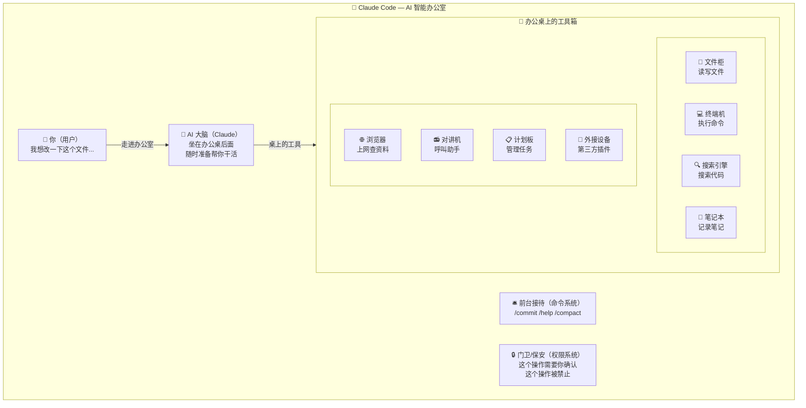

**一句话总结：**
Claude Code 就像一间智能办公室——你说需求，AI 助手 Claude 用桌上的 40 多种工具帮你干活，
前台帮你对接服务，保安确保一切安全合规。

---

## 图2: 一次对话的完整旅程

当你在终端里打字，按下回车，到最终看到回复，
中间经历了一条完整的 "流水线"。就像寄快递一样，包裹经过层层处理才到你手上。

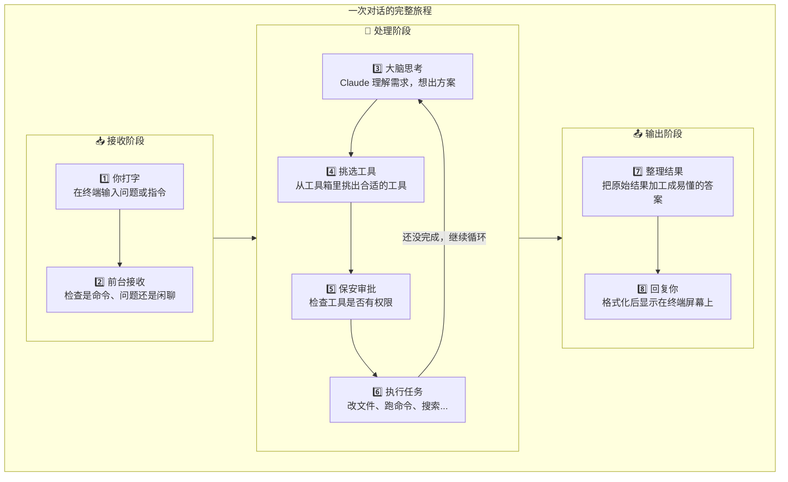

**一句话总结：**
你的每条消息都经过"接收 -> 思考 -> 选工具 -> 审批 -> 执行 -> 整理 -> 回复"七站流水线，
如果任务没做完，Claude 会自动循环 "思考 -> 执行" 直到搞定。

---

## 图3: 工具箱全景图

Claude Code 内置了 **40 多种工具**，就像一个超级工具箱。
这些工具按用途分成七大类：

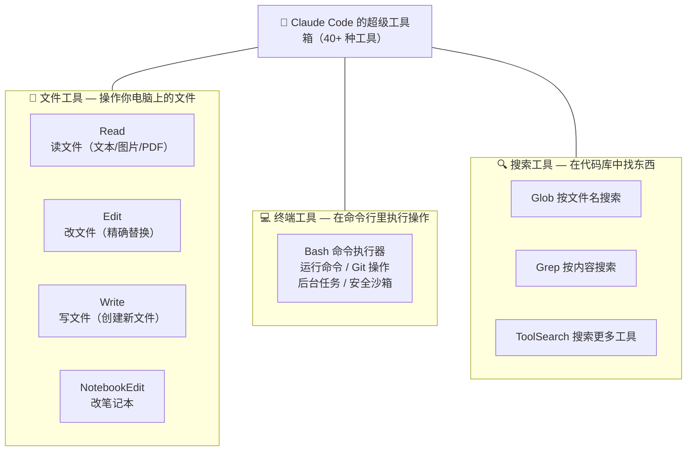

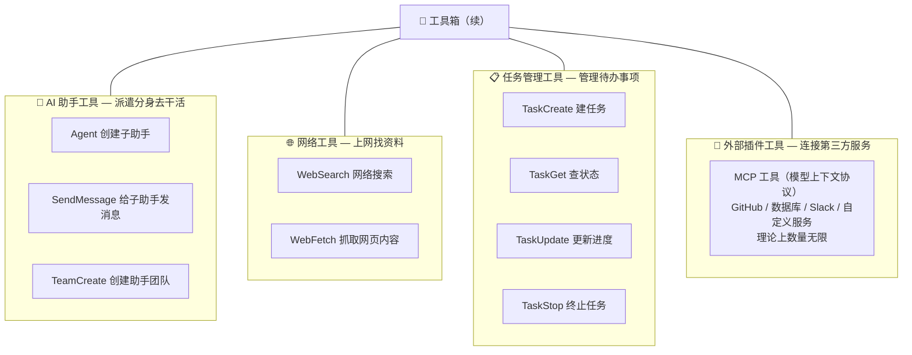

**一句话总结：**
Claude Code 有 40 多种内置工具，分为文件操作、命令执行、代码搜索、AI 分身、
网络查询、任务管理、外部插件七大类，覆盖了软件开发的方方面面。

---

## 图4: 大脑怎么记住之前说的话？

AI 的 "记忆" 其实是有限的。
想象 Claude 的大脑就是一张 **书桌**——桌面大小有限，不能把所有文件都摊开。

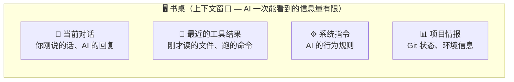

桌面快满了怎么办？Claude 有**四大记忆管理策略**：

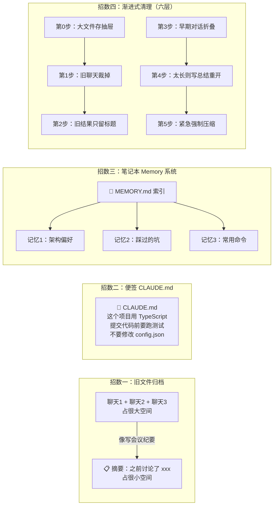

**一句话总结：**
Claude 的 "书桌" 空间有限，它通过压缩旧对话、阅读项目便签（CLAUDE.md）、
维护长期记忆本（Memory），以及六层渐进式清理策略来管理有限的记忆空间。

---

## 图5: 安全保障体系

Claude Code 处理的是你的真实文件和代码，安全至关重要。
它的安全体系就像一个 **银行保险库**，有多层防护：

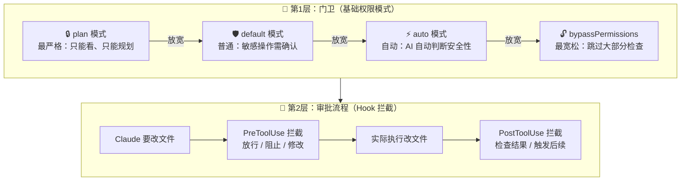

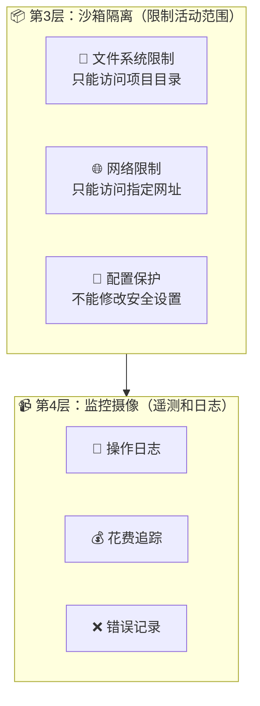

**一句话总结：**
Claude Code 有四层安全防护——权限模式控制大方向，Hook 拦截做精细审批，
沙箱隔离限制活动范围，遥测日志记录一切操作以备审计。

---

## 图6: 多人协作（多 Agent 系统）

当任务比较复杂时，Claude 不是一个人在战斗——它可以组建 **项目团队**，
把大任务拆分给多个 "分身" 同时处理。

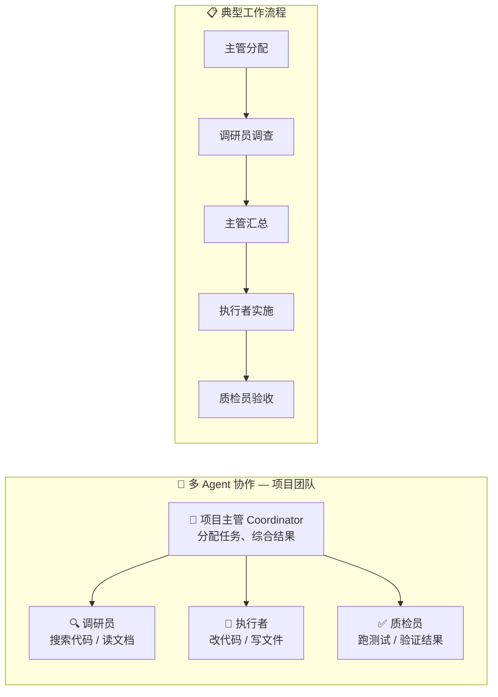

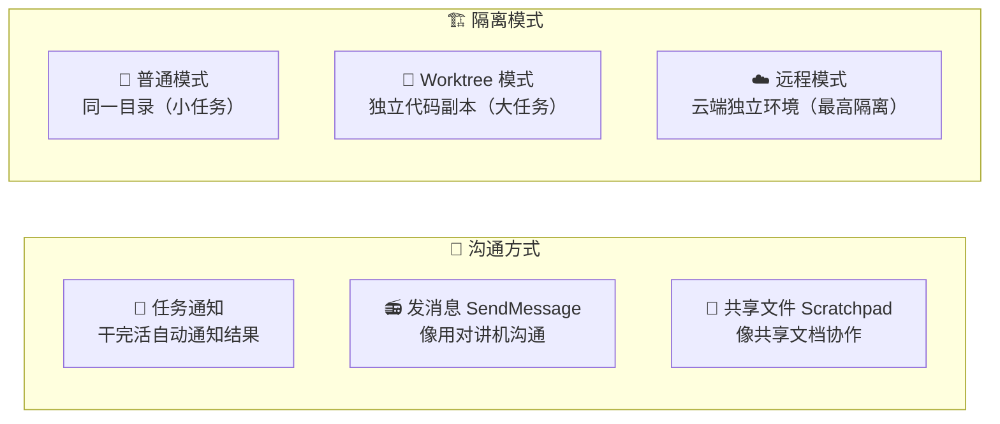

**一句话总结：**
Claude 可以组建项目团队——主管分配任务，调研员负责看，执行者负责做，
质检员负责查，多人协作互不干扰，大任务也能高效完成。

---

## 图7: 启动过程（开机流程）

每次你在终端输入 `claude` 命令启动 Claude Code，就像一家 **餐厅开门营业**：

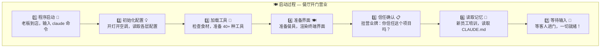

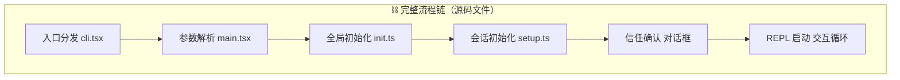

**一句话总结：**
Claude Code 启动就像餐厅开门——先检查环境、加载配置、准备工具、确认信任，
最后一切就绪，等你 "下单"。

---

## 图8: 配置系统（层层覆盖）

Claude Code 的配置就像 **穿衣服**——一层套一层，外面的会遮住里面的：

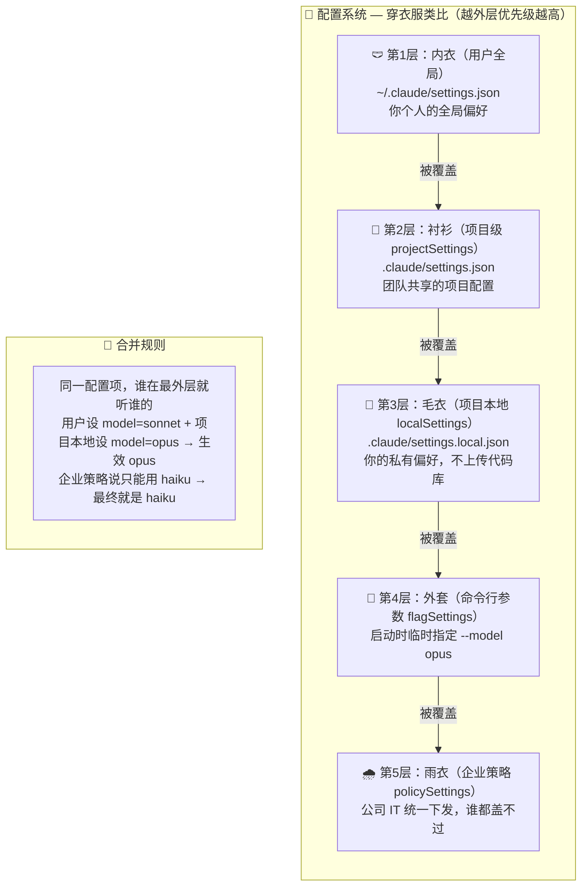

**一句话总结：**
配置像穿衣服——用户全局设置是内衣，项目设置是衬衫，本地设置是毛衣，
命令行参数是外套，企业策略是雨衣；外层永远覆盖内层，企业策略说了算。

---

## 图9: 插件和技能生态

Claude Code 不只是一个封闭的工具，它像手机一样有自己的 "应用商店"：

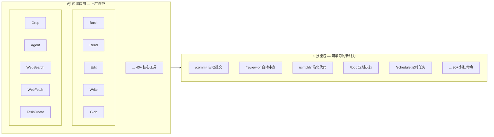

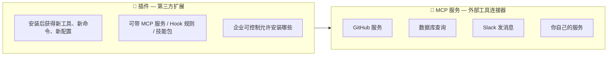

**一句话总结：**
Claude Code 有四层扩展能力——内置工具开箱即用，技能包提供快捷操作，
插件市场可安装第三方扩展，MCP 协议可连接任意外部服务，生态无限扩展。

---

## 图10: 数据的一生

你和 Claude Code 对话产生的数据，从诞生到被再次使用，走过一条完整的生命旅程：

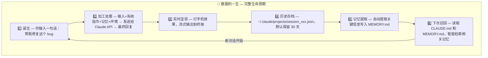

**一句话总结：**
数据从你输入的那一刻诞生，经历加工处理、实时显示、本地存档、记忆提取，
最终在下次对话时被自动召回——形成一个不断学习和记忆的循环。

---

## 全文总结

> **一句话概括 Claude Code：**
>
> Claude Code 是一间 AI 智能办公室——你提需求，Claude 用 40 多种工具帮你干活，
> 有安保系统确保安全，有团队协作处理大任务，有记忆系统越用越懂你，
> 还有插件商店让能力无限扩展。
