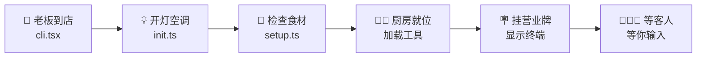

# Claude Code CLI 入口与启动流程架构分析

> 基于 Claude Code v2.1.88 源码分析

---

## 简明图解



---

## 目录

1. [总体架构概览](#1-总体架构概览)
2. [启动流程全景图](#2-启动流程全景图)
3. [入口点详解](#3-入口点详解)
4. [Bootstrap 阶段分析](#4-bootstrap-阶段分析)
5. [CLI 参数解析逻辑](#5-cli-参数解析逻辑)
6. [Setup 初始化阶段](#6-setup-初始化阶段)
7. [交互式与非交互式分支](#7-交互式与非交互式分支)
8. [启动顺序与依赖关系](#8-启动顺序与依赖关系)

---

## 1. 总体架构概览

Claude Code 的启动流程是一条多层级的链路,从 CLI 二进制执行到进入交互循环(REPL),经历了以下关键阶段:

```
用户输入 `claude`
    |
    v
[cli.tsx] 入口分发 ─── 快速路径(--version, --dump-system-prompt, mcp, daemon, bridge...)
    |
    v (常规路径)
[main.tsx] Commander 命令解析 + preAction 钩子
    |
    v
[init.ts] 全局初始化(配置、网络、遥测、CA证书、代理...)
    |
    v
[setup.ts] 会话级初始化(cwd、hooks、worktree、后台任务...)
    |
    v
[interactiveHelpers.tsx] 交互对话框(Onboarding、Trust Dialog...)
    |                         |
    | (交互模式)              | (非交互 --print 模式)
    v                         v
[replLauncher.tsx]        [print.ts]
  App + REPL 组件           runHeadless()
```

### 核心文件清单

| 文件路径 | 职责 |
|---------|------|
| `src/entrypoints/cli.tsx` | 顶层入口,快速路径分发 |
| `src/entrypoints/init.ts` | 全局初始化(memoized,仅执行一次) |
| `src/entrypoints/mcp.ts` | MCP Server 入口 |
| `src/entrypoints/agentSdkTypes.ts` | Agent SDK 类型导出与存根函数 |
| `src/entrypoints/sdk/` | SDK 核心类型与 schema 定义 |
| `src/bootstrap/state.ts` | 全局可变状态管理(会话ID、cwd、计量器等) |
| `src/main.tsx` | CLI Commander 定义 + 主命令 action 处理 |
| `src/setup.ts` | 会话级 setup(cwd、worktree、hooks、后台任务) |
| `src/replLauncher.tsx` | 懒加载 App + REPL 组件并挂载 |
| `src/dialogLaunchers.tsx` | 各类对话框的薄启动器 |
| `src/interactiveHelpers.tsx` | 交互模式辅助函数(setup screens、render、shutdown) |

---

## 2. 启动流程全景图

### 从命令行到交互循环的完整链路

```
cli.tsx::main()                        [阶段 1: 入口分发]
  |
  |-- 快速路径检查:
  |     --version           → 直接输出版本号, return
  |     --dump-system-prompt → 输出系统 prompt, return
  |     --daemon-worker     → 启动 daemon worker, return
  |     remote-control      → 启动 bridge 模式, return
  |     daemon              → 启动 daemon supervisor, return
  |     ps/logs/attach/kill → 后台会话管理, return
  |     new/list/reply      → 模板任务, return
  |     environment-runner  → BYOC runner, return
  |     self-hosted-runner  → 自托管 runner, return
  |     --tmux + --worktree → exec 进 tmux, return
  |
  |-- 常规路径:
  |     startCapturingEarlyInput()  // 开始捕获用户早期输入
  |     import('../main.js')        // 动态加载 main.tsx
  |     await cliMain()             // 进入主函数
  |
  v
main.tsx::main()                       [阶段 2: 主函数初始化]
  |
  |-- 安全设置(NoDefaultCurrentDirectoryInExePath)
  |-- 初始化 warning handler
  |-- 处理特殊 URL(cc://, 深度链接)
  |-- 处理子命令(assistant, ssh)的 argv 重写
  |-- 检测交互模式(isNonInteractive)
  |-- 设置 clientType(cli/sdk-cli/remote 等)
  |-- eagerLoadSettings() — 提前解析 --settings / --setting-sources
  |
  v
main.tsx::run()                        [阶段 3: Commander 命令解析]
  |
  |-- new CommanderCommand() 构建程序定义
  |-- program.hook('preAction', ...) 注册预执行钩子:
  |     |-- ensureMdmSettingsLoaded() + ensureKeychainPrefetchCompleted()
  |     |-- init()                  // 全局初始化 (init.ts)
  |     |-- initSinks()            // 日志/分析事件 sink
  |     |-- setInlinePlugins()     // --plugin-dir 处理
  |     |-- runMigrations()        // 数据迁移
  |     |-- loadRemoteManagedSettings() + loadPolicyLimits()
  |
  |-- program.action(async (prompt, options) => { ... })
  |     |
  |     v
  |   [action handler 开始]            [阶段 4: 命令 action 执行]
  |     |
  |     |-- 选项解析(debug, permissionMode, mcpConfig, model 等)
  |     |-- setup() 调用              [阶段 5: 会话 setup]
  |     |-- MCP 配置解析与连接
  |     |-- SessionStart hooks 启动
  |     |
  |     |-- 分支判断:
  |     |     isNonInteractiveSession? ──→ runHeadless() (print.ts)
  |     |     options.resume?          ──→ 恢复会话
  |     |     options.continue?        ──→ 继续上次会话
  |     |     正常启动                 ──→ 继续下方
  |     |
  |     v
  |   [交互模式路径]                   [阶段 6: 交互式启动]
  |     |
  |     |-- getRenderContext() 创建 Ink 渲染上下文
  |     |-- createRoot() 创建 Ink root
  |     |-- showSetupScreens() — 显示引导界面:
  |     |     |-- Onboarding 组件(首次运行)
  |     |     |-- TrustDialog 组件(工作区信任确认)
  |     |     |-- MCP server 审批
  |     |     |-- CLAUDE.md external includes 检查
  |     |     |-- applyConfigEnvironmentVariables()
  |     |     |-- initializeTelemetryAfterTrust()
  |     |
  |     |-- 验证 org / settings / quota
  |     |
  |     v
  |   launchRepl()                     [阶段 7: REPL 启动]
  |     |
  |     |-- import App 组件
  |     |-- import REPL 组件
  |     |-- renderAndRun(root, <App><REPL /></App>)
  |     |     |-- root.render(element)
  |     |     |-- startDeferredPrefetches() — 延迟预取
  |     |     |-- await root.waitUntilExit()
  |     |     |-- await gracefulShutdown(0)
```

---

## 3. 入口点详解

### 3.1 CLI 入口 — `src/entrypoints/cli.tsx`

这是整个程序的最顶层入口。文件末尾通过 `void main()` 立即调用主函数。

**关键设计**:所有 import 都是动态的(`await import(...)`)以最小化模块评估开销。`--version` 快速路径实现了零模块加载。

```
cli.tsx::main()
```

**快速路径分发**:

| 参数 | 处理逻辑 | 说明 |
|------|---------|------|
| `--version` / `-v` / `-V` | 直接输出 `MACRO.VERSION` | 零依赖,最快路径 |
| `--dump-system-prompt` | 输出系统 prompt(ant-only) | 需要 enableConfigs |
| `--claude-in-chrome-mcp` | Chrome MCP Server | 独立 MCP 入口 |
| `--chrome-native-host` | Chrome Native Host | Chrome 扩展通信 |
| `--computer-use-mcp` | Computer Use MCP(feature gated) | 计算机使用 MCP |
| `--daemon-worker` | Daemon Worker 进程 | 精简初始化,无 configs |
| `remote-control` / `rc` | Bridge 远程控制模式 | 需要 OAuth 认证 |
| `daemon` | Daemon Supervisor | 长运行管理进程 |
| `ps` / `logs` / `attach` / `kill` / `--bg` | 后台会话管理 | Feature gated |
| `new` / `list` / `reply` | 模板任务 | Feature gated |
| `environment-runner` | BYOC Runner | 无头环境运行器 |
| `self-hosted-runner` | 自托管 Runner | 轮询式 worker |
| `--tmux` + `--worktree` | 执行进 tmux | 在加载完整 CLI 之前 exec |

**顶层环境设置**(在 `main()` 之前):

- `COREPACK_ENABLE_AUTO_PIN=0` — 防止 corepack 修改 package.json
- CCR(远程)环境下设置 `NODE_OPTIONS --max-old-space-size=8192`
- 烧蚀基线(ABLATION_BASELINE)模式下设置多个禁用环境变量

### 3.2 MCP Server 入口 — `src/entrypoints/mcp.ts`

`startMCPServer(cwd, debug, verbose)` 函数实现了 Claude Code 作为 MCP Server 运行的能力。

- 使用 `@modelcontextprotocol/sdk` 创建 MCP Server 实例
- 通过 `StdioServerTransport` 使用标准输入/输出通信
- 暴露 Claude Code 内置工具为 MCP 工具
- 配置 `isNonInteractiveSession: true`
- 使用 LRU 缓存(100 文件/25MB)管理文件状态

### 3.3 Agent SDK 入口 — `src/entrypoints/agentSdkTypes.ts`

这是 SDK 消费者使用的公开 API 入口。它导出:

- **类型**:从 `sdk/coreTypes.ts`(可序列化类型) 和 `sdk/runtimeTypes.ts`(回调、接口)
- **存根函数**:
  - `query()` — 执行单次查询
  - `tool()` — 定义自定义 MCP 工具
  - `createSdkMcpServer()` — 创建 SDK MCP Server
  - `unstable_v2_createSession()` — 创建持久会话(alpha)
  - `unstable_v2_resumeSession()` — 恢复会话(alpha)
  - `unstable_v2_prompt()` — 一次性查询便捷函数(alpha)
  - `getSessionMessages()` / `listSessions()` / `getSessionInfo()` — 会话管理
  - `renameSession()` / `tagSession()` / `forkSession()` — 会话操作
  - `watchScheduledTasks()` — 定时任务调度(internal)
  - `connectRemoteControl()` — 远程控制桥接(internal)

所有函数在类型包中都是 `throw new Error('not implemented')` 存根;真正的实现在构建时通过别名注入。

### 3.4 SDK 类型定义 — `src/entrypoints/sdk/`

| 文件 | 说明 |
|------|------|
| `coreTypes.ts` | 核心可序列化类型(messages、configs),从 Zod schema 生成 |
| `coreSchemas.ts` | Zod schema 定义,用于运行时验证 |
| `controlSchemas.ts` | SDK 控制协议 schema |

### 3.5 各入口点对比

| 入口 | 文件 | 初始化深度 | 用途 |
|------|------|-----------|------|
| CLI 交互模式 | `cli.tsx` -> `main.tsx` | 完整(init + setup + trust + REPL) | 日常交互使用 |
| CLI 打印模式(`-p`) | `cli.tsx` -> `main.tsx` -> `print.ts` | 完整但无 UI(init + setup + runHeadless) | 脚本集成、管道 |
| MCP Server | `mcp.ts` | 中等(setCwd + 工具注册) | 作为 MCP 工具提供者 |
| Agent SDK | `agentSdkTypes.ts` | 类型仅,实现在构建时注入 | 程序化 SDK 调用 |
| Daemon Worker | `cli.tsx` -> `daemon/workerRegistry.js` | 精简(无 enableConfigs) | 后台 worker 进程 |
| Bridge/Remote Control | `cli.tsx` -> `bridge/bridgeMain.js` | 中等(enableConfigs + OAuth) | 远程控制桥接 |
| Environment Runner | `cli.tsx` -> `environment-runner/main.js` | 精简 | BYOC 无头运行器 |

---

## 4. Bootstrap 阶段分析

### 4.1 全局状态 — `src/bootstrap/state.ts`

这是整个应用的全局可变状态中心。采用模块级单例模式,通过 getter/setter 函数访问。

**核心状态字段**:

| 字段 | 类型 | 说明 |
|------|------|------|
| `originalCwd` | `string` | 原始工作目录 |
| `projectRoot` | `string` | 稳定的项目根目录(启动时设定一次) |
| `sessionId` | `SessionId` | 当前会话 UUID |
| `isInteractive` | `boolean` | 是否为交互模式 |
| `mainLoopModelOverride` | `ModelSetting` | 模型覆盖 |
| `totalCostUSD` | `number` | 累计 API 花费 |
| `meter` / `sessionCounter` / ... | OTEL 类型 | 遥测计量器 |
| `registeredHooks` | Hook 映射 | SDK 和插件钩子注册 |
| `kairosActive` | `boolean` | 助手模式是否激活 |
| `sessionBypassPermissionsMode` | `boolean` | 权限绕过标志 |
| `invokedSkills` | `Map` | 已调用的 skills 缓存 |

**关键导出函数**(部分):

- `getSessionId()` / `switchSession()` — 会话 ID 管理
- `getOriginalCwd()` / `setOriginalCwd()` — 原始工作目录
- `getProjectRoot()` / `setProjectRoot()` — 项目根目录
- `setIsInteractive()` — 设置交互模式标志
- `setClientType()` — 设置客户端类型
- `setMeter()` / `getSessionCounter()` — 遥测状态
- `getIsNonInteractiveSession()` — 判断是否非交互(print 模式)

### 4.2 全局初始化 — `src/entrypoints/init.ts`

`init()` 函数使用 `memoize` 包装,确保全局只执行一次。它在 Commander 的 `preAction` 钩子中被调用。

**初始化顺序**:

```
init()
  |
  |-- 1. enableConfigs()                    // 启用配置系统,验证配置有效性
  |-- 2. applySafeConfigEnvironmentVariables()  // 仅应用安全的环境变量(trust 前)
  |-- 3. applyExtraCACertsFromConfig()      // 应用自定义 CA 证书(必须在首个 TLS 连接前)
  |-- 4. setupGracefulShutdown()            // 注册优雅退出处理
  |-- 5. initialize1PEventLogging()         // 第一方事件日志(懒加载)
  |-- 6. populateOAuthAccountInfoIfNeeded() // 填充 OAuth 账户信息
  |-- 7. initJetBrainsDetection()           // JetBrains IDE 检测(异步)
  |-- 8. detectCurrentRepository()          // GitHub 仓库检测(异步)
  |-- 9. initializeRemoteManagedSettingsLoadingPromise()  // 远程管理设置
  |-- 10. initializePolicyLimitsLoadingPromise()          // 策略限制
  |-- 11. recordFirstStartTime()            // 记录首次启动时间
  |-- 12. configureGlobalMTLS()             // mTLS 配置
  |-- 13. configureGlobalAgents()           // HTTP 代理配置
  |-- 14. preconnectAnthropicApi()          // 预连接 API(TCP+TLS 握手重叠)
  |-- 15. initUpstreamProxy()               // 上游代理(仅 CCR 环境)
  |-- 16. setShellIfWindows()               // Windows shell 设置
  |-- 17. registerCleanup(shutdownLspServerManager)  // LSP 清理注册
  |-- 18. registerCleanup(cleanupSessionTeams)       // 会话 team 清理
  |-- 19. ensureScratchpadDir()             // Scratchpad 目录(如启用)
```

**遥测初始化**:

`initializeTelemetryAfterTrust()` 在 trust 确认后被调用,通过 `doInitializeTelemetry()` 懒加载 OpenTelemetry 模块(约 400KB),避免启动时加载。

**错误处理**:

- `ConfigParseError` → 非交互模式输出到 stderr;交互模式显示 `InvalidConfigDialog`
- 其他错误直接抛出

### 4.3 模块加载时的副作用 — `src/main.tsx` 顶部

`main.tsx` 在模块评估阶段(import 时)就执行了三个关键副作用:

```typescript
profileCheckpoint('main_tsx_entry');       // 标记入口时间点
startMdmRawRead();                         // 启动 MDM 子进程(plutil/reg query)
startKeychainPrefetch();                   // 启动 macOS Keychain 预读取
```

这些操作在 import 时立即运行,利用模块加载的 135ms 窗口并行执行子进程,是一个重要的启动性能优化。

---

## 5. CLI 参数解析逻辑

### 5.1 解析框架

使用 `@commander-js/extra-typings` 的 `CommanderCommand` 构建命令行界面。

```typescript
// src/main.tsx:902
const program = new CommanderCommand()
  .configureHelp(createSortedHelpConfig())
  .enablePositionalOptions();
```

### 5.2 核心选项

| 选项 | 说明 |
|------|------|
| `-p, --print` | 非交互打印模式 |
| `-d, --debug [filter]` | 调试模式(支持分类过滤) |
| `--verbose` | 详细输出 |
| `--model <model>` | 指定模型(别名或全名) |
| `--effort <level>` | 努力级别(low/medium/high/max) |
| `-c, --continue` | 继续最近的对话 |
| `-r, --resume [value]` | 恢复指定会话 |
| `--permission-mode <mode>` | 权限模式 |
| `--dangerously-skip-permissions` | 绕过权限检查(仅限沙箱) |
| `--output-format <format>` | 输出格式(text/json/stream-json) |
| `--input-format <format>` | 输入格式(text/stream-json) |
| `--mcp-config <configs...>` | MCP 服务器配置 |
| `--allowedTools <tools...>` | 允许的工具列表 |
| `--disallowedTools <tools...>` | 禁止的工具列表 |
| `--system-prompt <prompt>` | 自定义系统提示 |
| `--append-system-prompt <prompt>` | 追加系统提示 |
| `--settings <file-or-json>` | 额外设置(文件路径或 JSON) |
| `--add-dir <dirs...>` | 额外允许访问的目录 |
| `-w, --worktree [name]` | 创建 git worktree |
| `--tmux` | 创建 tmux 会话 |
| `--bare` | 精简模式(跳过 hooks、LSP、插件等) |
| `--session-id <uuid>` | 指定会话 ID |
| `-n, --name <name>` | 会话显示名称 |
| `--agents <json>` | 自定义 agent 定义 |
| `--plugin-dir <path>` | 加载插件目录(可重复) |

### 5.3 子命令

| 子命令 | 说明 |
|--------|------|
| `mcp serve` | 启动 MCP Server |
| `mcp add-json <name> <json>` | 添加 MCP 服务器 |
| `mcp remove <name>` | 移除 MCP 服务器 |
| `mcp list` | 列出 MCP 服务器 |
| `auth login` | 登录 |
| `auth status` | 认证状态 |
| `auth logout` | 登出 |
| `plugin install/uninstall/enable/disable/update` | 插件管理 |
| `plugin marketplace add/list/remove/update` | 市场管理 |
| `doctor` | 健康检查 |
| `setup-token` | 设置长期认证令牌 |
| `agents` | 列出配置的 agents |
| `auto-mode defaults/config/critique` | Auto Mode 检查(ant-only) |

### 5.4 早期参数解析

某些参数需要在 `init()` 之前解析:

```typescript
// src/main.tsx:502-516
function eagerLoadSettings(): void {
  const settingsFile = eagerParseCliFlag('--settings');
  if (settingsFile) loadSettingsFromFlag(settingsFile);

  const settingSourcesArg = eagerParseCliFlag('--setting-sources');
  if (settingSourcesArg !== undefined) loadSettingSourcesFromFlag(settingSourcesArg);
}
```

交互模式检测也在 `init()` 之前进行:

```typescript
// src/main.tsx:800-803
const hasPrintFlag = cliArgs.includes('-p') || cliArgs.includes('--print');
const hasInitOnlyFlag = cliArgs.includes('--init-only');
const hasSdkUrl = cliArgs.some(arg => arg.startsWith('--sdk-url'));
const isNonInteractive = hasPrintFlag || hasInitOnlyFlag || hasSdkUrl || !process.stdout.isTTY;
```

### 5.5 preAction 钩子

Commander 的 `preAction` 钩子在执行任何命令之前触发(帮助页面除外),执行全局初始化:

```
preAction钩子:
  1. ensureMdmSettingsLoaded()         // 等待 MDM 设置加载完成
  2. ensureKeychainPrefetchCompleted() // 等待 Keychain 预取完成
  3. init()                            // 全局初始化
  4. initSinks()                       // 日志/分析事件 sink
  5. setInlinePlugins()                // 处理 --plugin-dir
  6. runMigrations()                   // 数据迁移(版本化)
  7. loadRemoteManagedSettings()       // 远程管理设置(非阻塞)
  8. loadPolicyLimits()                // 策略限制(非阻塞)
```

---

## 6. Setup 初始化阶段

### 6.1 setup() 函数 — `src/setup.ts`

`setup()` 是会话级初始化,在每个 CLI 命令执行时调用。它的签名:

```typescript
export async function setup(
  cwd: string,
  permissionMode: PermissionMode,
  allowDangerouslySkipPermissions: boolean,
  worktreeEnabled: boolean,
  worktreeName: string | undefined,
  tmuxEnabled: boolean,
  customSessionId?: string | null,
  worktreePRNumber?: number,
  messagingSocketPath?: string,
): Promise<void>
```

**初始化步骤**:

```
setup()
  |
  |-- 1. Node.js 版本检查(>= 18)
  |-- 2. 自定义 session ID 设置
  |-- 3. UDS 消息服务器启动(非 --bare 模式)
  |-- 4. Teammate 模式快照捕获
  |-- 5. 终端备份恢复(iTerm2 / Terminal.app)
  |-- 6. setCwd(cwd)                    // 设置工作目录(关键: 必须在其他依赖 cwd 的代码之前)
  |-- 7. captureHooksConfigSnapshot()   // 捕获 hooks 配置快照
  |-- 8. initializeFileChangedWatcher() // 文件变更 hook 监听器
  |-- 9. Worktree 创建(如请求):
  |     |-- git 仓库验证
  |     |-- createWorktreeForSession()
  |     |-- tmux 会话创建(如启用)
  |     |-- 更新 cwd / originalCwd / projectRoot
  |     |-- clearMemoryFileCaches()
  |     |-- updateHooksConfigSnapshot()
  |-- 10. 后台任务注册:
  |     |-- initSessionMemory()
  |     |-- initContextCollapse() (feature gated)
  |     |-- lockCurrentVersion()
  |-- 11. 预取启动:
  |     |-- getCommands()              // 命令加载
  |     |-- loadPluginHooks()          // 插件 hook 加载
  |     |-- setupPluginHookHotReload() // 插件热重载
  |-- 12. 归因跟踪注册(ant-only):
  |     |-- registerAttributionHooks()
  |     |-- registerSessionFileAccessHooks()
  |     |-- startTeamMemoryWatcher()
  |-- 13. initSinks()                  // 错误日志 + 分析 sink
  |-- 14. logEvent('tengu_started')    // 会话启动信标
  |-- 15. prefetchApiKeyFromApiKeyHelperIfSafe()
  |-- 16. 发布说明检查(非 --bare)
  |-- 17. --dangerously-skip-permissions 安全验证:
  |     |-- 检查是否 root/sudo 运行
  |     |-- 检查 Docker/沙箱/网络隔离
  |-- 18. 上次会话 exit 事件记录
```

### 6.2 setup() 与 init() 的并行化

在 `main.tsx` 中,`setup()` 与命令加载和 agent 定义加载并行执行:

```typescript
// src/main.tsx:1927-1934
const setupPromise = setup(preSetupCwd, permissionMode, ...);
const commandsPromise = worktreeEnabled ? null : getCommands(preSetupCwd);
const agentDefsPromise = worktreeEnabled ? null : getAgentDefinitionsWithOverrides(preSetupCwd);
await setupPromise;
```

当 `--worktree` 启用时,由于 `setup()` 会 `process.chdir()`,命令和 agent 定义加载必须等待 setup 完成。

---

## 7. 交互式与非交互式分支

### 7.1 交互模式(默认)

进入交互模式后的关键路径:

```
1. getRenderContext()     → 创建 FPS 追踪器 + StatsStore
2. createRoot()           → 创建 Ink 渲染根节点
3. showSetupScreens()     → 显示引导对话框:
   |-- Onboarding 组件(首次使用)
   |-- TrustDialog(工作区信任)
   |-- MCP Server 审批
   |-- ClaudeMd External Includes 审批
   |-- applyConfigEnvironmentVariables()(trust 后应用全部环境变量)
   |-- initializeTelemetryAfterTrust()
4. 验证流程:
   |-- validateForceLoginOrg()
   |-- launchInvalidSettingsDialog()
   |-- checkQuotaStatus() / fetchBootstrapData()
5. launchRepl()           → 挂载 REPL
```

### 7.2 非交互模式(--print)

```
1. applyConfigEnvironmentVariables()    // trust 隐含,直接应用
2. initializeTelemetryAfterTrust()
3. processSessionStartHooks('startup')  // 并行启动
4. validateForceLoginOrg()
5. MCP 连接
6. runHeadless()                        // 执行查询并输出
```

### 7.3 REPL 启动 — `src/replLauncher.tsx`

```typescript
export async function launchRepl(root, appProps, replProps, renderAndRun) {
  const { App } = await import('./components/App.js');
  const { REPL } = await import('./screens/REPL.js');
  await renderAndRun(root, <App {...appProps}><REPL {...replProps} /></App>);
}
```

`renderAndRun()` (来自 `interactiveHelpers.tsx`):

```typescript
export async function renderAndRun(root, element) {
  root.render(element);
  startDeferredPrefetches();  // 延迟预取(用户上下文、tips、文件计数等)
  await root.waitUntilExit();
  await gracefulShutdown(0);
}
```

### 7.4 对话框启动器 — `src/dialogLaunchers.tsx`

为 `main.tsx` 中的各种对话框提供薄包装:

| 启动器 | 用途 |
|--------|------|
| `launchSnapshotUpdateDialog()` | Agent 内存快照更新提示 |
| `launchInvalidSettingsDialog()` | 设置验证错误 |
| `launchAssistantSessionChooser()` | 选择 bridge 会话 |
| `launchAssistantInstallWizard()` | 助手安装向导 |
| `launchTeleportResumeWrapper()` | Teleport 会话选择器 |
| `launchTeleportRepoMismatchDialog()` | Teleport 仓库不匹配 |
| `launchResumeChooser()` | 恢复对话选择器 |

每个启动器都动态导入其组件,减少初始加载开销。

---

## 8. 启动顺序与依赖关系

### 8.1 关键依赖链

```
[严格顺序]
1. 环境变量设置 (cli.tsx 顶层)
   → 必须在所有 import 前
2. startMdmRawRead() + startKeychainPrefetch() (main.tsx 顶层)
   → 利用 import 时间窗口并行执行
3. enableConfigs() (init.ts)
   → 必须在任何配置读取前
4. applySafeConfigEnvironmentVariables() (init.ts)
   → 必须在 trust 确认前(仅安全变量)
5. applyExtraCACertsFromConfig() (init.ts)
   → 必须在首个 TLS 连接前(Bun 缓存 TLS 证书)
6. configureGlobalMTLS() + configureGlobalAgents() (init.ts)
   → 必须在 preconnectAnthropicApi() 前
7. setCwd() (setup.ts)
   → 必须在任何依赖 cwd 的代码前
8. captureHooksConfigSnapshot() (setup.ts)
   → 必须在 setCwd() 后(从正确目录加载)
9. showSetupScreens() / TrustDialog (interactiveHelpers.tsx)
   → 必须在 applyConfigEnvironmentVariables() 前(不可信环境变量)
   → 必须在 initializeTelemetryAfterTrust() 前
10. setup() (setup.ts)
    → 必须在 launchRepl() 前
```

### 8.2 并行化优化

启动过程中有多处精心设计的并行化:

| 并行任务 | 说明 |
|---------|------|
| MDM 读取 + Keychain 预取 + 模块 import | 模块评估时启动子进程 |
| `setup()` + `getCommands()` + `getAgentDefinitions()` | 非 worktree 模式下并行 |
| MCP 配置解析 + setup + trust dialog | 配置 I/O 与 UI 重叠 |
| `processSessionStartHooks()` + MCP 连接 | hooks 与 MCP 并行 |
| `preconnectAnthropicApi()` + action handler 工作 | TCP+TLS 握手与逻辑重叠 |

### 8.3 延迟加载策略

以下模块使用延迟加载以减少启动时间:

| 模块 | 延迟原因 |
|------|---------|
| OpenTelemetry (~400KB) | 在遥测实际初始化时才加载 |
| gRPC exporters (~700KB) | 在遥测导出时才加载 |
| React 组件(App, REPL) | 在 `launchRepl()` 时才 import |
| InvalidConfigDialog | 仅在配置错误时加载 |
| 1P Event Logging | 通过 `Promise.all` + `import()` 延迟 |
| attribution hooks | 通过 `setImmediate()` 延迟到下一个 tick |
| upstream proxy | 仅在 CCR 环境加载 |

### 8.4 `--bare` 模式优化

`--bare` 标志设置 `CLAUDE_CODE_SIMPLE=1`,跳过大量启动工作:

- 跳过 hooks、LSP、插件同步、归因
- 跳过自动记忆、后台预取
- 跳过 Keychain 读取(仅使用 `ANTHROPIC_API_KEY` 或 `apiKeyHelper`)
- 跳过 CLAUDE.md 自动发现
- 跳过所有延迟预取(`startDeferredPrefetches` 中的全部内容)
- 跳过插件版本同步和孤立清理
- 跳过发布说明检查

这使得脚本化 `-p` 调用的启动时间显著减少。

### 8.5 启动时间基准

从源码注释和 profiling checkpoints 推断的近似时间:

| 阶段 | 近似耗时 | 说明 |
|------|---------|------|
| 模块 import (main.tsx) | ~135ms | 重模块评估 |
| MDM + Keychain 子进程 | ~65ms | 与 import 并行 |
| `init()` 总计 | ~50-100ms | 配置 + 网络设置 |
| `setup()` 总计 | ~28ms | 主要是 UDS socket bind (~20ms) |
| `showSetupScreens()` | 0ms ~ 70s+ | 取决于用户交互(p99 ~70s) |
| MCP 连接 | 变化大 | 取决于服务器数量和延迟 |
| preconnectAnthropicApi | ~100-200ms | TCP+TLS 握手(重叠执行) |

---

> 本文档基于 Claude Code v2.1.88 反编译源码分析,代码路径均相对于项目根目录 `/Users/mozes/workspace/claude-code-source-code`。
