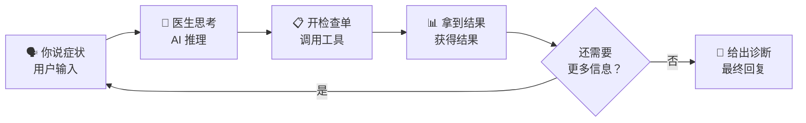

# Claude Code CLI 核心引擎与对话循环 架构分析

> 本文档深入分析 Claude Code CLI 的核心引擎——从用户输入到 AI 响应的完整数据流、对话循环机制、上下文管理、协调器、查询引擎、成本追踪等核心子系统。

---

## 简明图解



---

## 目录

1. [架构总览与数据流](#1-架构总览与数据流)
2. [QueryEngine：会话生命周期管理](#2-queryengine会话生命周期管理)
3. [query()：对话循环的核心实现](#3-query对话循环的核心实现)
4. [上下文管理](#4-上下文管理)
5. [Coordinator 协调器](#5-coordinator-协调器)
6. [成本追踪与 Token 计数](#6-成本追踪与-token-计数)
7. [历史记录管理](#7-历史记录管理)
8. [消息数据结构与流转](#8-消息数据结构与流转)

---

## 1. 架构总览与数据流

### 1.1 端到端数据流

```
用户输入 (文本/图片/粘贴内容)
    │
    ▼
┌─────────────────────────────────────────────────┐
│  QueryEngine.submitMessage()                     │
│  src/QueryEngine.ts                              │
│                                                  │
│  ┌───────────────────────────────────────────┐   │
│  │ 1. processUserInput()                     │   │
│  │    解析斜杠命令 / 构建用户消息            │   │
│  └──────────────┬────────────────────────────┘   │
│                 │                                 │
│  ┌──────────────▼────────────────────────────┐   │
│  │ 2. fetchSystemPromptParts()               │   │
│  │    构建 systemPrompt + userContext +       │   │
│  │    systemContext                           │   │
│  └──────────────┬────────────────────────────┘   │
│                 │                                 │
│  ┌──────────────▼────────────────────────────┐   │
│  │ 3. query() — 核心对话循环                  │   │
│  │    src/query.ts                            │   │
│  │                                            │   │
│  │    while (true) {                          │   │
│  │      ├── snipCompact (历史裁剪)            │   │
│  │      ├── microcompact (微压缩)             │   │
│  │      ├── contextCollapse (上下文折叠)      │   │
│  │      ├── autoCompact (自动压缩)            │   │
│  │      ├── callModel() → 流式 API 调用       │   │
│  │      ├── 处理 assistant 响应               │   │
│  │      ├── runTools() / StreamingToolExecutor │   │
│  │      ├── handleStopHooks()                 │   │
│  │      ├── getAttachmentMessages()           │   │
│  │      └── 决定: 继续循环 or 返回            │   │
│  │    }                                       │   │
│  └──────────────┬────────────────────────────┘   │
│                 │                                 │
│  ┌──────────────▼────────────────────────────┐   │
│  │ 4. 结果收集 & 成本累计                     │   │
│  │    addToTotalSessionCost()                 │   │
│  │    recordTranscript()                      │   │
│  └───────────────────────────────────────────┘   │
└─────────────────────────────────────────────────┘
    │
    ▼
SDKMessage 流式输出 (assistant/user/stream_event/attachment/progress)
```

### 1.2 关键文件索引

| 文件 | 职责 |
|------|------|
| `src/QueryEngine.ts` | 会话生命周期管理，每个对话一个实例 |
| `src/query.ts` | 核心对话循环 `query()` / `queryLoop()` |
| `src/context.ts` | 系统上下文和用户上下文的构建 |
| `src/utils/queryContext.ts` | system prompt 各部分的组装入口 |
| `src/constants/prompts.ts` | 默认系统提示词的生成 (`getSystemPrompt`) |
| `src/utils/api.ts` | 上下文注入辅助函数 (`prependUserContext`, `appendSystemContext`) |
| `src/coordinator/coordinatorMode.ts` | Coordinator 模式逻辑 |
| `src/cost-tracker.ts` | 成本/Token 追踪 |
| `src/history.ts` | 命令历史记录管理 |
| `src/query/config.ts` | 查询配置快照 |
| `src/query/deps.ts` | 查询依赖注入 (可测试) |
| `src/query/stopHooks.ts` | 停止钩子处理 |
| `src/query/tokenBudget.ts` | Token 预算追踪器 |
| `src/services/compact/autoCompact.ts` | 自动压缩上下文 |
| `src/services/compact/compact.ts` | 压缩核心逻辑 |
| `src/services/api/claude.ts` | Claude API 流式调用封装 |

---

## 2. QueryEngine：会话生命周期管理

> 文件：`src/QueryEngine.ts`

### 2.1 类设计

`QueryEngine` 是**每个对话的单例**。它封装了完整的会话状态，使得 SDK/headless 路径和 REPL 路径能够共享核心逻辑。

```
QueryEngine
├── config: QueryEngineConfig       // 不可变配置
├── mutableMessages: Message[]      // 对话消息历史 (跨 turn 持久)
├── abortController: AbortController // 中止控制
├── permissionDenials: SDKPermissionDenial[] // 权限拒绝记录
├── totalUsage: NonNullableUsage    // 累计 token 使用量
├── readFileState: FileStateCache   // 文件读取状态缓存
├── discoveredSkillNames: Set<string> // 本轮发现的技能
└── loadedNestedMemoryPaths: Set<string> // 已加载的嵌套记忆路径
```

### 2.2 QueryEngineConfig

定义于 `src/QueryEngine.ts` 第 130-173 行:

```typescript
export type QueryEngineConfig = {
  cwd: string                    // 工作目录
  tools: Tools                   // 可用工具列表
  commands: Command[]            // 斜杠命令列表
  mcpClients: MCPServerConnection[] // MCP 客户端连接
  agents: AgentDefinition[]      // Agent 定义
  canUseTool: CanUseToolFn       // 工具权限判断函数
  getAppState: () => AppState    // 应用状态获取器
  setAppState: (f) => void       // 应用状态更新器
  initialMessages?: Message[]    // 初始消息 (恢复会话用)
  readFileCache: FileStateCache  // 文件状态缓存
  customSystemPrompt?: string    // 自定义系统提示词
  appendSystemPrompt?: string    // 追加系统提示词
  thinkingConfig?: ThinkingConfig // 思考模式配置
  maxTurns?: number              // 最大轮次限制
  maxBudgetUsd?: number          // 最大预算 (美元)
  taskBudget?: { total: number } // API task_budget
  jsonSchema?: Record<string, unknown> // 结构化输出 schema
  snipReplay?: (msg, store) => ... // 裁剪重放处理器
  // ... 更多选项
}
```

### 2.3 submitMessage() 流程

`submitMessage()` 是异步生成器函数，每次调用代表一个 **turn**（轮次）。

**完整流程：**

```
submitMessage(prompt, options)
│
├── 1. 清理和初始化
│   ├── discoveredSkillNames.clear()
│   ├── setCwd(cwd)
│   └── 解析模型和思考配置
│
├── 2. 构建系统提示词
│   ├── fetchSystemPromptParts() → {defaultSystemPrompt, userContext, systemContext}
│   ├── 注入 coordinator 上下文 (如启用)
│   ├── 注入 memory-mechanics 提示 (如需要)
│   └── 组装最终 systemPrompt = [...default, ...memory, ...append]
│
├── 3. 处理用户输入
│   ├── processUserInput() → 解析斜杠命令、构建消息
│   ├── 如果是本地命令 (shouldQuery=false) → 直接返回结果
│   └── 如果需要 AI 查询 (shouldQuery=true) → 继续
│
├── 4. 持久化 & 确认
│   ├── recordTranscript() — 写入会话存储
│   ├── flushSessionStorage() — 急切刷新 (cowork 模式)
│   └── yield buildSystemInitMessage() — 系统初始化消息
│
├── 5. 进入查询循环
│   └── for await (const message of query({...}))
│       ├── 处理 assistant 消息 → 累计 usage, 持久化
│       ├── 处理 stream_event → 追踪 message_start/delta/stop
│       ├── 处理 user 消息 → turn 计数
│       ├── 处理 attachment → 结构化输出/max_turns
│       ├── 处理 progress → 工具进度
│       └── 处理 compact_boundary → 压缩边界
│
└── 6. 生成最终结果
    └── yield { type: 'result', subtype: 'success', ... }
```

---

## 3. query()：对话循环的核心实现

> 文件：`src/query.ts`

### 3.1 整体结构

`query()` 是一个包装函数，核心实现在 `queryLoop()`。这是一个 `while (true)` 无限循环，每次迭代代表一次 API 调用 + 工具执行。

```typescript
// src/query.ts
export async function* query(params: QueryParams) {
  const terminal = yield* queryLoop(params, consumedCommandUuids)
  // 完成后通知已消费的命令
  for (const uuid of consumedCommandUuids) {
    notifyCommandLifecycle(uuid, 'completed')
  }
  return terminal
}
```

### 3.2 QueryParams

```typescript
export type QueryParams = {
  messages: Message[]                    // 消息历史
  systemPrompt: SystemPrompt            // 系统提示词
  userContext: { [k: string]: string }   // 用户上下文 (CLAUDE.md 等)
  systemContext: { [k: string]: string } // 系统上下文 (git status 等)
  canUseTool: CanUseToolFn              // 工具权限函数
  toolUseContext: ToolUseContext         // 工具使用上下文
  fallbackModel?: string                // 备用模型
  querySource: QuerySource              // 查询来源标识
  maxTurns?: number                     // 最大轮次
  taskBudget?: { total: number }        // 任务预算
  deps?: QueryDeps                      // 可注入的依赖
}
```

### 3.3 循环状态 (State)

循环使用显式 `State` 结构管理跨迭代的可变状态：

```typescript
type State = {
  messages: Message[]                          // 当前消息数组
  toolUseContext: ToolUseContext               // 工具上下文
  autoCompactTracking: AutoCompactTrackingState // 自动压缩追踪
  maxOutputTokensRecoveryCount: number         // max_output_tokens 恢复次数
  hasAttemptedReactiveCompact: boolean         // 是否已尝试响应式压缩
  maxOutputTokensOverride: number | undefined  // token 上限覆盖
  pendingToolUseSummary: Promise<...>          // 待处理的工具摘要
  stopHookActive: boolean | undefined          // 停止钩子激活状态
  turnCount: number                            // 当前轮次计数
  transition: Continue | undefined             // 上一次迭代的继续原因
}
```

### 3.4 单次迭代详细流程

```
queryLoop 单次迭代
│
├── A. 预处理阶段
│   ├── 1. 初始化/递增 queryTracking (chainId + depth)
│   ├── 2. getMessagesAfterCompactBoundary() — 获取压缩边界后的消息
│   ├── 3. applyToolResultBudget() — 工具结果大小限制
│   ├── 4. snipCompactIfNeeded() — [HISTORY_SNIP] 历史裁剪
│   ├── 5. microcompactMessages() — 微压缩 (移除冗余信息)
│   ├── 6. applyCollapsesIfNeeded() — [CONTEXT_COLLAPSE] 上下文折叠
│   └── 7. autoCompactIfNeeded() — 自动压缩 (超阈值时触发)
│
├── B. API 调用阶段
│   ├── 8. 组装完整 system prompt = append(systemPrompt, systemContext)
│   ├── 9. 计算 tokenWarningState (检查阻塞限制)
│   ├── 10. queryModelWithStreaming() — 流式调用 Claude API
│   │   ├── 消息: prependUserContext(messages, userContext)
│   │   ├── 系统提示: fullSystemPrompt
│   │   ├── 工具: toolUseContext.options.tools
│   │   ├── 思考配置: thinkingConfig
│   │   └── 选项: model, fastMode, fallback, taskBudget...
│   │
│   ├── 11. 流式处理响应
│   │   ├── assistant 消息 → assistantMessages[], toolUseBlocks[]
│   │   ├── 流式工具执行 (StreamingToolExecutor)
│   │   ├── 错误扣留 (prompt_too_long, max_output_tokens, media_size)
│   │   └── 模型回退 (FallbackTriggeredError)
│   │
│   └── 12. 中止处理 (abortController.signal)
│
├── C. 工具执行阶段 (needsFollowUp == true)
│   ├── 13. runTools() / streamingToolExecutor.getRemainingResults()
│   │   ├── 每个 tool_use → 执行工具 → 生成 tool_result
│   │   └── 工具可修改 toolUseContext (如 AgentTool)
│   ├── 14. 生成工具摘要 (generateToolUseSummary, 异步后台)
│   └── 15. 检查中止信号
│
├── D. 后处理阶段
│   ├── 16. handleStopHooks() — 执行停止钩子
│   │   ├── executeStopHooks() → 阻塞错误 / 阻止继续
│   │   ├── executeTeammateIdleHooks() (teammate 模式)
│   │   ├── executeTaskCompletedHooks() (任务完成)
│   │   └── 后台: extractMemories, autoDream, promptSuggestion
│   │
│   ├── 17. checkTokenBudget() — Token 预算检查
│   │   ├── action: 'continue' → 注入 nudge 消息，继续循环
│   │   └── action: 'stop' → 正常结束
│   │
│   ├── 18. getAttachmentMessages() — 收集附件
│   │   ├── 队列命令 (task-notification, prompt)
│   │   ├── 记忆预取 (pendingMemoryPrefetch)
│   │   └── 技能发现 (skillDiscoveryPrefetch)
│   │
│   └── 19. maxTurns 检查 → 超限则结束
│
└── E. 继续决策
    ├── needsFollowUp == true → 更新 state, continue (下一迭代)
    └── needsFollowUp == false → return { reason: 'completed' }
```

### 3.5 循环终止条件 (Terminal Reasons)

循环通过 `return { reason: ... }` 终止，常见原因：

| reason | 触发场景 |
|--------|---------|
| `'completed'` | 模型正常完成，无 tool_use |
| `'aborted_streaming'` | 用户在 API 流式传输期间中止 |
| `'aborted_tools'` | 用户在工具执行期间中止 |
| `'max_turns'` | 超过最大轮次限制 |
| `'blocking_limit'` | 达到 token 阻塞限制 |
| `'prompt_too_long'` | 提示词过长且恢复失败 |
| `'image_error'` | 图片/媒体尺寸错误 |
| `'model_error'` | API 调用异常 |
| `'stop_hook_prevented'` | 停止钩子阻止继续 |
| `'hook_stopped'` | 工具钩子阻止继续 |

### 3.6 恢复机制

循环内置多种错误恢复路径，通过 `state.transition` 标记：

| transition.reason | 说明 |
|-------------------|------|
| `'next_turn'` | 正常的工具 → 下一轮 |
| `'stop_hook_blocking'` | 停止钩子报告阻塞错误，重新提交 |
| `'reactive_compact_retry'` | prompt_too_long 后触发响应式压缩 |
| `'collapse_drain_retry'` | 先耗尽所有暂存的上下文折叠 |
| `'max_output_tokens_escalate'` | 从 8k 默认升级到 64k 重试 |
| `'max_output_tokens_recovery'` | 注入恢复提示让模型继续 |
| `'token_budget_continuation'` | Token 预算允许继续 |

### 3.7 依赖注入 (QueryDeps)

> 文件：`src/query/deps.ts`

核心依赖可被注入以支持测试：

```typescript
export type QueryDeps = {
  callModel: typeof queryModelWithStreaming  // 模型调用
  microcompact: typeof microcompactMessages  // 微压缩
  autocompact: typeof autoCompactIfNeeded    // 自动压缩
  uuid: () => string                         // UUID 生成
}
```

生产环境使用 `productionDeps()`，测试中可注入 mock。

### 3.8 QueryConfig 快照

> 文件：`src/query/config.ts`

在 `queryLoop` 入口处快照不可变的环境/特性开关状态：

```typescript
export type QueryConfig = {
  sessionId: SessionId
  gates: {
    streamingToolExecution: boolean  // 流式工具执行
    emitToolUseSummaries: boolean    // 工具摘要发射
    isAnt: boolean                   // Anthropic 内部用户
    fastModeEnabled: boolean         // 快速模式
  }
}
```

---

## 4. 上下文管理

### 4.1 System Prompt 构建

System prompt 的构建是一个多层组装过程：

```
最终 API 调用的 system prompt
│
├── 第 1 层: 默认系统提示词
│   └── getSystemPrompt()        [src/constants/prompts.ts]
│       ├── 角色描述 ("You are Claude Code, ...")
│       ├── CWD, 日期
│       ├── 工具说明
│       ├── 技能命令说明
│       ├── 输出风格配置
│       └── 环境信息 (OS, shell, git...)
│
├── 第 2 层: 自定义覆盖
│   ├── customSystemPrompt → 完全替换第 1 层
│   ├── memoryMechanicsPrompt → 记忆机制指令
│   └── appendSystemPrompt → 追加内容
│
├── 第 3 层: 系统上下文 (appendSystemContext)
│   └── getSystemContext()       [src/context.ts]
│       ├── gitStatus: 分支、状态、最近提交
│       └── cacheBreaker: (内部调试用)
│
└── 第 4 层: 用户上下文 (prependUserContext)
    └── getUserContext()          [src/context.ts]
        ├── claudeMd: CLAUDE.md 内容
        ├── currentDate: 当前日期
        └── workerToolsContext: (coordinator 模式)
```

**组装逻辑 (`src/utils/api.ts`)：**

- `appendSystemContext(systemPrompt, systemContext)` 将 systemContext 作为字符串追加到 systemPrompt 数组末尾
- `prependUserContext(messages, userContext)` 在消息数组最前方插入一条 `<system-reminder>` 包裹的用户消息，内容为 userContext 的 key-value 对

### 4.2 getUserContext() — CLAUDE.md 加载

> 文件：`src/context.ts`

```typescript
export const getUserContext = memoize(async () => {
  // 1. 检查是否禁用 CLAUDE.md
  //    - CLAUDE_CODE_DISABLE_CLAUDE_MDS 环境变量
  //    - --bare 模式且无额外目录
  // 2. 加载并过滤记忆文件
  const claudeMd = getClaudeMds(filterInjectedMemoryFiles(await getMemoryFiles()))
  // 3. 缓存供 yoloClassifier 使用 (避免循环依赖)
  setCachedClaudeMdContent(claudeMd)
  return {
    ...(claudeMd && { claudeMd }),
    currentDate: `Today's date is ${getLocalISODate()}.`,
  }
})
```

**关键特性：** `memoize` 确保每个会话只加载一次，但 `setSystemPromptInjection()` 可以清除缓存强制刷新。

### 4.3 getSystemContext() — Git 状态

> 文件：`src/context.ts`

```typescript
export const getSystemContext = memoize(async () => {
  // 跳过条件: 远程模式 / 禁用 git 指令
  const gitStatus = await getGitStatus()
  return {
    ...(gitStatus && { gitStatus }),
    // 可选: 缓存破坏注入 (内部调试)
  }
})
```

`getGitStatus()` 并行执行：
- `getBranch()` — 当前分支
- `getDefaultBranch()` — 主分支
- `git status --short` — 工作区状态 (截断到 2000 字符)
- `git log --oneline -n 5` — 最近 5 条提交
- `git config user.name` — 用户名

### 4.4 消息压缩与上下文窗口管理

Claude Code 采用多层压缩策略，按执行顺序：

#### 4.4.1 Snip Compact (历史裁剪)

> 文件：`src/services/compact/snipCompact.ts` (特性门控: `HISTORY_SNIP`)

在每次迭代开始时运行，裁剪老旧历史消息。返回 `tokensFreed` 用于后续阈值计算。

#### 4.4.2 Microcompact (微压缩)

> 文件：`src/services/compact/microCompact.ts`

移除冗余的工具结果内容 (如重复的文件内容)。支持缓存编辑模式 (`CACHED_MICROCOMPACT`)，利用 API 的 cache 删除特性。

#### 4.4.3 Context Collapse (上下文折叠)

> 文件：`src/services/contextCollapse/index.ts` (特性门控: `CONTEXT_COLLAPSE`)

渐进式折叠：将旧的工具调用替换为摘要，保留最近的完整上下文。折叠结果存储在 collapse store 中，投影视图在每次 `projectView()` 时重放。

#### 4.4.4 Auto Compact (自动压缩)

> 文件：`src/services/compact/autoCompact.ts`

当估算 token 数超过阈值时，触发完整的对话压缩：

```
有效上下文窗口 = getContextWindowForModel() - MAX_OUTPUT_TOKENS_FOR_SUMMARY(20k)
自动压缩阈值 = 有效窗口 - AUTOCOMPACT_BUFFER_TOKENS(13k)
```

压缩使用 `compactConversation()` 生成摘要，替换所有历史消息，保留最近的关键段。

#### 4.4.5 Reactive Compact (响应式压缩)

> 文件：`src/services/compact/reactiveCompact.ts` (特性门控: `REACTIVE_COMPACT`)

当 API 返回 `prompt_too_long` 错误时紧急触发。作为自动压缩的后备：

```
isWithheld413 → 先尝试 contextCollapse.recoverFromOverflow()
             → 再尝试 tryReactiveCompact()
             → 都失败 → 表面错误
```

#### 4.4.6 Token 阻塞限制

在关闭自动压缩且没有响应式压缩时，使用 `calculateTokenWarningState()` 检查硬限制，预留空间让用户手动运行 `/compact`。

### 4.5 Token 预算追踪

> 文件：`src/query/tokenBudget.ts`

当用户设置了 token 预算 (`TOKEN_BUDGET` 特性)，循环在每轮结束时检查是否继续：

```typescript
export function checkTokenBudget(tracker, agentId, budget, globalTurnTokens) {
  // 子 agent 不受预算控制
  if (agentId || budget === null) return { action: 'stop' }

  // 未达到 90% 且未出现递减收益 → 继续
  if (!isDiminishing && turnTokens < budget * 0.9) {
    return { action: 'continue', nudgeMessage: '...' }
  }

  // 递减收益检测: 连续3次，每次增量 < 500 tokens
  if (isDiminishing) return { action: 'stop', ... }
}
```

---

## 5. Coordinator 协调器

> 文件：`src/coordinator/coordinatorMode.ts`

### 5.1 角色

Coordinator 模式将 Claude Code 从"单一 Agent"转变为"协调器 + 多 Worker"架构。启用条件：

```typescript
export function isCoordinatorMode(): boolean {
  // 需要 COORDINATOR_MODE 特性门控 + 环境变量
  return feature('COORDINATOR_MODE') &&
    isEnvTruthy(process.env.CLAUDE_CODE_COORDINATOR_MODE)
}
```

### 5.2 Coordinator 系统提示词

`getCoordinatorSystemPrompt()` 返回一个专门的系统提示词，定义了：

1. **角色定位**：协调器，不直接执行工具，而是指挥 Worker
2. **可用工具**：
   - `AgentTool` — 启动新 Worker
   - `SendMessageTool` — 向现有 Worker 发送后续指令
   - `TaskStopTool` — 停止运行中的 Worker
3. **任务工作流**：Research → Synthesis → Implementation → Verification
4. **并发管理**：只读任务并行，写入任务串行
5. **Worker 提示编写规范**：自包含、具体、包含文件路径和行号

### 5.3 Worker 上下文注入

```typescript
export function getCoordinatorUserContext(mcpClients, scratchpadDir) {
  // 列出 Worker 可用工具
  const workerTools = Array.from(ASYNC_AGENT_ALLOWED_TOOLS)
    .filter(name => !INTERNAL_WORKER_TOOLS.has(name))
    .sort().join(', ')

  // 可选: MCP 服务器信息
  // 可选: Scratchpad 目录 (跨 Worker 共享知识)
  return { workerToolsContext: content }
}
```

### 5.4 会话模式匹配

`matchSessionMode()` 确保恢复会话时模式一致：

```typescript
export function matchSessionMode(sessionMode) {
  // 如果会话存储的模式与当前模式不匹配，翻转环境变量
  if (sessionIsCoordinator) {
    process.env.CLAUDE_CODE_COORDINATOR_MODE = '1'
  } else {
    delete process.env.CLAUDE_CODE_COORDINATOR_MODE
  }
}
```

---

## 6. 成本追踪与 Token 计数

> 文件：`src/cost-tracker.ts`

### 6.1 核心函数

```typescript
export function addToTotalSessionCost(cost, usage, model): number
```

每次 API 调用完成后调用。内部流程：

```
addToTotalSessionCost(cost, usage, model)
│
├── addToTotalModelUsage() — 按模型累计 token
│   ├── inputTokens
│   ├── outputTokens
│   ├── cacheReadInputTokens
│   ├── cacheCreationInputTokens
│   ├── webSearchRequests
│   └── costUSD
│
├── addToTotalCostState() — 全局状态更新
│
├── getCostCounter()?.add() — OpenTelemetry 成本计数器
├── getTokenCounter()?.add() — OpenTelemetry token 计数器
│
└── getAdvisorUsage() — 递归处理 advisor 工具的嵌套 usage
    └── calculateUSDCost() → addToTotalSessionCost() (递归)
```

### 6.2 会话成本持久化

```typescript
// 保存当前会话成本到项目配置
export function saveCurrentSessionCosts(fpsMetrics?): void {
  saveCurrentProjectConfig(current => ({
    ...current,
    lastCost: getTotalCostUSD(),
    lastAPIDuration: getTotalAPIDuration(),
    lastModelUsage: Object.fromEntries(...),
    lastSessionId: getSessionId(),
    // ... 更多字段
  }))
}

// 恢复会话成本 (从 --resume 恢复时)
export function restoreCostStateForSession(sessionId): boolean {
  const data = getStoredSessionCosts(sessionId)
  if (!data) return false
  setCostStateForRestore(data)
  return true
}
```

### 6.3 ModelUsage 数据结构

```typescript
type ModelUsage = {
  inputTokens: number
  outputTokens: number
  cacheReadInputTokens: number
  cacheCreationInputTokens: number
  webSearchRequests: number
  costUSD: number
  contextWindow: number      // 模型上下文窗口大小
  maxOutputTokens: number    // 模型最大输出 token
}
```

### 6.4 成本格式化

`formatTotalCost()` 输出完整的成本摘要：

```
Total cost:            $0.1234
Total duration (API):  2m 30s
Total duration (wall): 5m 15s
Total code changes:    42 lines added, 10 lines removed
Usage by model:
   claude-sonnet-4-20250514:  150K input, 8K output, 120K cache read, 30K cache write ($0.08)
```

### 6.5 在 QueryEngine 中的集成

`QueryEngine.submitMessage()` 中通过 stream_event 追踪 usage：

```typescript
case 'stream_event':
  if (message.event.type === 'message_start') {
    currentMessageUsage = updateUsage(EMPTY_USAGE, message.event.message.usage)
  }
  if (message.event.type === 'message_delta') {
    currentMessageUsage = updateUsage(currentMessageUsage, message.event.usage)
  }
  if (message.event.type === 'message_stop') {
    this.totalUsage = accumulateUsage(this.totalUsage, currentMessageUsage)
  }
```

---

## 7. 历史记录管理

> 文件：`src/history.ts`

### 7.1 存储格式

历史记录存储在 `~/.claude/history.jsonl` 文件中，每行一条 JSON：

```typescript
type LogEntry = {
  display: string                               // 显示文本
  pastedContents: Record<number, StoredPastedContent> // 粘贴内容
  timestamp: number                             // 时间戳
  project: string                               // 项目路径
  sessionId?: string                            // 会话 ID
}
```

### 7.2 粘贴内容处理

大型粘贴内容 (> 1024 字符) 使用 hash 引用存储到 paste store：

```typescript
if (content.content.length <= MAX_PASTED_CONTENT_LENGTH) {
  // 内联存储
  storedPastedContents[id] = { content: content.content, ... }
} else {
  // 外部存储，保存 hash 引用
  const hash = hashPastedText(content.content)
  storedPastedContents[id] = { contentHash: hash, ... }
  void storePastedText(hash, content.content) // fire-and-forget
}
```

### 7.3 历史读取

`getHistory()` 为当前项目提供历史记录，**当前会话优先**：

```
getHistory()
├── makeLogEntryReader() — 反向读取 (最新优先)
│   ├── pendingEntries (内存中未刷盘的)
│   └── readLinesReverse(history.jsonl)
│
├── 当前会话的条目 → 立即 yield
├── 其他会话的条目 → 缓存到 otherSessionEntries[]
└── 当前会话条目后 → yield 其他会话条目
    (限制: MAX_HISTORY_ITEMS = 100)
```

### 7.4 撤销机制

`removeLastFromHistory()` 支持撤销最近的历史添加（用于 Esc 中断恢复）：

- **快速路径**：从 `pendingEntries` 内存缓冲区弹出
- **慢速路径**：如果已刷盘，将时间戳加入 `skippedTimestamps` 跳过集合

### 7.5 远程历史

> 文件：`src/assistant/sessionHistory.ts`

远程会话历史通过 API 分页获取：

```typescript
export async function fetchLatestEvents(ctx, limit): Promise<HistoryPage | null>
export async function fetchOlderEvents(ctx, beforeId, limit): Promise<HistoryPage | null>
```

使用 `before_id` 游标实现向后分页，每页 100 条事件。

---

## 8. 消息数据结构与流转

### 8.1 核心消息类型

消息系统定义于 `src/types/message.ts` (构建时生成)，主要类型：

| 类型 | 说明 | 角色 |
|------|------|------|
| `UserMessage` | 用户输入消息 | `role: 'user'` |
| `AssistantMessage` | AI 响应消息 | `role: 'assistant'` |
| `SystemMessage` | 系统消息 (各种子类型) | 控制信号 |
| `StreamEvent` | 流式事件 (来自 API stream) | 实时更新 |
| `ProgressMessage` | 工具执行进度 | UI 状态 |
| `AttachmentMessage` | 附件消息 (记忆/文件变更/钩子) | 上下文补充 |
| `TombstoneMessage` | 墓碑消息 (标记删除) | 清理信号 |
| `ToolUseSummaryMessage` | 工具使用摘要 | 压缩展示 |

### 8.2 消息在循环中的流转

```
用户输入
    │
    ▼
processUserInput()
    │ 生成: UserMessage[] + AttachmentMessage[] + SystemMessage[]
    ▼
mutableMessages.push(...messagesFromUserInput)
    │
    ▼
query() 循环入口
    │ messages = [...mutableMessages]  // 快照
    ▼
┌─ 循环迭代 ─────────────────────────────────────────────┐
│                                                         │
│  messagesForQuery = getMessagesAfterCompactBoundary()   │
│      │                                                  │
│      ▼ (经过 snip/micro/collapse/auto compact)          │
│                                                         │
│  API 调用: callModel({ messages: prependUserContext()}) │
│      │                                                  │
│      ▼                                                  │
│  assistantMessages[]  ← assistant 响应                  │
│  toolUseBlocks[]      ← tool_use 块                     │
│      │                                                  │
│      ▼                                                  │
│  runTools(toolUseBlocks) → toolResults[]                │
│      │                                                  │
│      ▼                                                  │
│  attachments[] ← getAttachmentMessages()                │
│      │                                                  │
│      ▼                                                  │
│  下一迭代 messages = [...messagesForQuery,              │
│                       ...assistantMessages,              │
│                       ...toolResults]                    │
└─────────────────────────────────────────────────────────┘
    │
    ▼
return { reason: 'completed' }
```

### 8.3 SDKMessage 输出类型

`QueryEngine.submitMessage()` 向外部 yield 的标准化 SDK 消息：

```typescript
// 系统初始化
{ type: 'system', subtype: 'init', tools, model, ... }

// 用户消息回放
{ type: 'user', message, session_id, isReplay: true, ... }

// 助手响应 (通过 normalizeMessage 转换)
{ type: 'assistant', message: { role, content, model, ... }, session_id, ... }

// 流式事件 (可选)
{ type: 'stream_event', event: BetaRawMessageStreamEvent, ... }

// 压缩边界
{ type: 'system', subtype: 'compact_boundary', compact_metadata, ... }

// 最终结果
{
  type: 'result',
  subtype: 'success',
  duration_ms, duration_api_ms, num_turns,
  result: string,          // 最终文本结果
  stop_reason: string,
  total_cost_usd: number,
  usage: NonNullableUsage,
  modelUsage: { [model]: ModelUsage },
  permission_denials: SDKPermissionDenial[],
}
```

### 8.4 ToolUseContext — 工具执行上下文

```typescript
export type ToolUseContext = {
  options: {
    commands: Command[]           // 斜杠命令
    mainLoopModel: string         // 主模型
    tools: Tools                  // 工具列表
    thinkingConfig: ThinkingConfig // 思考配置
    mcpClients: MCPServerConnection[] // MCP 连接
    agentDefinitions: AgentDefinitionsResult // Agent 定义
    // ...
  }
  abortController: AbortController     // 中止控制
  readFileState: FileStateCache        // 文件读取缓存
  getAppState(): AppState              // 应用状态
  setAppState(f): void                 // 状态更新
  messages: Message[]                  // 当前消息上下文
  queryTracking?: QueryChainTracking   // 查询链追踪
  agentId?: string                     // 子 Agent ID
  agentType?: string                   // Agent 类型
  // ... 更多回调
}
```

---

## 附录：关键设计决策

### A. 为什么使用 while(true) 而非递归

早期版本使用递归调用 `query()`，在长对话中导致栈溢出。重构为 `while(true)` + `State` 结构后：
- 栈深度恒定
- 所有继续决策显式化 (`state = next; continue`)
- 测试可通过 `state.transition` 断言恢复路径

### B. 流式工具执行 (StreamingToolExecutor)

特性门控 `streamingToolExecution`。在 API 流式返回 tool_use 块时**立即开始执行**，而非等待整个响应完成。显著降低了多工具场景的延迟。

### C. 上下文缓存策略

- `getUserContext` 和 `getSystemContext` 使用 `memoize`，每个会话计算一次
- `prependUserContext` 将用户上下文插入消息数组头部，利用 API 的 prompt caching
- `appendSystemContext` 将系统上下文追加到 system prompt 末尾，形成缓存键前缀

### D. 分叉 Agent 上下文传递

Worker/子 Agent 通过 `CacheSafeParams` 继承主线程的完整上下文（system prompt + user context + system context + 消息历史），确保缓存命中率。
