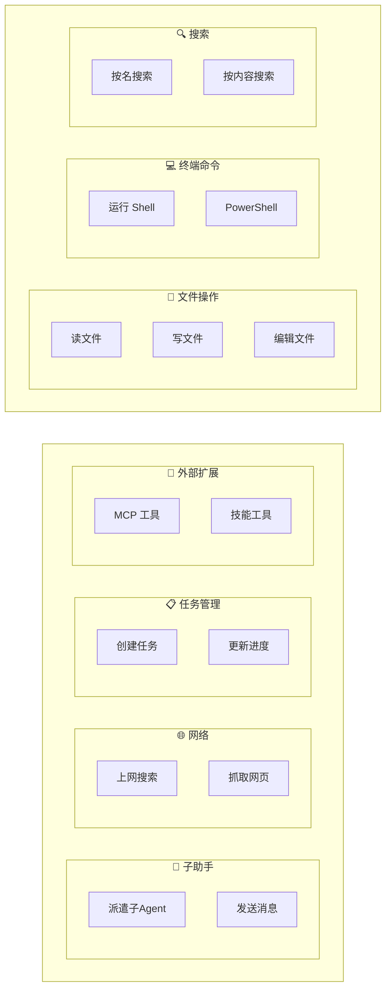

# Claude Code CLI -- 工具系统（Tool System）架构分析

> 本文档基于源码分析，深入解读 Claude Code CLI 工具系统的设计模式、注册机制、执行流程、权限控制以及关键工具实现。

---

## 简明图解



---

## 目录

1. [系统概览](#1-系统概览)
2. [Tool 类型定义与 buildTool 模式](#2-tool-类型定义与-buildtool-模式)
3. [工具注册、发现与加载机制](#3-工具注册发现与加载机制)
4. [工具执行流程](#4-工具执行流程)
5. [权限控制与工具系统的集成](#5-权限控制与工具系统的集成)
6. [关键工具实现分析](#6-关键工具实现分析)
7. [MCP 工具的特殊处理](#7-mcp-工具的特殊处理)
8. [ToolSearch 延迟加载机制](#8-toolsearch-延迟加载机制)
9. [工具参数验证与错误处理](#9-工具参数验证与错误处理)
10. [工具分类总表](#10-工具分类总表)

---

## 1. 系统概览

Claude Code CLI 的工具系统是整个应用的核心执行层，负责将 AI 模型的 `tool_use` 决策转化为实际的文件操作、Shell 命令执行、网络请求等具体行为。整个系统包含以下关键层次：

```
┌──────────────────────────────────────────────┐
│         AI 模型层 (Claude API)               │
│    输出 tool_use block (name + input)        │
└────────────────┬─────────────────────────────┘
                 │
┌────────────────▼─────────────────────────────┐
│       工具编排层 (toolOrchestration.ts)       │
│  分区：并发安全 vs 串行 → 批量/并行执行       │
└────────────────┬─────────────────────────────┘
                 │
┌────────────────▼─────────────────────────────┐
│       工具执行层 (toolExecution.ts)           │
│  输入验证 → PreToolUse Hook → 权限检查 →     │
│  tool.call() → PostToolUse Hook → 结果映射   │
└────────────────┬─────────────────────────────┘
                 │
┌────────────────▼─────────────────────────────┐
│       具体工具实现层 (src/tools/*)            │
│  BashTool, FileEditTool, AgentTool, ...      │
└──────────────────────────────────────────────┘
```

**核心源文件：**

| 文件路径 | 职责 |
|---------|------|
| `src/Tool.ts` | Tool 类型定义、`buildTool()` 工厂函数、`ToolUseContext` 上下文类型 |
| `src/tools.ts` | 工具注册表：`getAllBaseTools()`, `getTools()`, `assembleToolPool()` |
| `src/services/tools/toolOrchestration.ts` | 工具并发编排：分区、串行/并行执行 |
| `src/services/tools/toolExecution.ts` | 单个工具的完整执行流程（验证、权限、调用、Hook） |
| `src/services/tools/StreamingToolExecutor.ts` | 流式工具执行器，边流入边执行 |
| `src/services/tools/toolHooks.ts` | PreToolUse / PostToolUse Hook 执行 |
| `src/constants/tools.ts` | 工具分组常量（Agent 禁用列表、Coordinator 允许列表等） |

---

## 2. Tool 类型定义与 buildTool 模式

### 2.1 Tool 接口

`Tool` 类型定义于 `src/Tool.ts`，是一个完备的泛型类型（非抽象类），包含三个泛型参数：

```typescript
export type Tool<
  Input extends AnyObject = AnyObject,    // Zod schema 定义的输入类型
  Output = unknown,                        // 工具执行结果类型
  P extends ToolProgressData = ToolProgressData, // 进度事件类型
> = {
  name: string                             // 工具名称（唯一标识）
  aliases?: string[]                       // 向后兼容的别名
  inputSchema: Input                       // Zod 输入 schema
  inputJSONSchema?: ToolInputJSONSchema    // MCP 工具的 JSON Schema
  maxResultSizeChars: number               // 结果最大字符数

  // === 生命周期方法 ===
  call(args, context, canUseTool, parentMessage, onProgress?)  // 核心执行
  validateInput?(input, context)           // 输入值校验
  checkPermissions(input, context)         // 权限检查

  // === 元信息方法 ===
  description(input, options)              // 工具描述
  prompt(options)                          // 系统提示词
  isEnabled()                              // 是否启用
  isReadOnly(input)                        // 是否只读
  isDestructive?(input)                    // 是否破坏性
  isConcurrencySafe(input)                 // 是否并发安全
  isMcp?: boolean                          // 是否 MCP 工具
  shouldDefer?: boolean                    // 是否延迟加载

  // === UI 渲染方法 ===
  userFacingName(input)                    // 显示名称
  renderToolUseMessage(input, options)     // 渲染工具调用
  renderToolResultMessage?(content, ...)   // 渲染工具结果
  renderToolUseProgressMessage?(...)       // 渲染进度
  renderToolUseRejectedMessage?(...)       // 渲染拒绝
  renderToolUseErrorMessage?(...)          // 渲染错误
  renderGroupedToolUse?(...)               // 分组渲染

  // === 结果映射 ===
  mapToolResultToToolResultBlockParam(content, toolUseID)  // 转为 API 格式
  // ...
}
```

### 2.2 buildTool 工厂函数

所有工具必须通过 `buildTool()` 工厂函数创建，它自动填充安全默认值：

```typescript
// src/Tool.ts
const TOOL_DEFAULTS = {
  isEnabled: () => true,
  isConcurrencySafe: () => false,     // 默认不并发安全（保守策略）
  isReadOnly: () => false,            // 默认假设有写操作
  isDestructive: () => false,
  checkPermissions: (input) =>
    Promise.resolve({ behavior: 'allow', updatedInput: input }),
  toAutoClassifierInput: () => '',
  userFacingName: () => '',
}

export function buildTool<D extends AnyToolDef>(def: D): BuiltTool<D> {
  return {
    ...TOOL_DEFAULTS,
    userFacingName: () => def.name,
    ...def,
  } as BuiltTool<D>
}
```

**设计要点：**

- **fail-closed 原则**：`isConcurrencySafe` 默认 `false`，`isReadOnly` 默认 `false`，确保安全
- **ToolDef 简化定义**：`ToolDef` 类型让 `isEnabled`、`checkPermissions` 等方法可选，降低样板代码
- **类型安全**：`BuiltTool<D>` 精确推断出运行时 spread 后的类型

### 2.3 ToolUseContext -- 执行上下文

`ToolUseContext` 是工具执行时传入的上下文对象，携带了几乎所有运行时状态：

```typescript
export type ToolUseContext = {
  options: {
    tools: Tools              // 当前可用工具列表
    commands: Command[]       // 可用命令
    mcpClients: MCPServerConnection[]  // MCP 服务器连接
    mainLoopModel: string     // 当前模型
    thinkingConfig: ThinkingConfig
    isNonInteractiveSession: boolean
    agentDefinitions: AgentDefinitionsResult
    // ...
  }
  abortController: AbortController     // 取消控制器
  readFileState: FileStateCache         // 文件状态缓存
  getAppState(): AppState               // 全局应用状态
  setAppState(f: (prev) => AppState)    // 更新状态
  messages: Message[]                   // 当前消息历史
  toolDecisions?: Map<string, ...>      // 工具决策记录
  // ...
}
```

---

## 3. 工具注册、发现与加载机制

### 3.1 工具注册入口

所有内置工具在 `src/tools.ts` 中集中注册。注册逻辑分为三层：

**第一层：静态导入（核心工具）**

```typescript
// src/tools.ts
import { BashTool } from './tools/BashTool/BashTool.js'
import { FileEditTool } from './tools/FileEditTool/FileEditTool.js'
import { FileReadTool } from './tools/FileReadTool/FileReadTool.js'
import { AgentTool } from './tools/AgentTool/AgentTool.js'
import { GlobTool } from './tools/GlobTool/GlobTool.js'
import { GrepTool } from './tools/GrepTool/GrepTool.js'
// ...
```

**第二层：条件导入（feature-gated 工具）**

通过 `feature()` 宏和 `process.env` 条件在构建时消除死代码：

```typescript
const REPLTool = process.env.USER_TYPE === 'ant'
    ? require('./tools/REPLTool/REPLTool.js').REPLTool : null

const SleepTool = feature('PROACTIVE') || feature('KAIROS')
    ? require('./tools/SleepTool/SleepTool.js').SleepTool : null

const WebBrowserTool = feature('WEB_BROWSER_TOOL')
    ? require('./tools/WebBrowserTool/WebBrowserTool.js').WebBrowserTool : null
```

**第三层：延迟导入（解决循环依赖）**

```typescript
const getTeamCreateTool = () =>
  require('./tools/TeamCreateTool/TeamCreateTool.js').TeamCreateTool
const getSendMessageTool = () =>
  require('./tools/SendMessageTool/SendMessageTool.js').SendMessageTool
```

### 3.2 getAllBaseTools() -- 全量工具列表

`getAllBaseTools()` 返回当前环境下所有可能可用的工具：

```typescript
// src/tools.ts
export function getAllBaseTools(): Tools {
  return [
    AgentTool,
    TaskOutputTool,
    BashTool,
    // 当嵌入式搜索工具可用时，跳过 Glob/Grep
    ...(hasEmbeddedSearchTools() ? [] : [GlobTool, GrepTool]),
    ExitPlanModeV2Tool,
    FileReadTool,
    FileEditTool,
    FileWriteTool,
    NotebookEditTool,
    WebFetchTool,
    TodoWriteTool,
    WebSearchTool,
    // ... 条件性工具
    ...(isTodoV2Enabled() ? [TaskCreateTool, TaskGetTool, ...] : []),
    ...(isToolSearchEnabledOptimistic() ? [ToolSearchTool] : []),
    // ...
  ]
}
```

### 3.3 getTools() -- 过滤后的工具列表

`getTools()` 在 `getAllBaseTools()` 基础上进行多层过滤：

1. **简单模式过滤**：`CLAUDE_CODE_SIMPLE=true` 时只保留 Bash/Read/Edit
2. **特殊工具排除**：ListMcpResources、ReadMcpResource 等按需添加
3. **deny 规则过滤**：通过 `filterToolsByDenyRules()` 移除被权限规则禁用的工具
4. **REPL 模式过滤**：启用 REPL 时隐藏被 REPL 内部封装的基础工具
5. **isEnabled 检查**：调用每个工具的 `isEnabled()` 最终确认

### 3.4 assembleToolPool() -- 合并 MCP 工具

`assembleToolPool()` 是获取最终工具列表的统一入口：

```typescript
export function assembleToolPool(
  permissionContext: ToolPermissionContext,
  mcpTools: Tools,
): Tools {
  const builtInTools = getTools(permissionContext)
  const allowedMcpTools = filterToolsByDenyRules(mcpTools, permissionContext)
  // 按名称排序，内置工具作为前缀以保持 prompt cache 稳定
  const byName = (a: Tool, b: Tool) => a.name.localeCompare(b.name)
  return uniqBy(
    [...builtInTools].sort(byName).concat(allowedMcpTools.sort(byName)),
    'name',
  )
}
```

**关键设计决策：**
- 内置工具排在前面（prompt cache 稳定性）
- `uniqBy('name')` 确保内置工具同名优先（MCP 工具不能覆盖内置工具，除非在 SDK 无前缀模式）

---

## 4. 工具执行流程

### 4.1 整体流程

当 AI 模型返回 `tool_use` block 后，执行流程如下：

```
模型输出 tool_use blocks
        │
        ▼
  toolOrchestration.runTools()
  ├─ partitionToolCalls() ── 按并发安全性分区
  │   ├─ 并发安全组 → runToolsConcurrently() (最多 10 并发)
  │   └─ 非并发组   → runToolsSerially()
  │
  └─ 每个 tool_use → runToolUse()   [toolExecution.ts]
        │
        ├─ 1. 查找工具定义 (findToolByName)
        ├─ 2. 检查中断信号 (abortController)
        │
        └─ checkPermissionsAndCallTool()
             │
             ├─ 3. Zod 输入验证 (inputSchema.safeParse)
             ├─ 4. 自定义输入验证 (tool.validateInput)
             ├─ 5. backfillObservableInput (补充/规范化字段)
             ├─ 6. PreToolUse Hooks
             ├─ 7. 权限检查 (resolveHookPermissionDecision)
             │     ├─ Hook 决策优先
             │     └─ 规则/分类器/交互式权限
             ├─ 8. 调用工具 (tool.call)
             ├─ 9. PostToolUse Hooks
             ├─ 10. 结果映射 (mapToolResultToToolResultBlockParam)
             └─ 11. 大结果处理 (processToolResultBlock → 存盘)
```

### 4.2 并发编排 -- toolOrchestration.ts

`partitionToolCalls()` 将工具调用分为连续的批次：

```typescript
function partitionToolCalls(toolUseMessages, toolUseContext): Batch[] {
  // 连续的 isConcurrencySafe=true 工具合并为一个并发批次
  // isConcurrencySafe=false 的工具独占一个串行批次
  // 结果是交替的 [concurrent, serial, concurrent, serial, ...] 批次
}
```

- **并发批次**：通过 `all()` 生成器并发执行，最大并发数默认 10（`CLAUDE_CODE_MAX_TOOL_USE_CONCURRENCY`）
- **串行批次**：逐个执行，每个工具完成后更新上下文
- `contextModifier` 在批次结束后统一应用，保证上下文一致性

### 4.3 流式执行器 -- StreamingToolExecutor

`StreamingToolExecutor` 类支持在 AI 响应流式输出过程中即时开始执行工具：

```typescript
class StreamingToolExecutor {
  addTool(block: ToolUseBlock, assistantMessage: AssistantMessage): void
  // 工具流入即可开始执行，不需要等待所有工具 block 完成
  // 并发安全的工具可以与其他并发安全工具并行
  // 非并发工具独占执行

  discard(): void  // 流式回退时丢弃所有待执行工具

  async *getRemainingResults(): AsyncGenerator<MessageUpdate>
  // 按接收顺序返回结果（保证顺序性）
}
```

### 4.4 核心执行函数 -- checkPermissionsAndCallTool

这是 `src/services/tools/toolExecution.ts` 中最核心的函数（约 500 行），完整流程：

**步骤 3：Zod 输入验证**
```typescript
const parsedInput = tool.inputSchema.safeParse(input)
if (!parsedInput.success) {
  // 格式化 Zod 错误 + 延迟工具 schema 未发送提示
  return [{ message: createUserMessage({ content: errorContent, is_error: true }) }]
}
```

**步骤 4：自定义输入验证**
```typescript
const isValidCall = await tool.validateInput?.(parsedInput.data, toolUseContext)
if (isValidCall?.result === false) {
  return [{ message: createUserMessage({ content: isValidCall.message, is_error: true }) }]
}
```

**步骤 6-7：Hook 与权限检查**
```typescript
// PreToolUse Hooks
for await (const result of runPreToolUseHooks(toolUseContext, tool, ...)) {
  // Hook 可以修改输入、阻止执行、提供权限决策
}

// 权限决策（Hook 决策 > 规则匹配 > 交互式询问）
const resolved = await resolveHookPermissionDecision(
  hookPermissionResult, tool, processedInput, toolUseContext, canUseTool, ...
)
```

**步骤 8：实际执行**
```typescript
const result = await tool.call(
  callInput,
  { ...toolUseContext, toolUseId: toolUseID, userModified: ... },
  canUseTool, assistantMessage, onProgress
)
```

**步骤 10-11：结果处理**
```typescript
const mappedToolResultBlock = tool.mapToolResultToToolResultBlockParam(result.data, toolUseID)
// 大结果自动存盘（超过 maxResultSizeChars 时）
const processed = await processToolResultBlock(tool, result.data, toolUseID)
```

---

## 5. 权限控制与工具系统的集成

### 5.1 权限检查的多层架构

权限系统与工具系统的集成分为四层：

```
┌────────────────────────────────────────┐
│ 第1层：工具级别过滤 (getTools)          │
│ filterToolsByDenyRules() - 整工具禁用   │
├────────────────────────────────────────┤
│ 第2层：工具自身权限 (checkPermissions)  │
│ 每个工具各自的权限检查逻辑              │
├────────────────────────────────────────┤
│ 第3层：Hook 权限干预 (PreToolUse)      │
│ 用户配置的 Hook 可以 allow/deny/ask    │
├────────────────────────────────────────┤
│ 第4层：统一权限决策 (hasPermissionsToUseTool) │
│ 规则匹配 → 分类器 → 交互式询问         │
└────────────────────────────────────────┘
```

### 5.2 ToolPermissionContext

权限上下文通过 `ToolPermissionContext` 传递：

```typescript
export type ToolPermissionContext = DeepImmutable<{
  mode: PermissionMode              // 'default' | 'auto' | 'plan' | ...
  additionalWorkingDirectories: Map<string, AdditionalWorkingDirectory>
  alwaysAllowRules: ToolPermissionRulesBySource   // 始终允许
  alwaysDenyRules: ToolPermissionRulesBySource     // 始终拒绝
  alwaysAskRules: ToolPermissionRulesBySource      // 始终询问
  isBypassPermissionsModeAvailable: boolean
  shouldAvoidPermissionPrompts?: boolean  // 后台 agent 不弹权限
}>
```

### 5.3 PermissionResult 与 checkPermissions

每个工具的 `checkPermissions` 返回以下类型之一：

| behavior | 含义 |
|----------|------|
| `allow` | 直接允许，跳过后续检查 |
| `deny` | 拒绝执行 |
| `ask` | 需要用户确认 |
| `passthrough` | 交由通用权限系统处理（大多数工具默认） |

不同工具有不同的权限策略：
- **BashTool**：解析命令，按子命令逐一检查前缀规则（`bashToolHasPermission`）
- **FileEditTool / FileWriteTool**：通过 `checkWritePermissionForTool()` 检查文件路径规则
- **FileReadTool / GlobTool**：通过 `checkReadPermissionForTool()` 检查读权限
- **MCPTool**：默认 `passthrough`，每个 MCP 工具始终需要权限确认
- **AgentTool**：默认 `allow`（buildTool 默认），但受 `filterDeniedAgents` 控制

### 5.4 preparePermissionMatcher

文件类工具实现 `preparePermissionMatcher` 以支持 Hook `if` 条件中的通配符匹配：

```typescript
// FileEditTool
async preparePermissionMatcher({ file_path }) {
  return pattern => matchWildcardPattern(pattern, file_path)
}
```

### 5.5 工具分组权限常量

`src/constants/tools.ts` 定义了关键的工具分组：

```typescript
ALL_AGENT_DISALLOWED_TOOLS     // Agent（子代理）禁止使用的工具
CUSTOM_AGENT_DISALLOWED_TOOLS  // 自定义 Agent 禁止使用的工具
ASYNC_AGENT_ALLOWED_TOOLS      // 异步 Agent 允许的工具
COORDINATOR_MODE_ALLOWED_TOOLS // Coordinator 模式允许的工具
```

---

## 6. 关键工具实现分析

### 6.1 BashTool

**文件：** `src/tools/BashTool/BashTool.tsx`

BashTool 是最复杂的工具之一，负责执行 Shell 命令。

**输入 Schema（关键字段）：**
- `command: string` -- 要执行的命令
- `timeout?: number` -- 超时时间（毫秒）
- `description?: string` -- 命令描述
- `dangerouslyDisableSandbox?: boolean` -- 禁用沙箱
- `run_in_background?: boolean` -- 后台运行

**核心特性：**

1. **沙箱执行**：通过 `shouldUseSandbox()` 决定是否在沙箱中运行。`SandboxManager` 管理沙箱生命周期。

2. **命令解析**：使用 `parseForSecurity()` 进行 AST 安全分析，`splitCommandWithOperators()` 拆分复合命令。

3. **搜索/读取命令分类**：`isSearchOrReadBashCommand()` 将 Shell 命令分类为搜索（grep/find）、读取（cat/head）或列表（ls/tree），用于 UI 折叠显示。

4. **进度报告**：命令运行超过 2 秒后开始报告进度（`PROGRESS_THRESHOLD_MS = 2000`）。

5. **后台任务**：支持 `run_in_background` 将长时间任务转为后台执行。在 assistant 模式下，阻塞命令超过 15 秒自动后台化。

6. **并发安全判断**：通过分析命令是否为只读来判断 `isConcurrencySafe`。

7. **sed 编辑检测**：`parseSedEditCommand()` 可以检测 sed 编辑命令并将其转换为模拟文件编辑，触发文件编辑权限流程。

8. **权限规则**：`bashToolHasPermission()` 实现前缀匹配规则，支持 `Bash(git *)` 类通配符。

### 6.2 FileEditTool

**文件：** `src/tools/FileEditTool/FileEditTool.ts`

FileEditTool 实现精确的字符串替换式文件编辑。

**输入 Schema：**
- `file_path: string` -- 文件路径
- `old_string: string` -- 要替换的文本
- `new_string: string` -- 替换后的文本
- `replace_all?: boolean` -- 是否全部替换

**核心特性：**

1. **精确匹配**：要求 `old_string` 在文件中存在且唯一（除非 `replace_all=true`）
2. **文件创建**：`old_string=""` 且文件不存在时创建新文件
3. **validateInput**：丰富的预检逻辑
   - 检查 `old_string === new_string`
   - 检查文件大小上限（1 GiB）
   - 检查文件是否存在及拼写建议
   - 文件编码检测（UTF-8/UTF-16LE）
   - `.ipynb` 文件引导使用 NotebookEditTool
4. **fileStateCache**：使用文件修改时间检测并发修改冲突
5. **文件历史追踪**：通过 `fileHistoryTrackEdit()` 记录编辑操作用于 undo
6. **LSP 通知**：编辑后通知 LSP 服务器和 VS Code 更新
7. **Skill 发现**：编辑文件后触发 `discoverSkillDirsForPaths()`

### 6.3 FileReadTool

**文件：** `src/tools/FileReadTool/FileReadTool.ts`

**核心特性：**
- 支持文本、图片、PDF、Jupyter Notebook 等多种文件格式
- Token 限制：超大文件自动截断并提示使用 offset/limit
- 图片自动压缩/缩放以适应 token 限制
- PDF 支持分页读取（`pages` 参数）
- `maxResultSizeChars: Infinity` -- 结果永不存盘（避免 Read->file->Read 循环）

### 6.4 AgentTool

**文件：** `src/tools/AgentTool/AgentTool.tsx`

AgentTool 是多代理系统的核心，支持创建子代理来并行处理任务。

**输入 Schema：**
- `description: string` -- 任务简述（3-5 词）
- `prompt: string` -- 详细任务描述
- `subagent_type?: string` -- 专用代理类型
- `model?: 'sonnet' | 'opus' | 'haiku'` -- 模型选择
- `run_in_background?: boolean` -- 后台运行
- `isolation?: 'worktree' | 'remote'` -- 隔离模式
- `name?: string` -- 代理名称（用于 SendMessage 寻址）
- `cwd?: string` -- 工作目录

**核心特性：**

1. **同步/异步执行**：`run_in_background=true` 启动异步代理，主线程继续工作
2. **Worktree 隔离**：创建 Git worktree 确保代理操作不影响主工作区
3. **远程执行**：`isolation='remote'` 在远程环境中运行
4. **Fork 子代理**：`isForkSubagentEnabled()` 时使用 fork 模式共享上下文
5. **嵌套限制**：通过 `ALL_AGENT_DISALLOWED_TOOLS` 控制子代理可用工具
6. **进度报告**：后台代理通过进度事件报告状态
7. **工具池组装**：子代理获得独立的工具池（`assembleToolPool`）

### 6.5 GlobTool / GrepTool

**文件：** `src/tools/GlobTool/GlobTool.ts`, `src/tools/GrepTool/GrepTool.ts`

这两个工具负责文件搜索，在内置搜索工具可用（`hasEmbeddedSearchTools()`）时被跳过。

- 均为 `isConcurrencySafe=true`、`isReadOnly=true`
- 均支持文件路径权限检查
- 均有结果数量限制（Glob: 100 文件，Grep: configurable）
- 当 ant 用户有嵌入式 bfs/ugrep 时，模型通过 Bash 调用替代

### 6.6 SkillTool

**文件：** `src/tools/SkillTool/SkillTool.ts`

SkillTool 将 slash command（如 `/commit`、`/review-pr`）暴露为可被 AI 调用的工具。

- 将命令查找、参数解析和执行委托给命令系统
- 支持 MCP 技能/提示
- 内部使用 `runAgent()` 执行技能（类似子代理）
- 追踪技能使用记录用于建议和分析

---

## 7. MCP 工具的特殊处理

### 7.1 MCP 工具创建

MCP 工具在 `src/services/mcp/client.ts` 中通过展开 MCPTool 模板创建：

```typescript
// src/tools/MCPTool/MCPTool.ts -- 模板定义
export const MCPTool = buildTool({
  isMcp: true,
  name: 'mcp',  // 被覆盖
  async call() { return { data: '' } },  // 被覆盖
  async checkPermissions() {
    return { behavior: 'passthrough', message: 'MCPTool requires permission.' }
  },
  // ...
})

// src/services/mcp/client.ts -- 实际创建
return {
  ...MCPTool,                                    // 展开模板
  name: skipPrefix ? tool.name : fullyQualifiedName,  // mcp__server__tool
  mcpInfo: { serverName: client.name, toolName: tool.name },
  isMcp: true,
  searchHint: tool._meta?.['anthropic/searchHint'],
  alwaysLoad: tool._meta?.['anthropic/alwaysLoad'] === true,
  inputJSONSchema: tool.inputSchema,             // 使用 JSON Schema 而非 Zod

  // 覆盖方法
  async description() { return tool.description ?? '' },
  isConcurrencySafe() { return tool.annotations?.readOnlyHint ?? false },
  isReadOnly() { return tool.annotations?.readOnlyHint ?? false },
  isDestructive() { return tool.annotations?.destructiveHint ?? false },

  async call(args, context, _canUseTool, parentMessage, onProgress?) {
    // 通过 MCP 客户端调用远程工具
    const mcpResult = await callMCPToolWithUrlElicitationRetry({
      client: connectedClient,
      tool: tool.name,
      args,
      meta,
      signal: context.abortController.signal,
      // ...
    })
    return { data: formatMcpResult(mcpResult) }
  },

  async checkPermissions() {
    return {
      behavior: 'passthrough',
      suggestions: [{
        type: 'addRules',
        rules: [{ toolName: fullyQualifiedName, ruleContent: undefined }],
        behavior: 'allow',
        destination: 'localSettings',
      }],
    }
  },
}
```

### 7.2 MCP 工具命名

- 完全限定名：`mcp__<serverName>__<toolName>`（如 `mcp__github__create_issue`）
- SDK 无前缀模式（`CLAUDE_AGENT_SDK_MCP_NO_PREFIX`）：使用原始工具名
- `mcpInfo` 字段始终保留原始服务器/工具名，用于权限检查

### 7.3 MCP 工具的特殊行为

1. **权限**：始终 `passthrough`，每次调用都需权限审批
2. **输入 Schema**：使用 `inputJSONSchema`（JSON Schema 格式）而非 Zod
3. **annotations**：从 MCP 工具 annotations 推断只读/破坏性等属性
4. **连接重试**：支持会话重连和 URL elicitation（OAuth 认证流程）
5. **错误处理**：`McpToolCallError` 和 `McpAuthError` 有专用处理逻辑

---

## 8. ToolSearch 延迟加载机制

### 8.1 设计动机

当工具总数超过阈值时（包括大量 MCP 工具），将非核心工具标记为"延迟加载"（deferred），通过 `ToolSearchTool` 按需发现和加载。

### 8.2 工作流程

```
1. 初始化时，部分工具标记为 shouldDefer=true
2. 延迟工具仅发送 name（不含完整 schema）
3. 模型需要使用延迟工具时：
   a. 调用 ToolSearchTool(query="select:ToolName")   -- 精确选择
   b. 或 ToolSearchTool(query="keyword search")       -- 关键词搜索
4. ToolSearch 返回 tool_reference blocks
5. 下一轮 API 调用中包含匹配工具的完整 schema
```

### 8.3 搜索算法

`src/tools/ToolSearchTool/ToolSearchTool.ts` 实现了两种搜索模式：

**精确选择**（`select:` 前缀）：
```typescript
// select:Read,Edit,Grep -- 逗号分隔多选
const tool = findToolByName(deferredTools, toolName) ?? findToolByName(tools, toolName)
```

**关键词搜索**：
- 解析工具名（CamelCase 拆分、MCP `__` 拆分）
- 支持 `+required optional` 必选/可选词
- 评分维度：名称部分匹配(10分)、searchHint(4分)、描述匹配(2分)
- MCP 工具名匹配加权（12分 vs 10分）

### 8.4 Schema 未发送检测

当模型调用延迟工具但其 schema 未被发送时，Zod 验证会失败。此时 `buildSchemaNotSentHint()` 附加提示：

```
This tool's schema was not sent to the API — it was not in the discovered-tool set.
Load the tool first: call ToolSearch with query "select:ToolName", then retry this call.
```

---

## 9. 工具参数验证与错误处理

### 9.1 三层验证机制

| 层次 | 函数 | 职责 |
|------|------|------|
| **Zod Schema 验证** | `inputSchema.safeParse(input)` | 类型和结构验证 |
| **自定义输入验证** | `tool.validateInput(input, context)` | 业务逻辑验证 |
| **权限验证** | `tool.checkPermissions(input, context)` | 安全性验证 |

### 9.2 Zod Schema 验证

所有工具使用 `z.strictObject()` 或 `z.object()` 定义输入 schema，使用 `lazySchema()` 包装以延迟初始化：

```typescript
// 典型模式
const inputSchema = lazySchema(() =>
  z.strictObject({
    file_path: z.string().describe('The absolute path to the file'),
    content: z.string().describe('The content to write'),
  })
)
```

验证失败时返回格式化错误：
```typescript
const errorContent = formatZodValidationError(tool.name, parsedInput.error)
// 输出类似：<tool_use_error>InputValidationError: Expected string at "file_path"</tool_use_error>
```

### 9.3 自定义验证 (validateInput)

`validateInput` 返回 `ValidationResult`：

```typescript
type ValidationResult =
  | { result: true }
  | { result: false; message: string; errorCode: number }
```

典型验证逻辑（以 FileEditTool 为例）：
- `errorCode: 1` -- old_string === new_string（无变更）
- `errorCode: 2` -- 文件在 deny 目录中
- `errorCode: 3` -- 文件已存在（创建冲突）
- `errorCode: 4` -- 文件不存在 + 拼写建议
- `errorCode: 10` -- 文件过大（> 1 GiB）

### 9.4 错误分类与遥测

`classifyToolError()` 将执行错误分类为遥测安全的字符串：

```typescript
export function classifyToolError(error: unknown): string {
  if (error instanceof TelemetrySafeError) return error.telemetryMessage
  if (error instanceof Error) {
    const errnoCode = getErrnoCode(error)       // ENOENT, EACCES, ...
    if (errnoCode) return `Error:${errnoCode}`
    if (error.name.length > 3) return error.name // ShellError, ...
    return 'Error'
  }
  return 'UnknownError'
}
```

### 9.5 大结果处理

工具结果超过 `maxResultSizeChars` 时自动存盘：

```typescript
// processToolResultBlock 逻辑
if (resultSize > tool.maxResultSizeChars) {
  // 存储完整结果到磁盘文件
  await writeToFile(getToolResultPath(toolUseID), fullContent)
  // 生成预览版（PREVIEW_SIZE_BYTES）
  const preview = generatePreview(fullContent)
  return buildLargeToolResultMessage(preview, filePath)
}
```

例外：`FileReadTool.maxResultSizeChars = Infinity`（避免 Read->file->Read 循环）

---

## 10. 工具分类总表

### 核心文件操作工具

| 工具名 | 文件路径 | 只读 | 并发安全 | 说明 |
|--------|---------|------|---------|------|
| `Bash` | `src/tools/BashTool/` | 视命令 | 视命令 | Shell 命令执行 |
| `Read` | `src/tools/FileReadTool/` | 是 | 是 | 文件读取（文本/图片/PDF/Notebook） |
| `Edit` | `src/tools/FileEditTool/` | 否 | 否 | 精确字符串替换编辑 |
| `Write` | `src/tools/FileWriteTool/` | 否 | 否 | 文件写入/创建 |
| `NotebookEdit` | `src/tools/NotebookEditTool/` | 否 | 否 | Jupyter Notebook 编辑 |

### 搜索工具

| 工具名 | 文件路径 | 说明 |
|--------|---------|------|
| `Glob` | `src/tools/GlobTool/` | 文件名模式匹配 |
| `Grep` | `src/tools/GrepTool/` | 文件内容搜索（ripgrep） |
| `ToolSearch` | `src/tools/ToolSearchTool/` | 延迟工具发现/加载 |

### 代理/任务工具

| 工具名 | 文件路径 | 说明 |
|--------|---------|------|
| `Agent` | `src/tools/AgentTool/` | 创建子代理执行任务 |
| `SendMessage` | `src/tools/SendMessageTool/` | 向其他代理发送消息 |
| `TaskCreate` | `src/tools/TaskCreateTool/` | 创建任务 |
| `TaskGet` | `src/tools/TaskGetTool/` | 获取任务状态 |
| `TaskUpdate` | `src/tools/TaskUpdateTool/` | 更新任务 |
| `TaskList` | `src/tools/TaskListTool/` | 列出任务 |
| `TaskStop` | `src/tools/TaskStopTool/` | 终止任务/进程 |
| `TaskOutput` | `src/tools/TaskOutputTool/` | 产出最终结果 |
| `TeamCreate` | `src/tools/TeamCreateTool/` | 创建代理团队 |
| `TeamDelete` | `src/tools/TeamDeleteTool/` | 删除代理团队 |

### 网络工具

| 工具名 | 文件路径 | 说明 |
|--------|---------|------|
| `WebFetch` | `src/tools/WebFetchTool/` | HTTP 请求/网页抓取 |
| `WebSearch` | `src/tools/WebSearchTool/` | 网络搜索 |

### 计划/模式工具

| 工具名 | 文件路径 | 说明 |
|--------|---------|------|
| `EnterPlanMode` | `src/tools/EnterPlanModeTool/` | 进入计划模式 |
| `ExitPlanModeV2` | `src/tools/ExitPlanModeTool/` | 退出计划模式 |
| `EnterWorktree` | `src/tools/EnterWorktreeTool/` | 进入 worktree 隔离 |
| `ExitWorktree` | `src/tools/ExitWorktreeTool/` | 退出 worktree 隔离 |

### MCP / 外部集成工具

| 工具名 | 文件路径 | 说明 |
|--------|---------|------|
| `MCPTool (模板)` | `src/tools/MCPTool/` | MCP 工具模板，运行时克隆 |
| `ListMcpResources` | `src/tools/ListMcpResourcesTool/` | 列出 MCP 资源 |
| `ReadMcpResource` | `src/tools/ReadMcpResourceTool/` | 读取 MCP 资源 |
| `LSP` | `src/tools/LSPTool/` | LSP 语言服务器交互 |

### 辅助工具

| 工具名 | 文件路径 | 说明 |
|--------|---------|------|
| `Skill` | `src/tools/SkillTool/` | 执行 slash command/技能 |
| `Config` | `src/tools/ConfigTool/` | 配置管理（ant 用户） |
| `TodoWrite` | `src/tools/TodoWriteTool/` | TODO 列表管理 |
| `AskUserQuestion` | `src/tools/AskUserQuestionTool/` | 向用户提问 |
| `Brief` | `src/tools/BriefTool/` | 切换简洁输出模式 |
| `Tungsten` | `src/tools/TungstenTool/` | 虚拟终端（ant 用户） |

### 条件/实验性工具

| 工具名 | 条件 | 说明 |
|--------|------|------|
| `REPLTool` | `USER_TYPE=ant` | VM 沙箱 REPL |
| `PowerShellTool` | Windows | PowerShell 执行 |
| `SleepTool` | `PROACTIVE/KAIROS` | 定时休眠 |
| `CronCreate/Delete/List` | `AGENT_TRIGGERS` | 定时任务管理 |
| `SuggestBackgroundPR` | `USER_TYPE=ant` | 建议后台 PR |
| `WebBrowserTool` | `WEB_BROWSER_TOOL` | 浏览器操作 |
| `MonitorTool` | `MONITOR_TOOL` | 监控工具 |
| `WorkflowTool` | `WORKFLOW_SCRIPTS` | 工作流脚本 |

---

## 附：关键设计决策总结

1. **对象字面量 + 工厂函数**：不使用类继承，而是通过 `buildTool()` + 对象字面量，兼顾灵活性和类型安全
2. **并发分区编排**：自动识别只读工具并行执行，写入工具串行执行
3. **流式执行**：`StreamingToolExecutor` 允许工具在 AI 响应流中即时启动
4. **多层权限**：规则 > Hook > 分类器 > 交互式，层层递进
5. **延迟加载**：ToolSearch 机制应对大量 MCP 工具场景，减少 prompt token
6. **fail-closed 默认值**：所有安全相关属性默认保守（不并发、非只读）
7. **MCP 模板克隆**：单一 MCPTool 模板通过展开覆盖实现多态，避免类继承
