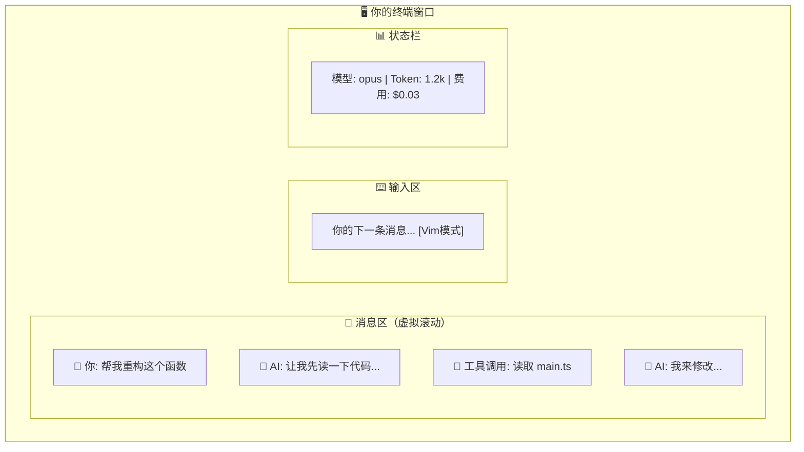

# Claude Code CLI — UI 渲染与组件系统架构

> 本文档深入分析 Claude Code CLI 的终端 UI 架构，涵盖自定义 Ink 框架、组件层次、消息渲染管线、用户输入处理、Vim 模式、快捷键系统和屏幕导航机制。

---

## 简明图解



---

## 目录

1. [终端 UI 整体渲染架构](#1-终端-ui-整体渲染架构)
2. [自定义 Ink 框架的实现与改进](#2-自定义-ink-框架的实现与改进)
3. [核心组件层次结构与职责](#3-核心组件层次结构与职责)
4. [消息渲染流水线](#4-消息渲染流水线)
5. [用户输入处理流程](#5-用户输入处理流程)
6. [Vim 模式与快捷键系统](#6-vim-模式与快捷键系统)
7. [屏幕/页面导航机制](#7-屏幕页面导航机制)

---

## 1. 终端 UI 整体渲染架构

### 1.1 核心技术栈

Claude Code CLI 的 UI 基于 **React + 自定义 Ink 框架**，采用以下技术架构：

```
React 19 (JSX 组件)
       │
       ▼
react-reconciler (自定义协调器)
       │
       ▼
自定义 DOM 树 (DOMElement / TextNode)
       │
       ▼
Yoga 布局引擎 (Flexbox 计算)
       │
       ▼
Screen 缓冲区 (Cell 矩阵)
       │
       ▼
LogUpdate 差异更新 → ANSI 终端输出
```

### 1.2 渲染入口

**文件**: `src/ink.ts`

这是 Ink 框架的对外入口，对所有渲染调用自动包裹 `ThemeProvider`：

```typescript
// 所有 CC 渲染调用自动包裹 ThemeProvider
function withTheme(node: ReactNode): ReactNode {
  return createElement(ThemeProvider, null, node)
}

export async function render(node, options?) {
  return inkRender(withTheme(node), options)
}
```

该文件同时统一导出所有 UI 原语：`Box`, `Text`, `useInput`, `useTheme` 等。组件通过 `import { Box, Text } from '../ink.js'` 获得的是经过主题封装的 `ThemedBox` 和 `ThemedText`，而非底层的 Ink 原生组件。

### 1.3 双缓冲帧渲染

**文件**: `src/ink/ink.tsx` (class `Ink`)

Ink 实例是整个渲染管线的中枢，核心流程如下：

```
React commit → resetAfterCommit()
       │
       ▼
onComputeLayout()  ← Yoga 布局计算
       │
       ▼
scheduleRender()   ← 节流到 16ms (FRAME_INTERVAL_MS)
       │
       ▼
onRender()         ← 帧渲染主函数
       │
       ├─ renderer() → 生成新帧 Screen
       ├─ 选区叠加 (applySelectionOverlay)
       ├─ 搜索高亮 (applySearchHighlight)
       └─ LogUpdate.diff() → 输出 ANSI 差异到终端
```

关键设计：
- **双缓冲**: `frontFrame` (前帧) 和 `backFrame` (后帧) 交替使用，避免画面撕裂
- **微任务调度**: `scheduleRender` 通过 `queueMicrotask` 延迟到 React 布局效果提交后再执行，确保光标位置等状态不会滞后一帧
- **节流渲染**: 使用 lodash `throttle(deferredRender, FRAME_INTERVAL_MS)`，leading + trailing 模式
- **Alt Screen 支持**: 全屏模式下进入终端备用屏幕缓冲区，退出时恢复主屏幕

### 1.4 帧渲染管线细节

**文件**: `src/ink/renderer.ts`

```
createRenderer(rootNode, stylePool)
       │
       ▼
renderer({ frontFrame, backFrame, terminalWidth, terminalRows, altScreen })
       │
       ├─ Yoga: getComputedWidth/Height
       ├─ Output: 重置并准备写入
       ├─ renderNodeToOutput(): DOM → Screen
       │   ├─ blit 优化 (未变化区域直接复制)
       │   ├─ ScrollBox 视口裁剪
       │   └─ 脏节点标记传播
       └─ 返回 { screen, viewport, cursor }
```

**文件**: `src/ink/render-node-to-output.ts`

该模块执行 DOM 树到 Screen 缓冲区的转换，核心优化包括：
- **Blit 优化**: 通过 `prevScreen` 对比，未修改的区域直接复制像素而非重新渲染
- **脏节点跟踪**: 只重新渲染标记为 `dirty` 的子树
- **布局偏移检测**: `layoutShifted` 标志跟踪节点位置/尺寸变化，稳态帧走窄损伤路径
- **硬件滚动提示**: `ScrollHint` 允许使用 DECSTBM + SU/SD 硬件滚动指令

> 💡 **Agent 开发启示**：Claude Code 为什么自己写渲染引擎而不用现成的？因为终端 Agent 需要：流式输出（逐字显示 AI 回复）、虚拟滚动（几千行对话不能全部渲染）、内联权限对话框（在输出中间弹出确认）。这些需求组合在一起，没有现成方案能满足。
>
> **设计要点**：`src/ink/` 基于 `react-reconciler` 自定义了 DOM 树 → Yoga 布局 → Screen Cell 矩阵 → ANSI 输出 的完整管线。双缓冲帧渲染 + 16ms 节流确保不闪烁。
> **你自己造的时候**：你**不需要**自己写渲染引擎。用 Ink 或者直接 console.log 流式输出就够了。关键是支持流式显示（边生成边输出）和进度指示。

---

## 2. 自定义 Ink 框架的实现与改进

### 2.1 自定义协调器

**文件**: `src/ink/reconciler.ts`

基于 `react-reconciler` 构建的自定义 React 协调器，适配 React 19：

```typescript
const reconciler = createReconciler<
  ElementNames,  // 'ink-root' | 'ink-box' | 'ink-text' | ...
  Props,
  DOMElement,
  DOMElement,
  TextNode,
  ...
>({
  createInstance(type, props, root, hostContext, fiber) {
    // 创建 DOMElement + Yoga 节点
    const node = createNode(type)
    for (const [key, value] of Object.entries(props)) {
      applyProp(node, key, value)
    }
    return node
  },
  resetAfterCommit(rootNode) {
    // 触发 Yoga 布局 → 帧渲染
    rootNode.onComputeLayout()
    rootNode.onRender?.()
  },
  // React 19 的 commitUpdate 直接接收 oldProps / newProps
  commitUpdate(node, type, oldProps, newProps) {
    const props = diff(oldProps, newProps)
    // 仅更新变化的属性
  },
})
```

支持的元素类型 (`ElementNames`):
| 元素 | 用途 |
|------|------|
| `ink-root` | 根节点 |
| `ink-box` | Flexbox 容器 (类似 `<div>`) |
| `ink-text` | 文本节点 |
| `ink-virtual-text` | 嵌套在 Text 内的虚拟文本 |
| `ink-link` | 超链接 (OSC 8) |
| `ink-progress` | 进度条 |
| `ink-raw-ansi` | 预渲染 ANSI 字符串 (跳过解析) |

### 2.2 自定义 DOM 树

**文件**: `src/ink/dom.ts`

DOM 节点结构包含：

```typescript
type DOMElement = {
  nodeName: ElementNames
  attributes: Record<string, DOMNodeAttribute>
  childNodes: DOMNode[]
  parentNode: DOMElement | undefined
  yogaNode?: LayoutNode       // Yoga 布局节点
  style: Styles               // Flexbox 样式
  textStyles?: TextStyles     // 文本样式 (颜色、粗体等)
  dirty: boolean              // 脏标记
  isHidden?: boolean          // 隐藏状态
  _eventHandlers?: Record<string, unknown>  // 事件处理器

  // 滚动状态 (overflow: 'scroll' 的 Box)
  scrollTop?: number
  pendingScrollDelta?: number  // 未应用的滚动增量
  stickyScroll?: boolean       // 自动固定到底部
  scrollAnchor?: { el: DOMElement; offset: number }  // 元素级滚动锚点

  // 焦点管理
  focusManager?: FocusManager  // 仅 ink-root 持有
}
```

**脏标记传播** (`markDirty`): 当任何节点属性变化时，向上遍历所有祖先节点设置 `dirty = true`。对于 `ink-text` 和 `ink-raw-ansi` 叶子节点，还会调用 Yoga 的 `markDirty()` 触发重新测量。

**属性变化优化**: `setAttribute`, `setStyle`, `setTextStyles` 均进行浅比较，未变化时跳过 `markDirty`，避免 React 每次渲染创建新对象导致的无谓脏标记。

### 2.3 布局引擎

**目录**: `src/ink/layout/`

| 文件 | 职责 |
|------|------|
| `engine.ts` | 布局节点工厂 (`createLayoutNode`) |
| `node.ts` | `LayoutNode` 接口定义 (Flexbox 属性/方法) |
| `yoga.ts` | Yoga WASM 绑定适配 |
| `geometry.ts` | `Point`, `Rectangle`, `Size`, `unionRect` 几何工具 |

布局计算在 React commit 阶段的 `onComputeLayout()` 回调中同步执行：

```typescript
rootNode.onComputeLayout = () => {
  rootNode.yogaNode.setWidth(terminalColumns)
  rootNode.yogaNode.calculateLayout(terminalColumns)
  recordYogaMs(performance.now() - t0)
}
```

### 2.4 Screen 缓冲区

**文件**: `src/ink/screen.ts`

Screen 是一个二维 Cell 矩阵，每个 Cell 包含：字符 ID (interned)、样式 ID (interned)、宽度标记、超链接 ID。

关键池化设计：
- **CharPool**: 字符串驻留池，ASCII 字符使用 `Int32Array` 快速路径
- **StylePool**: 样式驻留池，会话级生命周期（不重置）
- **HyperlinkPool**: 超链接驻留池，每 5 分钟代际重置

### 2.5 差异更新引擎

**文件**: `src/ink/log-update.ts` (`LogUpdate` 类)

对比前帧和当前帧的 Screen 缓冲区，生成最小化的终端差异更新序列 (Diff)：

```typescript
type Diff = Array<
  | { type: 'stdout'; content: string }   // 文本输出
  | { type: 'cursorMove'; x: number; y: number }  // 光标移动
  | { type: 'cursorTo'; col: number; row: number } // 绝对光标定位
  | { type: 'clear'; count: number }      // 清除行
  | { type: 'carriageReturn' }            // 回车
>
```

**文件**: `src/ink/optimizer.ts`

对 Diff 序列执行合并优化：空补丁删除、连续光标移动合并、相邻样式串联、超链接去重、光标隐藏/显示配对消除。

### 2.6 事件系统

**目录**: `src/ink/events/`

仿浏览器 DOM 事件模型：

| 文件 | 职责 |
|------|------|
| `dispatcher.ts` | 事件调度器，实现捕获/冒泡两阶段分发 |
| `terminal-event.ts` | 基础事件类 (`bubbles`, `cancelable`, `stopPropagation`) |
| `keyboard-event.ts` | 键盘事件 (仿浏览器 `KeyboardEvent`) |
| `click-event.ts` | 鼠标点击事件 (Alt Screen 下) |
| `focus-event.ts` | 焦点事件 |
| `input-event.ts` | 输入事件 (useInput 使用) |
| `emitter.ts` | 自定义 EventEmitter |

`Dispatcher` 实现了 React 的离散更新 (`discreteUpdates`) 集成：

```typescript
// 事件优先级
dispatcher.discreteUpdates = reconciler.discreteUpdates.bind(reconciler)
// 收集监听器: 根→目标 (捕获) + 目标→根 (冒泡)
collectListeners(target, event) // [root-cap, ..., target-bub, ..., root-bub]
```

### 2.7 焦点管理

**文件**: `src/ink/focus.ts` (`FocusManager` 类)

实现类浏览器的焦点管理：
- `focus(node)` / `blur()`: 焦点切换 + 事件分发
- `activeElement`: 当前获焦元素
- 焦点栈 (max 32): 节点被移除时自动恢复到前一焦点
- `handleNodeRemoved()`: 协调器删除节点时清理焦点
- `handleAutoFocus()`: 处理 `autoFocus` 属性
- Tab / Shift+Tab 循环: 通过 `tabIndex` 参与

---

## 3. 核心组件层次结构与职责

### 3.1 组件树总览

```
<Ink>                                     // src/ink/ink.tsx - 渲染引擎
  <ThemeProvider>                          // src/components/design-system/ThemeProvider.tsx
    <App>                                  // src/components/App.tsx - 顶层包裹
      <FpsMetricsProvider>                 // 性能指标
        <StatsProvider>                    // 统计信息
          <AppStateProvider>               // 全局状态
            <KeybindingSetup>              // src/keybindings/KeybindingProviderSetup.tsx
              <REPL>                       // src/screens/REPL.tsx - 主屏幕 ★
                ├─ <AlternateScreen>       // 全屏模式 (Alt Screen)
                │   └─ <FullscreenLayout> // src/components/FullscreenLayout.tsx
                │       ├─ [scrollable] <ScrollBox>
                │       │   ├─ <LogoV2>
                │       │   ├─ <StatusNotices>
                │       │   ├─ <VirtualMessageList>     // 虚拟滚动
                │       │   │   └─ <MessageRow> × N
                │       │   │       └─ <Message>
                │       │   │           ├─ <UserTextMessage>
                │       │   │           ├─ <AssistantTextMessage>
                │       │   │           ├─ <AssistantToolUseMessage>
                │       │   │           └─ ...
                │       │   └─ [overlay] <PermissionRequest>
                │       ├─ [bottom]
                │       │   ├─ <SpinnerWithVerb>
                │       │   ├─ <PromptInput>            // 用户输入
                │       │   │   ├─ <TextInput> / <VimTextInput>
                │       │   │   ├─ <PromptInputFooter>
                │       │   │   └─ <Notifications>
                │       │   └─ <PermissionRequest>
                │       └─ [modal] (对话框/命令面板)
                │           ├─ <DiffDialog>
                │           ├─ <GlobalSearchDialog>
                │           ├─ <HelpV2>
                │           └─ ...
                ├─ <ScrollKeybindingHandler>
                ├─ <GlobalKeybindingHandlers>
                ├─ <CommandKeybindingHandlers>
                └─ <CancelRequestHandler>
```

### 3.2 屏幕层

**文件**: `src/screens/`

| 屏幕 | 文件 | 用途 |
|------|------|------|
| REPL | `REPL.tsx` | 主交互界面（对话、工具调用、权限请求） |
| Doctor | `Doctor.tsx` | 诊断/修复界面 |
| ResumeConversation | `ResumeConversation.tsx` | 恢复会话 |

`REPL.tsx` 是整个应用最核心的组件（约 5000+ 行），管理：
- 消息状态和 AI 查询循环
- 权限请求流程
- 工具执行上下文
- 会话管理 (恢复、分叉、后台)
- 团队协作 (Swarm) 集成

### 3.3 布局组件

**文件**: `src/components/FullscreenLayout.tsx`

全屏布局组件，职责：
- 划分 `scrollable` (可滚动消息区) 和 `bottom` (固定底部区域)
- 管理 modal 层 (对话框覆盖在 ScrollBox 之上)
- 提供 `ScrollChromeContext` (粘性头部、"N new messages" 提示)
- 实现 `useUnseenDivider`: 用户滚动离开底部时跟踪新消息分界线

**文件**: `src/ink/components/AlternateScreen.tsx`

Alt Screen 管理：
- 挂载时进入终端备用屏幕、清屏、可选启用鼠标追踪
- 高度约束为终端行数
- 卸载时退出 Alt Screen，恢复主屏幕

**文件**: `src/ink/components/ScrollBox.tsx`

滚动容器，提供命令式 API (`ScrollBoxHandle`):
- `scrollTo(y)` / `scrollBy(dy)` / `scrollToBottom()`
- `scrollToElement(el, offset)`: 元素级滚动（延迟到渲染时读取 Yoga 位置）
- `stickyScroll`: 内容增长时自动固定在底部
- `setClampBounds(min, max)`: 渲染时 scrollTop 钳位，防止快速滚动超过已挂载内容

### 3.4 设计系统

**目录**: `src/components/design-system/`

| 组件 | 文件 | 用途 |
|------|------|------|
| ThemedBox | `ThemedBox.tsx` | 主题感知的 Box (应用导出为 `Box`) |
| ThemedText | `ThemedText.tsx` | 主题感知的 Text (应用导出为 `Text`) |
| ThemeProvider | `ThemeProvider.tsx` | 主题上下文提供者 |
| Dialog | `Dialog.tsx` | 确认/取消对话框 (含快捷键绑定) |
| Pane | `Pane.tsx` | 面板 (斜杠命令屏幕的容器) |
| Divider | `Divider.tsx` | 分隔线 |
| FuzzyPicker | `FuzzyPicker.tsx` | 模糊搜索选择器 |
| Tabs | `Tabs.tsx` | 标签页 |
| ProgressBar | `ProgressBar.tsx` | 进度条 |
| StatusIcon | `StatusIcon.tsx` | 状态图标 |
| KeyboardShortcutHint | `KeyboardShortcutHint.tsx` | 快捷键提示 |

### 3.5 权限组件

**目录**: `src/components/permissions/`

权限请求系统采用 **工具→权限组件映射** 的分发模式：

```typescript
// src/components/permissions/PermissionRequest.tsx
function permissionComponentForTool(tool: Tool) {
  switch (tool) {
    case FileEditTool:  return FileEditPermissionRequest
    case BashTool:      return BashPermissionRequest
    case FileWriteTool: return FileWritePermissionRequest
    case WebFetchTool:  return WebFetchPermissionRequest
    // ...每种工具有专门的权限 UI
  }
}
```

每个权限组件显示工具参数预览 (如 Bash 命令、文件 Diff)，并提供操作选项 (允许/拒绝/始终允许)。

---

## 4. 消息渲染流水线

### 4.1 消息数据流

```
messages[] (原始消息数组)
      │
      ▼
normalizeMessages()          // 标准化消息格式
      │
      ▼
reorderMessagesInUI()        // UI 排序 (工具结果紧跟工具调用)
      │
      ▼
collapseReadSearchGroups()   // 折叠连续 Read/Search 工具调用
collapseHookSummaries()      // 折叠 Hook 摘要
applyGrouping()              // 分组工具使用
      │
      ▼
renderableMessages[]         // 可渲染消息数组
      │
      ▼
<VirtualMessageList>         // 虚拟滚动渲染
      │
      ▼
<MessageRow>                 // 单条消息行
      │
      ▼
<Message>                    // 消息类型分发
      │
      ├─ <UserTextMessage>              // 用户文本
      ├─ <AssistantTextMessage>         // AI 回复 → <Markdown>
      ├─ <AssistantToolUseMessage>      // 工具调用
      ├─ <AssistantThinkingMessage>     // 思考过程
      ├─ <UserToolResultMessage>        // 工具结果
      ├─ <CollapsedReadSearchContent>   // 折叠的读/搜索
      ├─ <GroupedToolUseContent>        // 分组的工具调用
      ├─ <CompactBoundaryMessage>       // 压缩边界
      └─ ...
```

### 4.2 虚拟滚动

**文件**: `src/components/VirtualMessageList.tsx` + `src/hooks/useVirtualScroll.ts`

核心策略：
- **高度估算**: 默认 `DEFAULT_ESTIMATE = 3` 行，宁可低估（多挂载几个）不高估（避免空白）
- **过扫描**: `OVERSCAN_ROWS = 80` 行，视口上下各多渲染 80 行
- **冷启动**: 无布局数据时渲染前 `COLD_START_COUNT = 30` 条
- **滚动量子化**: `SCROLL_QUANTUM = 40` 行，减少 React 提交频率
- **滑动窗口**: `SLIDE_STEP = 25`，单次 commit 最多新挂载 25 条，避免长同步阻塞
- **渲染时钳位**: `scrollClampMin/Max` 在渲染阶段将 scrollTop 限制在已挂载内容范围内

VirtualMessageList 还实现了：
- **搜索跳转** (`JumpHandle`): 全文搜索、上下匹配导航
- **粘性提示**: 滚动离开用户提示时显示固定头部
- **消息操作导航** (shift+up): 用光标在消息间移动

### 4.3 Markdown 渲染

**文件**: `src/components/Markdown.tsx`

渲染管线：

```
content (string)
      │
      ▼
快速路径检查: hasMarkdownSyntax()  // 正则检测 MD 语法标记
      │ (无 MD 语法 → 直接构造段落 Token)
      ▼
cachedLexer()                      // LRU 缓存 (500 条, 按内容哈希)
      │                            // marked.lexer() → Token[]
      ▼
formatToken()                      // Token → ANSI 字符串
      │
      ├─ 代码块 → <HighlightedCode> (语法高亮)
      ├─ 表格 → <MarkdownTable> (React 组件)
      └─ 其他 → <Ansi> (ANSI 字符串直接渲染)
```

关键优化：
- **MD 语法快速检测**: 对前 500 字符用正则检查，无 MD 标记直接跳过 `marked.lexer`
- **Token LRU 缓存**: 避免虚拟滚动反复卸载/挂载时重复解析
- **Suspense + 懒加载高亮**: 语法高亮通过 `React.Suspense` 延迟加载，首次渲染显示无高亮版本
- **StreamingMarkdown**: 流式响应时的增量 Markdown 渲染

### 4.4 代码高亮

**文件**: `src/components/HighlightedCode.tsx`

```
code + filePath
      │
      ▼
ColorFile (NAPI 原生模块)
      │
      ▼
color(width, theme) → ANSI string
      │
      ▼
<Ansi> / <RawAnsi>
```

- 使用 Rust NAPI 模块 (`ColorFile`) 进行语法高亮，比纯 JS 方案快数倍
- 结果通过 `<RawAnsi>` 直接注入（跳过 Ink 的文本测量和换行），性能最优

### 4.5 Diff 渲染

**文件**: `src/components/StructuredDiff.tsx`

```
patch (StructuredPatchHunk)
      │
      ▼
ColorDiff (Rust NAPI 模块)
      ├─ 语法感知的行内差异高亮
      ├─ 行号 + 标记符排版
      └─ 按目标宽度换行
      │
      ▼
RENDER_CACHE (WeakMap, 按 patch 对象缓存)
      │
      ├─ gutters → <RawAnsi> (行号+标记, NoSelect)
      └─ contents → <RawAnsi> (代码内容)
```

- `RENDER_CACHE` 使用 `WeakMap<StructuredPatchHunk, ...>` 缓存渲染结果，ctrl+o 转录视图切换时零成本重挂载
- Gutter (行号列) 标记为 `NoSelect`，复制代码时不包含行号

> 💡 **Agent 开发启示**：消息渲染不是 `console.log(text)` 这么简单。Claude Code 的渲染管线处理：Markdown → 代码高亮 → Diff 着色 → 工具调用展示 → 权限提示 → 进度条。`src/components/messages/` 根据消息类型分发到不同的渲染器。
>
> **设计要点**：虚拟滚动（`useVirtualScroll`）是长对话的关键——只渲染可见区域的消息，过扫描 80 行确保滚动流畅。
> **你自己造的时候**：至少实现：流式文本输出 + 工具调用状态显示（调用中/完成/失败）+ 代码块高亮。用 `marked` + `chalk` 就够了。

---

## 5. 用户输入处理流程

### 5.1 输入管线

```
终端 stdin (raw mode)
      │
      ▼
parseKeypress()                    // src/ink/parse-keypress.ts
      │                            // 解析 ANSI 转义序列 → ParsedKey
      ▼
Ink.handleInput()                  // src/ink/ink.tsx
      │
      ├─ 鼠标事件 → handleMouseEvent() → hit-test → dispatchClick/dispatchHover
      ├─ 键盘事件 → KeyboardEvent → Dispatcher → 捕获/冒泡
      └─ 传统路径 → EventEmitter.emit('input', InputEvent)
                          │
                          ▼
                   useInput() handlers (组件注册)
                          │
                   ┌──────┼──────┐
                   ▼      ▼      ▼
           useKeybinding  TextInput  VimTextInput
```

### 5.2 文本输入组件

**文件**: `src/components/PromptInput/PromptInput.tsx`

PromptInput 是用户输入的主入口，包含：

```
<PromptInput>
  ├─ <TextInput> / <VimTextInput>     // 根据 vim 模式切换
  ├─ <PromptInputModeIndicator>       // 模式指示器 (plan/code/etc)
  ├─ <PromptInputFooter>              // 底部状态栏
  │   ├─ <PromptInputFooterLeftSide>  // 左侧信息
  │   └─ <PromptInputFooterSuggestions> // 自动补全建议
  ├─ <Notifications>                  // 通知区域
  ├─ <IssueFlagBanner>                // Issue 标记
  └─ <HistorySearchInput>             // Ctrl+R 历史搜索
```

**文件**: `src/components/TextInput.tsx`

标准文本输入，特性包括：
- 多行编辑
- 光标控制
- 粘贴检测 (字符数超过 `PASTE_THRESHOLD`)
- 图片粘贴 (ctrl+v / alt+v)
- 语音录入波形光标
- 高亮提示 (命令建议、思考触发词等)

**文件**: `src/components/VimTextInput.tsx`

Vim 模式文本输入，代理到 `useVimInput()` Hook 处理 Vim 键映射。

### 5.3 输入缓冲与历史

**文件**: `src/hooks/useInputBuffer.ts`

输入缓冲处理快速键入场景，确保不丢失按键。

**文件**: `src/hooks/useArrowKeyHistory.ts`

上/下箭头遍历输入历史。

**文件**: `src/hooks/useHistorySearch.ts`

Ctrl+R 模式的反向增量搜索。

---

## 6. Vim 模式与快捷键系统

### 6.1 Vim 模式状态机

**目录**: `src/vim/`

Vim 模式实现了一个完整的状态机：

```
                              VimState
   ┌──────────────────────────────┬──────────────────────────────────────┐
   │  INSERT                      │  NORMAL                              │
   │  (tracks insertedText)       │  (CommandState machine)              │
   │                              │                                      │
   │                              │  idle ──┬─[d/c/y]──► operator        │
   │                              │         ├─[1-9]────► count           │
   │                              │         ├─[fFtT]───► find            │
   │                              │         ├─[g]──────► g               │
   │                              │         ├─[r]──────► replace         │
   │                              │         └─[><]─────► indent          │
   │                              │                                      │
   │                              │  operator ─┬─[motion]──► execute     │
   │                              │            ├─[0-9]────► operatorCount│
   │                              │            ├─[ia]─────► operatorTextObj
   │                              │            └─[fFtT]───► operatorFind │
   └──────────────────────────────┴──────────────────────────────────────┘
```

| 文件 | 职责 |
|------|------|
| `types.ts` | 状态类型定义 (`VimState`, `CommandState`, `PersistentState`) |
| `transitions.ts` | 状态转换表 (`transition(state, input, ctx) → TransitionResult`) |
| `motions.ts` | 光标移动指令 (h/l/j/k/w/b/e/0/$/^...) |
| `operators.ts` | 操作符执行 (delete/change/yank + text objects) |
| `textObjects.ts` | 文本对象 (word, WORD, 引号对, 括号对) |

**持久状态** (`PersistentState`)：
- `lastChange`: 记录上次变更（用于 `.` 重复）
- `lastFind`: 上次 f/F/t/T 查找（用于 `;`/`,` 重复）
- `register`: 寄存器内容（复制/粘贴）
- `registerIsLinewise`: 行级寄存器标记

支持的功能：
- 基本移动: h/l/j/k, w/b/e/W/B/E, 0/^/$
- 操作符: d (删除), c (修改), y (复制)
- 文本对象: iw/aw, i"/a", i(/a(, i{/a{, ...
- 查找: f/F/t/T + 字符
- 计数前缀: `3dw`, `2j`
- 点重复: `.`
- 替换: `r` + 字符
- 缩进: `>>`/`<<`
- 撤销: `u`
- 大小写切换: `~`
- 整行操作: `dd`, `cc`, `yy`
- `g` 前缀: `gg` (首行), `G` (末行)

### 6.2 快捷键系统

**目录**: `src/keybindings/`

采用 **分层配置 + 运行时解析** 的架构：

```
默认绑定 (defaultBindings.ts)
      │
      ▼
用户绑定 (~/.claude/keybindings.json)  // loadUserBindings.ts
      │  (后加载的覆盖先前的)
      ▼
解析绑定 (parser.ts → ParsedBinding[])
      │
      ▼
KeybindingProvider (Context)
      │
      ▼
useKeybinding(action, handler)  // 组件绑定
      │
      ▼
resolver.ts → 按键输入匹配
```

#### 默认绑定

**文件**: `src/keybindings/defaultBindings.ts`

按上下文分组：

| 上下文 | 绑定示例 |
|--------|---------|
| `Global` | ctrl+c (中断), ctrl+d (退出), ctrl+l (重绘), ctrl+t (待办), ctrl+o (转录) |
| `Chat` | enter (提交), escape (取消), shift+tab (切换模式), meta+p (模型选择) |
| `Autocomplete` | tab (接受), escape (关闭) |
| `Confirmation` | enter/y (确认), escape/n (取消) |
| `Scroll` | j/k (单行), ctrl+d/u (半页), g/G (首尾) |

#### 和弦支持

**文件**: `src/keybindings/resolver.ts`

支持多键和弦，如 `ctrl+x ctrl+k` (终止所有 Agent):

```typescript
type ChordResolveResult =
  | { type: 'match'; action: string }
  | { type: 'chord_started'; pending: ParsedKeystroke[] }
  | { type: 'chord_cancelled' }
  | { type: 'no_match' }
```

#### useKeybinding Hook

**文件**: `src/keybindings/useKeybinding.ts`

```typescript
// 使用示例
useKeybinding('app:toggleTodos', () => {
  setShowTodos(prev => !prev)
}, { context: 'Global' })
```

功能：
- 自动解析当前按键到配置的 action
- 通过 `stopImmediatePropagation()` 阻止后续处理器
- 和弦自动管理（pending state 由 context 维护）
- 支持动态启用/禁用 (`isActive`)

---

## 7. 屏幕/页面导航机制

### 7.1 导航架构

Claude Code 不使用传统路由器，而是通过 **AppState + 条件渲染** 实现页面切换：

```typescript
// src/state/AppState.ts
type AppState = {
  screen: Screen              // 当前屏幕标识
  showTranscript: boolean     // ctrl+o 转录视图
  showTodos: boolean          // ctrl+t 待办列表
  showBrief: boolean          // 简要模式
  teammateView: string | null // 团队成员视图
  // ... 更多 UI 状态
}
```

### 7.2 主要导航模式

**模式 A: 主屏幕内切换**

```
REPL 正常模式 (输入框聚焦)
      │
      ├─ ctrl+o → 转录视图 (AlternateScreen, 只读滚动)
      ├─ ctrl+t → 待办列表覆盖
      ├─ shift+up → 消息操作模式 (光标在消息间移动)
      ├─ / (斜杠命令) → Modal 对话框
      │   ├─ /help → HelpV2
      │   ├─ /config → Settings
      │   ├─ /diff → DiffDialog
      │   ├─ /compact → 压缩对话
      │   └─ ...
      └─ 权限请求弹出 → PermissionRequest (overlay)
```

**模式 B: 对话框/模态层**

通过 `FullscreenLayout` 的 `modal` 插槽渲染：

```
ScrollBox (可滚动区)      ← 被模态层部分遮挡
──────────────────        ← Divider (▔)
Modal Content             ← 模态内容 (absolute 定位)
──────────────────
Bottom (输入区)           ← 保持可见
```

`ModalContext` 提供嵌套模态感知，防止 Pane/Dialog 在已嵌套时重复绘制边框。

**模式 C: 全屏切换**

```
主屏幕 (main screen, 普通终端输出)
      │
      ▼ (全屏启用时)
<AlternateScreen>        // 进入 Alt Screen Buffer
  └─ <FullscreenLayout>  // 高度 = 终端行数
       └─ <ScrollBox>    // 虚拟滚动替代终端原生滚动
```

### 7.3 滚动导航

**文件**: `src/components/ScrollKeybindingHandler.tsx`

滚动处理包括：
- 键盘滚动: j/k (单行), ctrl+d/u (半页), ctrl+b/f (全页), g/G (首尾)
- 鼠标滚轮: 带加速曲线的滚动
  - 原生终端: 线性加速（40ms 窗口内递增 0.3，上限 6x）
  - xterm.js (VS Code): 指数衰减曲线（补偿较低的事件率）
  - 编码器反弹消抖: 检测物理滚轮的反向抖动
- 文本选择: Alt Screen 下的鼠标拖选 + 自动复制
- "N new messages" 提示: 滚动离开底部时显示未读计数

### 7.4 外部编辑器集成

**文件**: `src/ink/ink.tsx` (`enterAlternateScreen` / `exitAlternateScreen`)

当需要调用外部 TUI (如 `git commit` 编辑器) 时：

```
1. enterAlternateScreen()
   ├─ 暂停 Ink 渲染
   ├─ 暂停 stdin 监听
   ├─ 禁用 Kitty 键盘协议 + 鼠标追踪
   └─ 进入/清空 Alt Screen

2. 外部程序运行...

3. exitAlternateScreen()
   ├─ 如已在 Alt Screen → 重新进入 (vim 的 rmcup 会退出)
   ├─ 清屏 + 重置帧缓冲
   ├─ 恢复鼠标追踪 + 焦点报告 + Kitty 协议
   └─ 恢复 Ink 渲染
```

---

## 附录: 关键文件索引

| 模块 | 核心文件 |
|------|---------|
| Ink 入口 | `src/ink.ts` |
| Ink 引擎 | `src/ink/ink.tsx` |
| 协调器 | `src/ink/reconciler.ts` |
| DOM 树 | `src/ink/dom.ts` |
| 渲染器 | `src/ink/renderer.ts` |
| DOM→Screen | `src/ink/render-node-to-output.ts` |
| Screen 缓冲 | `src/ink/screen.ts` |
| 差异更新 | `src/ink/log-update.ts` |
| 补丁优化 | `src/ink/optimizer.ts` |
| 布局引擎 | `src/ink/layout/engine.ts`, `yoga.ts`, `node.ts` |
| 事件调度 | `src/ink/events/dispatcher.ts` |
| 焦点管理 | `src/ink/focus.ts` |
| 选区/高亮 | `src/ink/selection.ts`, `searchHighlight.ts` |
| App 壳 | `src/components/App.tsx` |
| REPL 主屏 | `src/screens/REPL.tsx` |
| 全屏布局 | `src/components/FullscreenLayout.tsx` |
| Alt Screen | `src/ink/components/AlternateScreen.tsx` |
| ScrollBox | `src/ink/components/ScrollBox.tsx` |
| 虚拟滚动 | `src/components/VirtualMessageList.tsx`, `src/hooks/useVirtualScroll.ts` |
| 消息分发 | `src/components/Message.tsx` |
| 消息行 | `src/components/MessageRow.tsx` |
| 消息列表 | `src/components/Messages.tsx` |
| Markdown | `src/components/Markdown.tsx` |
| 代码高亮 | `src/components/HighlightedCode.tsx` |
| Diff 渲染 | `src/components/StructuredDiff.tsx` |
| 用户输入 | `src/components/PromptInput/PromptInput.tsx` |
| 文本编辑 | `src/components/TextInput.tsx`, `VimTextInput.tsx` |
| 权限请求 | `src/components/permissions/PermissionRequest.tsx` |
| 设计系统 | `src/components/design-system/` |
| Vim 状态机 | `src/vim/types.ts`, `transitions.ts` |
| 快捷键配置 | `src/keybindings/defaultBindings.ts` |
| 快捷键解析 | `src/keybindings/resolver.ts`, `parser.ts` |
| 快捷键 Hook | `src/keybindings/useKeybinding.ts` |
| 快捷键上下文 | `src/keybindings/KeybindingContext.tsx` |
| 滚动处理 | `src/components/ScrollKeybindingHandler.tsx` |
| 输出样式 | `src/outputStyles/loadOutputStylesDir.ts` |

