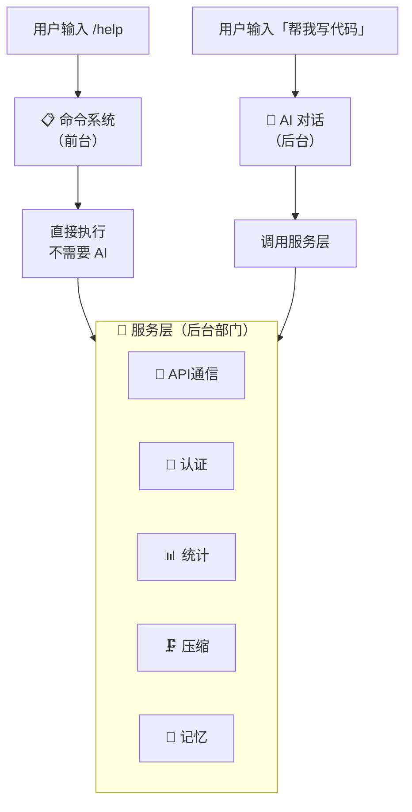

# 05 - 命令系统与服务层架构

> Claude Code CLI 的命令系统和服务层构成了产品的核心交互与能力基础设施。命令系统负责用户输入的解析与分发，服务层则封装了 API 通信、协议集成、认证、分析等底层能力。

---

## 简明图解



---

## 目录

1. [命令系统概览](#1-命令系统概览)
2. [命令的注册与分发机制](#2-命令的注册与分发机制)
3. [命令的生命周期](#3-命令的生命周期)
4. [命令分类与功能表](#4-命令分类与功能表)
5. [服务层架构](#5-服务层架构)
6. [API 通信服务](#6-api-通信服务)
7. [MCP 协议服务](#7-mcp-协议服务)
8. [OAuth 认证流程](#8-oauth-认证流程)
9. [服务间交互模式](#9-服务间交互模式)

---

## 1. 命令系统概览

Claude Code 的命令系统通过斜杠命令（`/command`）为用户提供直接操控能力。整个命令体系由以下几部分组成：

- **内置命令**：约 90+ 个，定义在 `src/commands/` 目录下
- **技能命令（Skills）**：从 `.claude/skills/` 目录、插件和捆绑技能中加载
- **MCP 命令**：通过 MCP 服务器提供的 prompt 类型命令
- **插件命令**：由第三方插件注册的命令
- **工作流命令**：基于工作流脚本生成的命令

核心注册文件：`src/commands.ts`（约 755 行）
类型定义文件：`src/types/command.ts`

### 1.1 命令类型体系

命令通过 `Command` 联合类型定义，包含三种执行模式：

```
Command = CommandBase & (PromptCommand | LocalCommand | LocalJSXCommand)
```

| 类型 | 描述 | 返回值 | 典型场景 |
|------|------|--------|----------|
| `prompt` | 生成 prompt 内容发送给模型 | `ContentBlockParam[]` | `/review`, `/commit`, 技能命令 |
| `local` | 本地执行，返回文本结果 | `LocalCommandResult` | `/compact`, `/cost` |
| `local-jsx` | 本地执行，渲染 React/Ink UI | `React.ReactNode` | `/help`, `/config`, `/mcp`, `/login` |

### 1.2 CommandBase 公共属性

定义在 `src/types/command.ts` 中的 `CommandBase` 类型包含所有命令共享的元数据：

- `name` / `aliases`：命令名称与别名
- `description`：命令描述
- `availability`：可用性约束（`'claude-ai'` | `'console'`）
- `isEnabled`：动态启用/禁用（基于 Feature Flag、环境变量等）
- `isHidden`：是否从 typeahead/help 中隐藏
- `loadedFrom`：命令来源（`'skills'` | `'plugin'` | `'bundled'` | `'mcp'` | `'commands_DEPRECATED'`）
- `disableModelInvocation`：是否禁止模型自动调用
- `immediate`：是否跳过队列立即执行
- `whenToUse`：详细的使用场景描述（用于技能匹配）

---

## 2. 命令的注册与分发机制

### 2.1 命令注册流程

命令注册通过 `src/commands.ts` 中的多层机制实现：

```
┌─────────────────────────────────────────────────┐
│              getCommands(cwd)                    │
│  ┌────────────────────────────────────────────┐  │
│  │         loadAllCommands(cwd)               │  │  ← memoized
│  │  ┌──────────────────────────────────────┐  │  │
│  │  │  并行加载:                            │  │  │
│  │  │  1. getSkills(cwd)                   │  │  │
│  │  │     - getSkillDirCommands()          │  │  │  ← .claude/skills/ 目录
│  │  │     - getPluginSkills()              │  │  │  ← 插件技能
│  │  │     - getBundledSkills()             │  │  │  ← 内置捆绑技能
│  │  │     - getBuiltinPluginSkillCommands()│  │  │  ← 内置插件技能
│  │  │  2. getPluginCommands()              │  │  │  ← 插件注册的命令
│  │  │  3. getWorkflowCommands(cwd)         │  │  │  ← 工作流命令
│  │  └──────────────────────────────────────┘  │  │
│  │                                            │  │
│  │  合并顺序:                                  │  │
│  │  bundledSkills → builtinPluginSkills →      │  │
│  │  skillDirCommands → workflowCommands →      │  │
│  │  pluginCommands → pluginSkills → COMMANDS() │  │
│  └────────────────────────────────────────────┘  │
│                                                  │
│  过滤:                                           │
│  - meetsAvailabilityRequirement() ← 认证/提供商匹配│
│  - isCommandEnabled()            ← Feature Flag  │
│  + getDynamicSkills()            ← 运行时发现的技能│
└─────────────────────────────────────────────────┘
```

**关键文件引用**：
- `src/commands.ts` — 命令注册主文件，`COMMANDS()` 函数（第 258-346 行）
- `src/skills/loadSkillsDir.ts` — 从磁盘加载技能
- `src/skills/bundledSkills.ts` — 内置捆绑技能
- `src/plugins/builtinPlugins.ts` — 内置插件技能
- `src/utils/plugins/loadPluginCommands.ts` — 插件命令加载

### 2.2 条件注册与特性门控

许多命令通过 `bun:bundle` 的 `feature()` 函数进行编译时条件加载（dead code elimination）：

```typescript
// src/commands.ts 中的条件导入示例
const proactive = feature('PROACTIVE') || feature('KAIROS')
  ? require('./commands/proactive.js').default : null

const voiceCommand = feature('VOICE_MODE')
  ? require('./commands/voice/index.js').default : null

const workflowsCmd = feature('WORKFLOW_SCRIPTS')
  ? require('./commands/workflows/index.js').default : null
```

此外，`INTERNAL_ONLY_COMMANDS` 数组（第 225-254 行）包含仅在 `USER_TYPE === 'ant'` 时可用的内部命令。

### 2.3 命令查找

命令查找通过 `findCommand()` 函数实现，支持按 `name`、`getCommandName()` 返回值或 `aliases` 匹配：

```typescript
// src/commands.ts 第 688-698 行
export function findCommand(commandName: string, commands: Command[]): Command | undefined {
  return commands.find(
    _ => _.name === commandName ||
         getCommandName(_) === commandName ||
         _.aliases?.includes(commandName),
  )
}
```

### 2.4 可用性与远程模式

系统定义了两组命令白名单：

- `REMOTE_SAFE_COMMANDS`（第 619-637 行）：在 `--remote` 模式下安全的命令（仅影响本地 TUI 状态）
- `BRIDGE_SAFE_COMMANDS`（第 651-660 行）：可通过远程控制桥（移动端/Web）执行的命令

> 💡 **Agent 开发启示**：Claude Code 的命令系统不只是"解析 /help"这么简单。`src/commands.ts` 的 `getCommands()` 并行加载 6 种来源（内置、技能目录、插件、工作流、MCP、捆绑技能），然后用 `meetsAvailabilityRequirement()` 动态过滤。这让命令系统成为了一个可扩展的生态入口。
>
> **设计要点**：命令分三种执行模式：`prompt`（生成 prompt 发给 AI）、`local`（本地直接执行）、`local-jsx`（渲染 UI 组件）。最常用的是 `prompt` 类型——它不是直接执行，而是生成一段 prompt 让 AI 来处理。
> **你自己造的时候**：斜杠命令是极好的用户交互方式。至少实现 `/help`、`/clear`、`/exit`。命令用 `{name, description, execute}` 三字段就够了。

---

## 3. 命令的生命周期

### 3.1 完整生命周期流程

```
用户输入 "/" → 解析 → 查找 → 权限检查 → 执行 → 结果处理 → 显示
```

详细流程：

```
┌──────────────┐
│  用户键入     │  如: /compact custom instructions
│  斜杠命令     │
└──────┬───────┘
       │
       ▼
┌──────────────┐
│ parseSlash   │  src/utils/slashCommandParsing.ts
│ Command()    │  → { commandName: "compact", args: "custom instructions", isMcp: false }
└──────┬───────┘
       │
       ▼
┌──────────────┐
│ processSlash │  src/utils/processUserInput/processSlashCommand.tsx
│ Command()    │  → 查找命令, 验证存在性
└──────┬───────┘
       │
       ▼
┌──────────────┐
│ getMessages  │  根据命令类型分发:
│ ForSlash     │
│ Command()    │  ┌─ prompt  → getPromptForCommand() → 生成 API 内容
│              │  ├─ local   → load() → call(args, context)
│              │  └─ local-jsx → load() → call(onDone, context, args)
└──────┬───────┘
       │
       ▼
┌──────────────────────────┐
│ 结果处理                   │
│ ┌─ text   → 显示文本       │
│ ├─ compact → 重建消息列表   │
│ ├─ skip   → 跳过显示       │
│ └─ JSX    → 渲染 React 组件│
└──────────────────────────┘
```

### 3.2 Prompt 类型命令执行详情

Prompt 命令的内容会作为用户消息的一部分注入对话，由模型处理：

1. 调用 `command.getPromptForCommand(args, context)` 获取 `ContentBlockParam[]`
2. 内容被包裹在 XML 标签中：`<command-name>` 和 `<command-message>`
3. 如果命令有 `context: 'fork'` 属性，则在独立子代理中执行（`executeForkedSlashCommand`）
4. 支持 `allowedTools` 和 `model` 覆盖
5. 命令结果的 `shouldQuery` 标志决定是否触发模型推理

### 3.3 本地命令的惰性加载

所有本地命令（`local` 和 `local-jsx`）采用惰性加载模式。命令定义只包含轻量级元数据，实际实现通过 `load()` 异步导入：

```typescript
// src/commands/compact/index.ts — 典型的命令定义
const compact = {
  type: 'local',
  name: 'compact',
  description: 'Clear conversation history but keep a summary in context.',
  isEnabled: () => !isEnvTruthy(process.env.DISABLE_COMPACT),
  supportsNonInteractive: true,
  load: () => import('./compact.js'),  // 惰性加载
} satisfies Command
```

这种模式避免了在启动时加载所有命令的实现代码，减少内存占用和启动延迟。

### 3.4 Forked 命令（子代理执行）

当 Prompt 命令的 `context` 属性为 `'fork'` 时，命令在独立子代理中执行：

- 通过 `runAgent()` 创建独立对话上下文
- 拥有独立的 token 预算
- 支持异步/后台执行（Kairos assistant 模式下 fire-and-forget）
- 结果通过 `extractResultText()` 提取后返回主对话

---

## 4. 命令分类与功能表

### 4.1 核心交互命令

| 命令 | 类型 | 描述 | 文件路径 |
|------|------|------|----------|
| `/help` | local-jsx | 显示帮助信息和可用命令 | `src/commands/help/` |
| `/clear` | local-jsx | 清除对话历史 | `src/commands/clear/` |
| `/compact` | local | 压缩对话上下文但保留摘要 | `src/commands/compact/` |
| `/exit` | local-jsx | 退出 CLI | `src/commands/exit/` |
| `/copy` | local-jsx | 复制最后消息到剪贴板 | `src/commands/copy/` |

### 4.2 配置与设置命令

| 命令 | 类型 | 描述 | 文件路径 |
|------|------|------|----------|
| `/config` | local-jsx | 打开配置面板 | `src/commands/config/` |
| `/model` | local-jsx | 设置 AI 模型 | `src/commands/model/` |
| `/theme` | local-jsx | 更改终端主题 | `src/commands/theme/` |
| `/color` | local-jsx | 更改代理颜色 | `src/commands/color/` |
| `/vim` | local-jsx | 切换 vim 模式 | `src/commands/vim/` |
| `/keybindings` | local-jsx | 键位绑定管理 | `src/commands/keybindings/` |
| `/permissions` | local-jsx | 权限设置 | `src/commands/permissions/` |
| `/privacy-settings` | local-jsx | 隐私设置 | `src/commands/privacy-settings/` |
| `/hooks` | local-jsx | 钩子管理 | `src/commands/hooks/` |
| `/effort` | local-jsx | 设置推理努力程度 | `src/commands/effort/` |
| `/output-style` | local-jsx | 输出样式设置 | `src/commands/output-style/` |
| `/fast` | local-jsx | 快速模式切换 | `src/commands/fast/` |
| `/sandbox-toggle` | local-jsx | 沙箱模式切换 | `src/commands/sandbox-toggle/` |

### 4.3 认证与账户命令

| 命令 | 类型 | 描述 | 文件路径 |
|------|------|------|----------|
| `/login` | local-jsx | 登录 Anthropic 账户 | `src/commands/login/` |
| `/logout` | local-jsx | 退出登录 | `src/commands/logout/` |
| `/usage` | local-jsx | 显示用量信息 | `src/commands/usage/` |
| `/cost` | local-jsx | 显示会话成本 | `src/commands/cost/` |
| `/status` | local-jsx | 显示状态信息 | `src/commands/status/` |

### 4.4 开发工具命令

| 命令 | 类型 | 描述 | 文件路径 |
|------|------|------|----------|
| `/review` | prompt | 代码审查 | `src/commands/review.ts` |
| `/commit` | prompt | Git 提交 | `src/commands/commit.ts` |
| `/diff` | local-jsx | 查看差异 | `src/commands/diff/` |
| `/branch` | local-jsx | 分支管理 | `src/commands/branch/` |
| `/init` | prompt | 初始化项目配置 | `src/commands/init.ts` |
| `/pr_comments` | prompt | PR 评论 | `src/commands/pr_comments/` |
| `/security-review` | prompt | 安全审查 | `src/commands/security-review.ts` |

### 4.5 上下文与记忆命令

| 命令 | 类型 | 描述 | 文件路径 |
|------|------|------|----------|
| `/context` | local-jsx | 可视化上下文使用情况 | `src/commands/context/` |
| `/memory` | local-jsx | 管理持久化记忆 | `src/commands/memory/` |
| `/files` | local-jsx | 列出已追踪文件 | `src/commands/files/` |
| `/add-dir` | local-jsx | 添加工作目录 | `src/commands/add-dir/` |

### 4.6 MCP 与集成命令

| 命令 | 类型 | 描述 | 文件路径 |
|------|------|------|----------|
| `/mcp` | local-jsx | 管理 MCP 服务器 | `src/commands/mcp/` |
| `/plugin` | local-jsx | 管理插件 | `src/commands/plugin/` |
| `/reload-plugins` | local-jsx | 重新加载插件 | `src/commands/reload-plugins/` |
| `/skills` | local-jsx | 列出可用技能 | `src/commands/skills/` |
| `/ide` | local-jsx | IDE 集成 | `src/commands/ide/` |
| `/chrome` | local-jsx | Chrome 集成 | `src/commands/chrome/` |

### 4.7 会话管理命令

| 命令 | 类型 | 描述 | 文件路径 |
|------|------|------|----------|
| `/resume` | local-jsx | 恢复之前的会话 | `src/commands/resume/` |
| `/session` | local-jsx | 会话管理（QR/URL） | `src/commands/session/` |
| `/rename` | local-jsx | 重命名会话 | `src/commands/rename/` |
| `/share` | prompt | 分享对话 | `src/commands/share/` |
| `/export` | local-jsx | 导出对话 | `src/commands/export/` |
| `/rewind` | local-jsx | 回退操作 | `src/commands/rewind/` |

### 4.8 诊断与调试命令

| 命令 | 类型 | 描述 | 文件路径 |
|------|------|------|----------|
| `/doctor` | local-jsx | 诊断安装和设置 | `src/commands/doctor/` |
| `/stats` | local-jsx | 统计信息 | `src/commands/stats/` |
| `/feedback` | local-jsx | 发送反馈 | `src/commands/feedback/` |
| `/release-notes` | local-jsx | 显示更新日志 | `src/commands/release-notes/` |
| `/upgrade` | local-jsx | 升级 CLI | `src/commands/upgrade/` |
| `/terminal-setup` | local-jsx | 终端设置 | `src/commands/terminalSetup/` |

### 4.9 高级/实验性命令

| 命令 | 类型 | 描述 | 特性门控 |
|------|------|------|----------|
| `/proactive` | prompt | 主动建议 | `PROACTIVE` / `KAIROS` |
| `/voice` | local-jsx | 语音模式 | `VOICE_MODE` |
| `/bridge` | local-jsx | 远程控制桥 | `BRIDGE_MODE` |
| `/workflows` | local-jsx | 工作流管理 | `WORKFLOW_SCRIPTS` |
| `/fork` | local-jsx | Fork 子代理 | `FORK_SUBAGENT` |
| `/torch` | prompt | Torch 功能 | `TORCH` |
| `/peers` | local-jsx | 对等连接 | `UDS_INBOX` |

---

## 5. 服务层架构

### 5.1 服务层目录结构

```
src/services/
├── api/                    # API 通信服务（核心）
│   ├── client.ts           # Anthropic SDK 客户端创建
│   ├── claude.ts           # 模型查询核心（3400+ 行）
│   ├── withRetry.ts        # 重试与容错逻辑
│   ├── errors.ts           # API 错误处理
│   ├── logging.ts          # API 请求日志
│   ├── usage.ts            # 用量追踪
│   └── promptCacheBreakDetection.ts  # 缓存命中监测
├── mcp/                    # MCP 协议服务
│   ├── client.ts           # MCP 客户端（3300+ 行）
│   ├── config.ts           # MCP 配置管理
│   ├── types.ts            # 类型定义
│   ├── auth.ts             # MCP OAuth 认证
│   ├── MCPConnectionManager.tsx  # React 连接管理
│   └── useManageMCPConnections.ts  # React Hook
├── oauth/                  # OAuth 2.0 认证
│   ├── index.ts            # OAuthService 主类
│   ├── client.ts           # OAuth HTTP 客户端
│   ├── crypto.ts           # PKCE 加密工具
│   └── auth-code-listener.ts  # 本地回调服务器
├── analytics/              # 分析与遥测
│   ├── index.ts            # 事件日志公共 API
│   ├── growthbook.ts       # Feature Flag（GrowthBook）
│   ├── datadog.ts          # Datadog 集成
│   ├── sink.ts             # 事件路由
│   └── metadata.ts         # 元数据处理
├── compact/                # 上下文压缩
│   ├── compact.ts          # 传统压缩
│   ├── microCompact.ts     # 微压缩
│   ├── autoCompact.ts      # 自动压缩触发
│   ├── sessionMemoryCompact.ts  # 会话记忆压缩
│   └── apiMicrocompact.ts  # API 级微压缩
├── extractMemories/        # 记忆提取
│   ├── extractMemories.ts  # 持久记忆抽取
│   └── prompts.ts          # 提取 prompt
├── SessionMemory/          # 会话记忆
│   ├── sessionMemory.ts    # 会话内记忆管理
│   ├── sessionMemoryUtils.ts  # 工具函数
│   └── prompts.ts          # 会话记忆 prompt
├── lsp/                    # 语言服务器协议
│   ├── manager.ts          # 全局单例管理器
│   ├── LSPServerManager.ts # 多服务器路由
│   ├── LSPServerInstance.ts  # 单个服务器实例
│   └── LSPClient.ts        # LSP 客户端
├── plugins/                # 插件服务
│   ├── PluginInstallationManager.ts  # 后台安装管理
│   └── pluginOperations.ts # 插件操作
├── tools/                  # 工具执行服务
│   ├── toolOrchestration.ts  # 工具编排（并发/串行）
│   ├── toolExecution.ts    # 工具执行核心
│   ├── StreamingToolExecutor.ts  # 流式工具执行
│   └── toolHooks.ts        # 工具钩子
├── tips/                   # 提示服务
│   ├── tipRegistry.ts      # 提示注册中心
│   ├── tipScheduler.ts     # 提示调度
│   └── tipHistory.ts       # 提示历史
├── settingsSync/           # 设置同步
│   ├── index.ts            # 设置上传/下载
│   └── types.ts            # 同步数据结构
├── remoteManagedSettings/  # 远程托管设置
│   ├── index.ts            # 安全检查与同步
│   └── types.ts            # 类型定义
├── policyLimits/           # 策略限制
│   ├── index.ts            # 限制检查
│   └── types.ts            # 限制类型
├── AgentSummary/           # 代理摘要
│   └── agentSummary.ts     # 对话摘要生成
├── MagicDocs/              # 智能文档
│   ├── magicDocs.ts        # 自动文档检索
│   └── prompts.ts          # 文档 prompt
├── PromptSuggestion/       # 提示建议
│   ├── promptSuggestion.ts # 后续问题建议
│   └── speculation.ts      # 推测性预取
├── teamMemorySync/         # 团队记忆同步
│   ├── index.ts            # 团队记忆服务
│   └── watcher.ts          # 文件监听
├── tokenEstimation.ts      # Token 估算
├── diagnosticTracking.ts   # 诊断追踪
├── notifier.ts             # 通知服务
├── vcr.ts                  # 请求录制/回放
└── voice.ts                # 语音服务
```

### 5.2 服务依赖关系图

```
                    ┌─────────────┐
                    │  REPL/main  │
                    └──────┬──────┘
                           │
              ┌────────────┼────────────────┐
              │            │                │
              ▼            ▼                ▼
        ┌──────────┐ ┌──────────┐   ┌────────────┐
        │ Commands │ │  query   │   │  Services  │
        │ System   │ │  Loop    │   │  Layer     │
        └────┬─────┘ └────┬─────┘   └─────┬──────┘
             │            │               │
     ┌───────┴───────┐    │    ┌──────────┼──────────┐
     │               │    │    │          │          │
     ▼               ▼    ▼    ▼          ▼          ▼
┌─────────┐   ┌──────────────────┐  ┌──────────┐  ┌──────────┐
│Skill/   │   │   API Service    │  │  MCP     │  │ Analytics│
│Plugin   │   │ ┌──────────────┐ │  │ Service  │  │ Service  │
│Loader   │   │ │   client.ts  │ │  │          │  │          │
│         │   │ │ (SDK Client) │ │  │ client   │  │ growthbook│
│         │   │ └──────┬───────┘ │  │ config   │  │ datadog  │
│         │   │ ┌──────┴───────┐ │  │ auth     │  │ sink     │
│         │   │ │  claude.ts   │ │  │ types    │  │          │
│         │   │ │ (queryModel) │ │  │          │  │          │
│         │   │ └──────┬───────┘ │  └────┬─────┘  └──────────┘
│         │   │ ┌──────┴───────┐ │       │
│         │   │ │ withRetry.ts │ │       │
│         │   │ └──────────────┘ │       │
│         │   └──────────────────┘       │
└─────────┘            │                 │
                       ▼                 ▼
              ┌──────────────┐   ┌──────────────┐
              │    OAuth     │   │   Tool       │
              │   Service    │   │  Execution   │
              │              │   │   Service    │
              │ index.ts     │   │              │
              │ client.ts    │   │orchestration │
              │ crypto.ts    │   │ execution    │
              └──────────────┘   │ streaming    │
                                 └──────────────┘
                                       │
                          ┌────────────┼────────────┐
                          ▼            ▼            ▼
                    ┌──────────┐ ┌──────────┐ ┌──────────┐
                    │ Compact  │ │ Memory   │ │  LSP     │
                    │ Service  │ │ Services │ │ Service  │
                    │          │ │          │ │          │
                    │ compact  │ │ extract  │ │ manager  │
                    │ micro    │ │ session  │ │ server   │
                    │ auto     │ │ team     │ │ client   │
                    └──────────┘ └──────────┘ └──────────┘
```

---

## 6. API 通信服务

### 6.1 客户端创建（`src/services/api/client.ts`）

`getAnthropicClient()` 函数是 API 客户端的工厂方法，支持多种 API 提供商：

| 提供商 | SDK 类 | 关键环境变量 |
|--------|--------|-------------|
| **Anthropic 直连** | `Anthropic` | `ANTHROPIC_API_KEY` |
| **AWS Bedrock** | `AnthropicBedrock` | `CLAUDE_CODE_USE_BEDROCK`, AWS 凭证 |
| **Azure Foundry** | `AnthropicFoundry` | `CLAUDE_CODE_USE_FOUNDRY`, Azure 凭证 |
| **Google Vertex** | `AnthropicVertex` | `CLAUDE_CODE_USE_VERTEX`, GCP 凭证 |
| **Claude.ai OAuth** | `Anthropic`（authToken） | OAuth token |

客户端创建流程：

```
getAnthropicClient()
  ├─ 配置 defaultHeaders (x-app, User-Agent, Session-Id, ...)
  ├─ checkAndRefreshOAuthTokenIfNeeded()
  ├─ configureApiKeyHeaders()  ← 非 Claude.ai 用户
  ├─ buildFetch()  ← 注入 x-client-request-id
  └─ 根据环境变量选择提供商:
     ├─ CLAUDE_CODE_USE_BEDROCK → new AnthropicBedrock(...)
     ├─ CLAUDE_CODE_USE_FOUNDRY → new AnthropicFoundry(...)
     ├─ CLAUDE_CODE_USE_VERTEX  → new AnthropicVertex(...)
     └─ 默认 → new Anthropic({ apiKey | authToken })
```

### 6.2 模型查询（`src/services/api/claude.ts`）

这是最核心的 API 调用模块（3400+ 行），提供两个主要入口：

- `queryModelWithStreaming()` — 流式请求（主要入口）
- `queryModelWithoutStreaming()` — 非流式请求

两者内部都调用 `queryModel()` 生成器函数，该函数：

1. 构建请求参数（system prompt、messages、tools、thinking config）
2. 通过 `withRetry()` 包装处理重试逻辑
3. 使用 `anthropic.beta.messages.stream()` 创建流式连接
4. 解析流事件，yield `StreamEvent` 和 `AssistantMessage`
5. 处理 prompt 缓存（`cache_control`、`getCacheControl()`）
6. 支持努力度调节（`configureEffortParams()`）
7. 支持 advisor 双模型模式
8. 处理 tool_search 延迟加载工具

### 6.3 重试机制（`src/services/api/withRetry.ts`）

`withRetry()` 实现了复杂的重试策略：

- **最大重试次数**：默认 10 次
- **529 错误特殊处理**：最多 3 次重试，仅限前台查询源（`FOREGROUND_529_RETRY_SOURCES`）
- **401 OAuth 处理**：尝试刷新 token 后重试
- **AWS/GCP 凭证刷新**：自动清除并重新获取凭证缓存
- **Fast Mode 降级**：在过载时自动关闭快速模式
- **模型回退**：支持 `fallbackModel` 配置

### 6.4 Prompt 缓存

系统使用 Anthropic 的 prompt 缓存特性减少重复 token 消耗：

- `getPromptCachingEnabled()` — 根据模型和配置决定是否启用
- `getCacheControl()` — 生成 `cache_control` 参数
- `should1hCacheTTL()` — 是否使用 1 小时长缓存 TTL
- `promptCacheBreakDetection.ts` — 检测缓存失效

> 💡 **Agent 开发启示**：`src/services/api/` 支持 5 种 API 后端（Anthropic 直连、AWS Bedrock、Azure Foundry、GCP Vertex、Claude.ai），通过工厂函数 `createApiClient()` 统一接口。每个后端的认证、端点、请求格式都不同，但对上层来说是透明的。
>
> **设计要点**：重试策略值得学习——API 超时或 5xx 错误时自动重试，429 时指数退避，但 4xx 客户端错误不重试。流式模式下用 SSE 逐 token 接收。
> **你自己造的时候**：先只支持一个 API（Anthropic SDK 最简单）。但从第一天就用接口抽象 `{stream, complete}`，方便以后换后端。一定要加重试和超时。

---

## 7. MCP 协议服务

### 7.1 架构概览

MCP（Model Context Protocol）服务管理与外部工具服务器的连接，是 Claude Code 扩展能力的核心通道。

**文件**: `src/services/mcp/client.ts`（3300+ 行）

### 7.2 传输协议支持

MCP 客户端支持多种传输协议：

| 传输类型 | Schema | 典型场景 |
|----------|--------|----------|
| `stdio` | `McpStdioServerConfig` | 本地子进程 MCP 服务器 |
| `sse` | `McpSSEServerConfig` | Server-Sent Events 远程服务器 |
| `sse-ide` | `McpSSEIDEServerConfig` | IDE 扩展（内部） |
| `http` | `McpHTTPServerConfig` | Streamable HTTP（MCP 2025-03-26 规范） |
| `ws` | `McpWebSocketServerConfig` | WebSocket 连接 |
| `sdk` | `McpSdkServerConfig` | SDK 控制协议 |
| `claudeai-proxy` | `McpClaudeAIProxyServerConfig` | Claude.ai 代理 |

### 7.3 连接管理

```
┌─────────────────────────────────────────────┐
│            MCPConnectionManager             │
│         (React Context Provider)            │
│                                             │
│  useManageMCPConnections()                  │
│  ├─ reconnectMcpServer()                    │
│  └─ toggleMcpServer()                       │
└──────────────────┬──────────────────────────┘
                   │
                   ▼
┌─────────────────────────────────────────────┐
│         MCP Client (client.ts)              │
│                                             │
│  连接生命周期:                                │
│  1. getAllMcpConfigs()  ← 从多个源收集配置     │
│  2. 创建 Transport (stdio/sse/http/ws)       │
│  3. new Client() → client.connect()          │
│  4. 注册工具 → MCPTool                        │
│  5. 注册资源 → ReadMcpResourceTool            │
│  6. 注册提示 → Command (prompt 类型)          │
│                                              │
│  连接状态:                                    │
│  connected | failed | needs-auth |           │
│  pending | disabled                          │
└──────────────────────────────────────────────┘
```

### 7.4 MCP 配置来源

配置通过 `getAllMcpConfigs()` 从多个来源合并（`src/services/mcp/config.ts`）：

| 来源 | scope | 优先级 | 说明 |
|------|-------|--------|------|
| 项目 `.claude/settings.json` | `project` | 高 | 项目级配置 |
| 用户 `~/.claude/settings.json` | `user` | 中 | 用户全局配置 |
| 企业 `managed-mcp.json` | `enterprise` | 最高 | 企业管理配置 |
| Claude.ai | `claudeai` | 中 | Claude.ai 提供的远程 MCP |
| 插件 | `local` | 中 | 插件注册的 MCP 服务器 |
| 动态 | `dynamic` | 低 | 运行时动态添加 |

### 7.5 MCP 工具集成

MCP 服务器发现的工具被封装为 `MCPTool` 实例，资源被封装为 `ReadMcpResourceTool` 和 `ListMcpResourcesTool`。MCP prompts 被转换为 `Command` 类型的 prompt 命令。

认证失败的 MCP 服务器通过 `McpAuthError` 标记，15 分钟缓存 TTL 防止频繁认证弹窗。

---

## 8. OAuth 认证流程

### 8.1 OAuth 2.0 + PKCE 流程

`src/services/oauth/index.ts` 中的 `OAuthService` 实现了 OAuth 2.0 Authorization Code Flow with PKCE：

```
┌──────────┐     ┌──────────────┐     ┌──────────────────┐
│  CLI     │     │ 本地服务器     │     │ Anthropic OAuth  │
│ (Client) │     │ (Callback)    │     │ Server           │
└────┬─────┘     └──────┬───────┘     └────────┬─────────┘
     │                  │                       │
     │  1. 生成 PKCE 参数                        │
     │  codeVerifier = randomBytes(32)           │
     │  codeChallenge = SHA256(codeVerifier)     │
     │                  │                       │
     │  2. 启动本地 HTTP 服务器                    │
     │  ────────────────>│                       │
     │     port = 随机端口                        │
     │                  │                       │
     │  3. 构建授权 URL                           │
     │  ──────────────────────────────────────>  │
     │  URL = /authorize?                        │
     │    client_id=...&code_challenge=...       │
     │    &redirect_uri=http://localhost:{port}  │
     │                  │                       │
     │  4. 打开浏览器                             │
     │  (自动流: openBrowser)                     │
     │  (手动流: 显示 URL 供用户复制)               │
     │                  │                       │
     │                  │    5. 用户授权后重定向    │
     │                  │  <───────────────────  │
     │                  │  /callback?code=xxx    │
     │                  │                       │
     │  6. 接收授权码    │                       │
     │  <────────────── │                       │
     │                  │                       │
     │  7. 交换 token                            │
     │  ──────────────────────────────────────>  │
     │  POST /token                              │
     │  { code, code_verifier, ... }             │
     │                  │                       │
     │  8. 获取 access_token + refresh_token     │
     │  <──────────────────────────────────────  │
     │                  │                       │
     │  9. 获取用户资料                            │
     │  ──────────────────────────────────────>  │
     │  GET /profile                             │
     │  <──────────────────────────────────────  │
     │  { subscriptionType, rateLimitTier }      │
     │                  │                       │
     │  10. 格式化并存储 tokens                    │
     │  → OAuthTokens { accessToken,             │
     │    refreshToken, expiresAt, scopes,       │
     │    subscriptionType, rateLimitTier }       │
     └──────────────────┘                       │
```

### 8.2 Token 管理

OAuth token 在以下场景自动刷新：

- 每次 API 请求前：`checkAndRefreshOAuthTokenIfNeeded()`（在 `getAnthropicClient` 中调用）
- MCP 连接时：Claude.ai proxy fetch 中的 401 重试
- 显式操作：`/oauth-refresh` 命令

### 8.3 PKCE 加密工具（`src/services/oauth/crypto.ts`）

```typescript
generateCodeVerifier()  → base64URLEncode(randomBytes(32))
generateCodeChallenge() → base64URLEncode(SHA256(verifier))
generateState()         → base64URLEncode(randomBytes(32))
```

### 8.4 OAuth 作用域

系统支持两类 OAuth 作用域：

- `ALL_OAUTH_SCOPES` — 完整权限（profile + inference）
- `CLAUDE_AI_INFERENCE_SCOPE` — 仅推理权限（长期 token）

---

## 9. 服务间交互模式

### 9.1 主查询循环中的服务协作

```
用户消息 → query.ts (查询循环)
    │
    ├─ API Service: queryModelWithStreaming()
    │   ├─ OAuth Service: checkAndRefreshOAuthTokenIfNeeded()
    │   ├─ Analytics: logAPIQuery(), logAPISuccessAndDuration()
    │   └─ Compact Service: getAPIContextManagement()
    │
    ├─ Tool Execution Service: runTools()
    │   ├─ MCP Service: MCPTool.call() → MCP client.callTool()
    │   ├─ LSP Service: sendRequest() (代码智能)
    │   └─ Analytics: logEvent('tengu_tool_use_*')
    │
    ├─ Compact Service: 自动压缩检测
    │   ├─ calculateTokenWarningState()
    │   └─ autoCompact (当 token 即将耗尽时触发)
    │
    ├─ Memory Services: (后台)
    │   ├─ extractMemories: 从对话中提取持久记忆
    │   └─ sessionMemory: 维护会话记忆文件
    │
    └─ Analytics: 贯穿全程的遥测
```

### 9.2 服务初始化顺序

```
应用启动 (main.tsx)
  ├─ 1. Analytics: attachAnalyticsSink() → 事件队列开始分发
  ├─ 2. OAuth: 检查并刷新 token
  ├─ 3. Settings Sync: uploadUserSettingsInBackground() (后台)
  ├─ 4. MCP: useManageMCPConnections() → 并行连接所有配置的服务器
  ├─ 5. LSP: initializeLspServerManager() (异步, 不阻塞启动)
  ├─ 6. Plugins: performBackgroundPluginInstallations() (后台)
  ├─ 7. Commands: getCommands(cwd) → 加载并合并所有命令源
  └─ 8. Tips: tipScheduler → 定期显示使用提示
```

### 9.3 关键交互模式

#### 模式一：惰性单例（Lazy Singleton）

多个服务使用模块级单例 + 惰性初始化：

```typescript
// LSP 服务 — src/services/lsp/manager.ts
let lspManagerInstance: LSPServerManager | undefined
export function getLspServerManager(): LSPServerManager | undefined { ... }
```

#### 模式二：Memoized 工厂

命令加载使用 lodash `memoize` 缓存昂贵的异步操作：

```typescript
// src/commands.ts — 按 cwd 缓存命令列表
const loadAllCommands = memoize(async (cwd: string): Promise<Command[]> => { ... })
```

#### 模式三：事件队列（Analytics）

分析服务使用无依赖的事件队列模式，避免循环导入：

```typescript
// src/services/analytics/index.ts
// 事件在 sink 附加前排队，初始化后批量分发
logEvent(name, metadata)  // → 队列 或 直接发送
```

#### 模式四：React Context 传播（MCP）

MCP 连接管理通过 React Context 在组件树中传播：

```typescript
// src/services/mcp/MCPConnectionManager.tsx
<MCPConnectionContext.Provider value={{ reconnectMcpServer, toggleMcpServer }}>
  {children}
</MCPConnectionContext.Provider>
```

#### 模式五：Forked Agent（后台处理）

记忆提取和会话记忆使用 forked agent 模式——创建当前对话的完美分叉，共享 prompt 缓存，在后台独立执行：

```typescript
// src/services/extractMemories/extractMemories.ts
// 使用 runForkedAgent() 在后台提取记忆
// 共享父对话的 prompt 缓存
```

#### 模式六：重试与降级

API 服务实现了多层容错：

```
请求失败
  ├─ 529 (过载)  → 退避重试（最多 3 次）+ Fast Mode 降级
  ├─ 401 (认证)  → OAuth token 刷新 → 重试
  ├─ 流式超时     → 非流式回退 (executeNonStreamingRequest)
  ├─ 模型不可用   → fallbackModel 切换
  └─ 凭证过期     → 清除 AWS/GCP 缓存 → 重新获取
```

---

## 关键文件速查

| 功能域 | 核心文件 | 行数 |
|--------|---------|------|
| 命令注册 | `src/commands.ts` | ~755 |
| 命令类型 | `src/types/command.ts` | ~216 |
| 命令解析 | `src/utils/slashCommandParsing.ts` | ~60 |
| 命令执行 | `src/utils/processUserInput/processSlashCommand.tsx` | ~500+ |
| 查询循环 | `src/query.ts` | ~1729 |
| API 客户端 | `src/services/api/client.ts` | ~390 |
| 模型查询 | `src/services/api/claude.ts` | ~3419 |
| 重试逻辑 | `src/services/api/withRetry.ts` | ~500+ |
| MCP 客户端 | `src/services/mcp/client.ts` | ~3348 |
| MCP 配置 | `src/services/mcp/config.ts` | ~500+ |
| MCP 类型 | `src/services/mcp/types.ts` | ~259 |
| OAuth 服务 | `src/services/oauth/index.ts` | ~198 |
| OAuth 客户端 | `src/services/oauth/client.ts` | ~200+ |
| 工具编排 | `src/services/tools/toolOrchestration.ts` | ~200+ |
| 分析服务 | `src/services/analytics/index.ts` | ~100+ |
| 压缩服务 | `src/services/compact/compact.ts` | ~500+ |
| 会话记忆 | `src/services/SessionMemory/sessionMemory.ts` | ~500+ |
| 记忆提取 | `src/services/extractMemories/extractMemories.ts` | ~500+ |
| LSP 管理 | `src/services/lsp/manager.ts` + `LSPServerManager.ts` | ~200+ |
| 设置同步 | `src/services/settingsSync/index.ts` | ~200+ |

