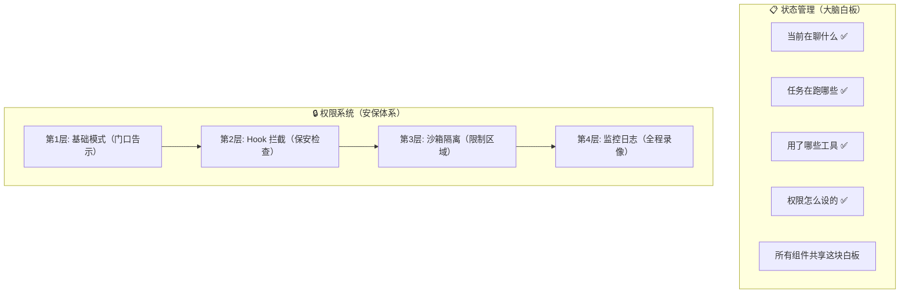

# Claude Code CLI: 状态管理、任务系统、权限与 Hooks 系统

> 基于源码深度分析，涵盖全局状态、Task 系统、Hooks 生命周期、权限模型、插件与 Skills 系统。

---

## 简明图解



---

## 目录

1. [全局状态管理架构](#1-全局状态管理架构)
2. [Task 系统设计](#2-task-系统设计)
3. [Hooks 系统实现](#3-hooks-系统实现)
4. [权限模型](#4-权限模型)
5. [插件系统](#5-插件系统)
6. [Skills 系统](#6-skills-系统)
7. [类型系统与数据模型](#7-类型系统与数据模型)
8. [数据迁移](#8-数据迁移)

---

## 1. 全局状态管理架构

### 1.1 Store 核心实现

**文件**: `src/state/store.ts`

Claude Code 采用自研的轻量级响应式 Store，不依赖 Redux 或 MobX 等外部库。核心设计极为精简：

```typescript
// Store 接口
type Store<T> = {
  getState: () => T
  setState: (updater: (prev: T) => T) => void
  subscribe: (listener: Listener) => () => void
}
```

关键设计要点：
- **不可变更新**: `setState` 接收一个 updater 函数 `(prev: T) => T`，通过 `Object.is` 比较新旧状态，跳过无变化更新
- **发布-订阅模式**: 通过 `subscribe` 注册监听器，状态变化时同步通知所有订阅者
- **onChange 回调**: 创建时可传入 `onChange` 钩子，在状态变化时获取 `{ newState, oldState }`

> 💡 **Agent 开发启示**：Claude Code 没用 Redux/MobX，而是自己写了一个 35 行的 Store。`src/state/store.ts` 只有 `getState/setState/subscribe` 三个方法，用 `Object.is` 跳过无变化更新。对 Agent 应用来说，这种极简状态管理完全够用。
>
> **设计要点**：状态更新用 updater 函数 `(prev) => next` 而不是直接赋值，确保不可变性。`DeepImmutable<>` 在类型级别强制不可变。
> **你自己造的时候**：Agent 状态管理不需要大框架。一个带 subscribe 的对象就够了。关键状态：当前权限模式、活跃任务列表、工具可用性。

### 1.2 AppState 类型定义

**文件**: `src/state/AppStateStore.ts`

`AppState` 是整个应用的状态类型，使用 `DeepImmutable<>` 包裹以确保类型级不可变性。主要状态域包括：

| 状态域 | 说明 |
|--------|------|
| `settings: SettingsJson` | 用户/项目/策略配置合并后的设置 |
| `tasks: { [taskId]: TaskState }` | 所有后台任务的状态映射 |
| `toolPermissionContext` | 当前权限模式、规则和工作目录 |
| `mcp` | MCP 连接、工具、命令和资源 |
| `plugins` | 插件加载状态（enabled/disabled/errors） |
| `speculation` | 推测执行状态（idle/active） |
| `teamContext` | Swarm 团队上下文（队友信息） |
| `inbox` | 收件箱消息队列 |
| `replBridge*` | 远程桥接连接状态系列字段 |
| `fileHistory` | 文件历史快照 |
| `attribution` | 代码提交归因状态 |
| `notifications` | 通知队列（current + queue） |
| `denialTracking` | 权限拒绝追踪（分类器回退机制） |

**特殊说明**: `tasks` 字段被排除在 `DeepImmutable` 之外，因为 `TaskState` 包含函数类型（如 `AbortController`、回调函数）。

### 1.3 默认状态初始化

**函数**: `getDefaultAppState()` — `src/state/AppStateStore.ts`

初始化逻辑检测当前是否为 Teammate 模式（`isTeammate() && isPlanModeRequired()`），如果是则以 `plan` 模式启动，否则使用 `default` 模式。

### 1.4 React 集成

**文件**: `src/state/AppState.tsx`

通过 `AppStateProvider` 组件将 Store 注入 React 上下文：
- `AppStoreContext` — React Context 提供 Store 实例
- `useSyncExternalStore` — React 18 的外部 Store 订阅 API
- `HasAppStateContext` — 防止 Provider 嵌套

### 1.5 状态变化副作用

**文件**: `src/state/onChangeAppState.ts`

`onChangeAppState` 是 Store 的 onChange 回调，负责在状态变化时执行副作用：

- **权限模式同步**: 当 `toolPermissionContext.mode` 变化时，通知 CCR (Claude Code Remote) 和 SDK 状态流。外部模式名称经 `toExternalPermissionMode()` 转换（如 `bubble`/`auto` 映射为 `default`）
- **模型设置持久化**: `mainLoopModel` 变化时写入 `userSettings`
- **视图展开状态持久化**: `expandedView` 变化写入 `globalConfig`
- **verbose 标志持久化**
- **认证缓存清理**: `settings` 变化时清理 API key/AWS/GCP 凭证缓存

### 1.6 状态选择器

**文件**: `src/state/selectors.ts`

提供纯函数的状态派生逻辑：
- `getViewedTeammateTask()` — 获取当前查看的队友任务
- `getActiveAgentForInput()` — 确定用户输入应路由到哪个 Agent（返回 `'leader'` / `'viewed'` / `'named_agent'`）

### 1.7 队友视图管理

**文件**: `src/state/teammateViewHelpers.ts`

管理队友转录视图的进入/退出/切换逻辑：
- `enterTeammateView(taskId)` — 进入队友视图，设 `retain: true`（阻止驱逐、启用流式追加）
- `exitTeammateView()` — 退出回到 Leader 视图，释放 retain，清空 messages
- `stopOrDismissAgent()` — 运行中 abort，已完成则设 `evictAfter: 0` 立即驱逐

---

## 2. Task 系统设计

### 2.1 核心类型

**文件**: `src/Task.ts`

Task 系统定义了 7 种任务类型：

```typescript
type TaskType =
  | 'local_bash'        // 本地 Shell 命令
  | 'local_agent'       // 本地 Agent 子任务
  | 'remote_agent'      // 远程 Agent (云端会话)
  | 'in_process_teammate' // 进程内队友 (Swarm)
  | 'local_workflow'    // 本地工作流
  | 'monitor_mcp'       // MCP 监控
  | 'dream'             // 自动梦境 (记忆整理)
```

每种类型的 Task ID 有特定前缀（`b`/`a`/`r`/`t`/`w`/`m`/`d`），使用 36 进制字符集生成 8 位随机 ID（约 2.8 万亿组合，抵抗符号链接暴力攻击）。

**任务状态生命周期**:
```
pending → running → completed / failed / killed
```

`isTerminalTaskStatus()` 判断终态（`completed`/`failed`/`killed`），用于防止向已终止的 Teammate 注入消息、驱逐已完成任务等。

**TaskStateBase** 公共字段:
| 字段 | 说明 |
|------|------|
| `id` | 唯一任务 ID |
| `type` | 任务类型 |
| `status` | 当前状态 |
| `description` | 任务描述 |
| `startTime` / `endTime` | 时间戳 |
| `outputFile` | 磁盘输出路径 |
| `notified` | 是否已发送完成通知 |

### 2.2 Task 注册表

**文件**: `src/tasks.ts`

`getAllTasks()` 返回所有任务实现的数组，`getTaskByType()` 按类型查找任务。部分任务（`LocalWorkflowTask`、`MonitorMcpTask`）通过 feature flag 条件加载。

每个 Task 实现了统一接口：
```typescript
type Task = {
  name: string
  type: TaskType
  kill(taskId: string, setAppState: SetAppState): Promise<void>
}
```

### 2.3 各任务类型详解

#### LocalShellTask — 本地 Shell 任务

**文件**: `src/tasks/LocalShellTask/LocalShellTask.tsx`、`src/tasks/LocalShellTask/guards.ts`

用于在后台运行 Shell 命令。核心状态扩展字段：
- `command: string` — 执行的命令
- `shellCommand: ShellCommand | null` — Shell 命令实例
- `isBackgrounded: boolean` — 是否已后台化
- `agentId?: AgentId` — 生成此任务的 Agent（用于在 Agent 退出时清理孤儿任务）
- `kind?: 'bash' | 'monitor'` — UI 显示变体

**Stall Watchdog**: 45 秒无输出增长时检查尾部是否像交互式提示（`(y/n)`、`Press Enter` 等），若是则发送停滞通知。

#### LocalAgentTask — 本地 Agent 任务

**文件**: `src/tasks/LocalAgentTask/LocalAgentTask.tsx`

用于子 Agent 调用（Agent Tool 发起的嵌套 Agent）。核心扩展字段：
- `agentId: string` — Agent 标识
- `prompt: string` — Agent 提示词
- `selectedAgent?: AgentDefinition` — Agent 定义
- `progress?: AgentProgress` — 进度跟踪（工具使用数、Token 数、最近活动）
- `messages?: Message[]` — 对话消息（仅在 `retain: true` 时加载）
- `retain: boolean` — 保持在内存中（供转录视图使用）
- `diskLoaded: boolean` — 是否从磁盘加载了消息

**ProgressTracker**: 跟踪工具使用次数和 Token 消耗。`input_tokens` 取最新值（API 累计值），`output_tokens` 累加。

#### LocalMainSessionTask — 后台化主会话

**文件**: `src/tasks/LocalMainSessionTask.ts`

当用户按 Ctrl+B 两次将当前查询后台化时创建。复用 `LocalAgentTaskState` 结构但 `agentType: 'main-session'`。任务 ID 使用 `s` 前缀。

完成时根据 `isBackgrounded` 状态决定：后台化发 XML 通知，前台化（用户正在观看）跳过通知但发 SDK 事件。

#### RemoteAgentTask — 远程 Agent 任务

**文件**: `src/tasks/RemoteAgentTask/RemoteAgentTask.tsx`

管理在 Claude Code Remote (CCR) 上运行的远程会话。核心扩展字段：
- `sessionId: string` — 远程会话 ID
- `remoteTaskType: RemoteTaskType` — 远程任务类型（`remote-agent`/`ultraplan`/`ultrareview`/`autofix-pr`/`background-pr`）
- `todoList: TodoList` — 远程任务的待办列表
- `log: SDKMessage[]` — 远程事件日志
- `isUltraplan?: boolean` — 是否为 Ultraplan 任务
- `ultraplanPhase?: UltraplanPhase` — Ultraplan 阶段（`needs_input`/`plan_ready`）

支持 `RemoteTaskCompletionChecker` 注册，每次轮询时调用，检查外部条件（如 PR 合并状态）。

#### InProcessTeammateTask — 进程内队友

**文件**: `src/tasks/InProcessTeammateTask/types.ts`

Swarm 模式下的进程内队友。核心扩展字段：
- `identity: TeammateIdentity` — 队友身份（agentId, agentName, teamName, color, planModeRequired）
- `prompt: string` — 执行提示
- `permissionMode: PermissionMode` — 独立的权限模式（可通过 Shift+Tab 在查看时切换）
- `awaitingPlanApproval: boolean` — 是否等待 Plan 审批
- `messages?: Message[]` — UI 转录消息（上限 `TEAMMATE_MESSAGES_UI_CAP = 50`，避免内存膨胀）
- `pendingUserMessages: string[]` — 待传递的用户消息队列
- `isIdle: boolean` / `shutdownRequested: boolean` — 生命周期控制

**内存优化**: 分析显示 500+ 轮会话时每个 Agent 约 20MB RSS，292 个 Agent 在 2 分钟内启动可达 36.8GB。UI 消息数组上限 50 条。

#### DreamTask — 自动梦境任务

**文件**: `src/tasks/DreamTask/DreamTask.ts`

用于自动记忆整理（auto-dream），在后台运行记忆整理子 Agent。核心扩展字段：
- `phase: 'starting' | 'updating'` — 从 starting 到首次检测到 Edit/Write 操作变为 updating
- `sessionsReviewing: number` — 正在审查的会话数
- `filesTouched: string[]` — 不完整的已触及文件列表（仅捕获 Edit/Write 工具调用）
- `turns: DreamTurn[]` — 最近 30 轮助手回复

Kill 时调用 `rollbackConsolidationLock()` 回滚锁的 mtime，允许下次会话重试。

### 2.4 任务停止机制

**文件**: `src/tasks/stopTask.ts`

统一的任务停止接口，供 `TaskStopTool`（LLM 调用）和 SDK `stop_task` 控制请求使用：
1. 通过 `taskId` 在 `AppState.tasks` 中查找
2. 验证状态为 `running`
3. 调用对应 Task 实现的 `kill()` 方法
4. 对 Shell 任务，抑制退出码 137 通知（噪声）；Agent 任务保留通知（包含 `extractPartialResult`）

### 2.5 后台任务指示

**文件**: `src/tasks/pillLabel.ts`

`getPillLabel()` 生成底栏药丸标签（如 "1 shell"、"2 cloud sessions"、"dreaming"、"ultraplan ready"）。Ultraplan 使用钻石符号（`◇` 运行中、`◆` 就绪）。

### 2.6 TaskState 联合类型

**文件**: `src/tasks/types.ts`

```typescript
type TaskState =
  | LocalShellTaskState
  | LocalAgentTaskState
  | RemoteAgentTaskState
  | InProcessTeammateTaskState
  | LocalWorkflowTaskState
  | MonitorMcpTaskState
  | DreamTaskState
```

`isBackgroundTask()` 判定任务是否显示在后台指示器中（running/pending 且非前台运行）。

---

## 3. Hooks 系统实现

### 3.1 Hook 事件类型

**文件**: `src/entrypoints/sdk/coreSchemas.ts`

系统定义了 27 种 Hook 事件：

| 事件 | 触发时机 |
|------|----------|
| `PreToolUse` | 工具执行前 |
| `PostToolUse` | 工具执行后 |
| `PostToolUseFailure` | 工具执行失败后 |
| `Notification` | 通知触发时 |
| `UserPromptSubmit` | 用户提交提示时 |
| `SessionStart` | 会话启动时 |
| `SessionEnd` | 会话结束时 |
| `Stop` | 助手停止时 |
| `StopFailure` | 停止失败时 |
| `SubagentStart` | 子 Agent 启动时 |
| `SubagentStop` | 子 Agent 停止时 |
| `PreCompact` | 上下文压缩前 |
| `PostCompact` | 上下文压缩后 |
| `PermissionRequest` | 权限请求时 |
| `PermissionDenied` | 权限被拒绝时 |
| `Setup` | 初始设置时 |
| `TeammateIdle` | 队友空闲时 |
| `TaskCreated` | 任务创建时 |
| `TaskCompleted` | 任务完成时 |
| `Elicitation` / `ElicitationResult` | 交互引出 |
| `ConfigChange` | 配置变更时 |
| `WorktreeCreate` / `WorktreeRemove` | Git Worktree 操作时 |
| `InstructionsLoaded` | 指令文件加载时 |
| `CwdChanged` | 工作目录变更时 |
| `FileChanged` | 文件变更时 |

### 3.2 Hook 命令类型

**文件**: `src/schemas/hooks.ts`

Hook 命令支持 4 种类型（通过 `type` 字段鉴别联合）：

**1. command (Shell 命令 Hook)**:
```json
{
  "type": "command",
  "command": "npm test",
  "if": "Bash(npm *)",
  "shell": "bash",
  "timeout": 30,
  "async": true,
  "asyncRewake": false,
  "once": true
}
```

**2. prompt (LLM 提示 Hook)**:
```json
{
  "type": "prompt",
  "prompt": "Check if this change breaks tests. $ARGUMENTS",
  "model": "claude-sonnet-4-6",
  "timeout": 60
}
```

**3. http (HTTP Hook)**:
```json
{
  "type": "http",
  "url": "https://example.com/hook",
  "headers": { "Authorization": "Bearer $MY_TOKEN" },
  "allowedEnvVars": ["MY_TOKEN"]
}
```

**4. agent (Agent 验证器 Hook)**:
```json
{
  "type": "agent",
  "prompt": "Verify that unit tests ran and passed.",
  "model": "claude-sonnet-4-6",
  "timeout": 60
}
```

**通用字段**:
- `if` — 权限规则语法过滤条件（如 `"Bash(git *)"` 仅匹配 git 命令），避免对不匹配的命令生成 Hook 进程
- `timeout` — 超时秒数
- `statusMessage` — Spinner 显示的自定义状态消息
- `once` — 是否仅执行一次后移除

### 3.3 Hook 匹配器配置

**文件**: `src/schemas/hooks.ts` — `HookMatcherSchema`

```json
{
  "matcher": "Write",
  "hooks": [{ "type": "command", "command": "prettier --write $FILE" }]
}
```

`matcher` 字段用于匹配与 Hook 事件相关的值（如工具名 `"Write"`）。`hooks` 数组中的多个 Hook 按顺序执行。

最终配置结构为 `HooksSettings = Partial<Record<HookEvent, HookMatcher[]>>`。

### 3.4 Hook 回调类型

**文件**: `src/types/hooks.ts`

除了 JSON 配置的 Hook，还支持代码级 `HookCallback`：

```typescript
type HookCallback = {
  type: 'callback'
  callback: (input, toolUseID, abort, hookIndex?, context?) => Promise<HookJSONOutput>
  timeout?: number
  internal?: boolean  // 内部 Hook 排除在指标之外
}
```

### 3.5 Hook 输出协议

**文件**: `src/types/hooks.ts`

Hook 输出分为同步和异步两种：

**同步输出** (`SyncHookJSONOutput`):
- `continue: boolean` — 是否继续（false 则中止）
- `suppressOutput: boolean` — 隐藏 stdout
- `stopReason: string` — 中止原因
- `decision: 'approve' | 'block'` — 权限决策
- `reason: string` — 决策原因
- `hookSpecificOutput` — 按事件类型的特定输出（鉴别联合，每个 HookEvent 有不同字段）

**异步输出** (`AsyncHookJSONOutput`):
- `async: true` — 标记为异步
- `asyncTimeout?: number` — 异步超时

**hookSpecificOutput 示例**（按事件区分）:
- `PreToolUse` — `permissionDecision`, `updatedInput`, `additionalContext`
- `PermissionRequest` — `decision: { behavior: 'allow'|'deny', ... }`
- `SessionStart` — `watchPaths` (FileChanged Hook 监控路径)
- `PostToolUse` — `updatedMCPToolOutput` (MCP 工具输出覆盖)
- `PermissionDenied` — `retry: boolean`

### 3.6 Hook 执行结果

**文件**: `src/types/hooks.ts`

```typescript
type HookResult = {
  message?: Message           // 注入到对话的消息
  systemMessage?: Message     // 系统消息
  blockingError?: HookBlockingError  // 阻塞性错误
  outcome: 'success' | 'blocking' | 'non_blocking_error' | 'cancelled'
  preventContinuation?: boolean
  permissionBehavior?: 'ask' | 'deny' | 'allow' | 'passthrough'
  updatedInput?: Record<string, unknown>  // 更新后的工具输入
  permissionRequestResult?: PermissionRequestResult  // 权限请求结果
  retry?: boolean
}
```

### 3.7 权限请求 Hook (PermissionRequest)

**文件**: `src/hooks/toolPermission/PermissionContext.ts`

`PermissionRequest` Hook 是权限系统的核心扩展点。当工具请求权限时，Hook 可以拦截并做出决策：

`createPermissionContext()` 工厂函数创建权限上下文，封装：
- `runHooks()` — 执行 PermissionRequest 事件的 Hook 链，返回 allow/deny 决策或 null（不干预）
- `tryClassifier()` — （feature-gated）运行 Bash 分类器自动审批
- `handleUserAllow()` / `handleHookAllow()` — 处理审批后的持久化和日志
- `cancelAndAbort()` — 拒绝并中止
- `persistPermissions()` — 将权限更新写入设置
- `pushToQueue()` / `removeFromQueue()` / `updateQueueItem()` — 管理 UI 确认队列

**ResolveOnce** 模式: 防止并发的 Hook/分类器/用户交互/远程桥接多次解析同一权限请求，使用 `claim()` 原子检查-标记机制。

### 3.8 交互式权限处理

**文件**: `src/hooks/toolPermission/handlers/interactiveHandler.ts`

`handleInteractivePermission()` 协调多个并发权限审批源：
1. 将 `ToolUseConfirm` 推入 UI 确认队列
2. 后台异步运行 Hook 和 Bash 分类器
3. 竞速：本地 UI / 远程桥接 / Hook / 分类器
4. 首个完成者通过 `resolveOnce` 获胜

### 3.9 权限决策日志

**文件**: `src/hooks/toolPermission/permissionLogging.ts`

`logPermissionDecision()` 是所有权限决策的统一日志入口，扇出到：
- Statsig 分析事件（按来源区分：`granted_in_config`/`granted_by_classifier`/`granted_in_prompt_permanent`/`granted_by_permission_hook`）
- OTel 遥测
- 代码编辑工具计数器（按语言分组）
- `toolUseContext.toolDecisions` 持久化（下游代码可检查）

> 💡 **Agent 开发启示**：Hook 系统是 Claude Code 最强的扩展点——27 种事件 × 4 种 Hook 类型（command/prompt/http/agent）。其中最重要的是 `PreToolUse` 和 `PostToolUse`——它们让你可以在不修改工具代码的情况下注入检查逻辑、修改输入参数、甚至拦截执行。
>
> **设计要点**：Hook 可以返回 `updatedInput`（修改工具参数）、`permissionBehavior`（覆盖权限决策）、`preventContinuation`（阻止循环继续）。这三个能力组合起来极其强大。
> **你自己造的时候**：至少实现 `beforeToolUse` 和 `afterToolUse` 两个 Hook 点。用回调函数数组实现，不需要复杂的事件系统。

---

## 4. 权限模型

### 4.1 权限模式

**文件**: `src/types/permissions.ts`、`src/utils/permissions/PermissionMode.ts`

系统定义 6 种权限模式：

| 模式 | 说明 | 外部模式名 |
|------|------|-----------|
| `default` | 默认模式，工具需要权限确认 | `default` |
| `plan` | 计划模式，仅生成计划不执行 | `plan` |
| `acceptEdits` | 自动接受编辑操作 | `acceptEdits` |
| `bypassPermissions` | 绕过所有权限检查 | `bypassPermissions` |
| `dontAsk` | 不询问，自动拒绝未允许的操作 | `dontAsk` |
| `auto` | 自动模式（ant-only），使用分类器判断 | `default`（外部映射） |

`bubble` 是一个内部模式，外部也映射为 `default`。

模式通过 Shift+Tab 循环切换。每个模式有 `title`、`shortTitle`、`symbol`（如 Plan Mode 使用 `⏸`）和 `color` 标识。

### 4.2 权限规则

**文件**: `src/types/permissions.ts`、`src/utils/permissions/PermissionRule.ts`

权限规则由三部分组成：

```typescript
type PermissionRule = {
  source: PermissionRuleSource    // 规则来源
  ruleBehavior: PermissionBehavior // 'allow' | 'deny' | 'ask'
  ruleValue: PermissionRuleValue  // { toolName, ruleContent? }
}
```

**规则来源** (`PermissionRuleSource`):
- `userSettings` — 用户级设置 (`~/.claude/settings.json`)
- `projectSettings` — 项目级设置 (`.claude/settings.json`)
- `localSettings` — 本地设置
- `flagSettings` — Feature flag 设置
- `policySettings` — 企业策略（managed settings）
- `cliArg` — CLI 参数
- `command` — 命令级别
- `session` — 会话级别

**规则示例**: `Bash(git *)` 表示允许/拒绝所有 git 命令。

### 4.3 权限上下文

**文件**: `src/types/permissions.ts`

```typescript
type ToolPermissionContext = {
  mode: PermissionMode
  additionalWorkingDirectories: ReadonlyMap<string, AdditionalWorkingDirectory>
  alwaysAllowRules: ToolPermissionRulesBySource
  alwaysDenyRules: ToolPermissionRulesBySource
  alwaysAskRules: ToolPermissionRulesBySource
  isBypassPermissionsModeAvailable: boolean
  strippedDangerousRules?: ToolPermissionRulesBySource
  shouldAvoidPermissionPrompts?: boolean
  awaitAutomatedChecksBeforeDialog?: boolean
  prePlanMode?: PermissionMode
}
```

### 4.4 权限规则加载

**文件**: `src/utils/permissions/permissionsLoader.ts`

`loadAllPermissionRulesFromDisk()` 从所有启用的设置源加载权限规则：
1. 如果 `allowManagedPermissionRulesOnly` 开启，仅加载 `policySettings`（企业策略锁定）
2. 否则遍历所有启用的设置源

规则存储在 `settings.json` 的 `permissions` 字段中：
```json
{
  "permissions": {
    "allow": ["Bash(git *)"],
    "deny": ["Bash(rm -rf /)"],
    "ask": ["Write"]
  }
}
```

添加/删除规则时使用规范化的 roundtrip 解析（`permissionRuleValueFromString` → `permissionRuleValueToString`），确保旧名称（如 `KillShell`）匹配新名称（`TaskStop`）。

### 4.5 权限决策类型

**文件**: `src/types/permissions.ts`

权限判定结果为三态联合：
- `PermissionAllowDecision` — 允许，可携带 `updatedInput`、`acceptFeedback`、`contentBlocks`
- `PermissionAskDecision` — 需要询问用户，可携带 `suggestions`（建议的权限更新）、`pendingClassifierCheck`（异步分类器检查）
- `PermissionDenyDecision` — 拒绝，携带 `message` 和 `decisionReason`

**PermissionDecisionReason** 标记决策来源（鉴别联合）：
- `rule` — 规则匹配
- `mode` — 模式限制
- `hook` — Hook 决策
- `classifier` — 分类器判断
- `sandboxOverride` — 沙箱覆盖
- `safetyCheck` — 安全检查
- `workingDir` — 工作目录限制

### 4.6 危险模式检测

**文件**: `src/utils/permissions/dangerousPatterns.ts`

定义了 Shell 命令的危险前缀列表，包括：
- **跨平台代码执行入口**: `python`, `node`, `deno`, `ruby`, `perl`, `npx`, `bunx`, `ssh`, `bash` 等
- **Bash 特有**: `zsh`, `fish`, `eval`, `exec`, `sudo`, `env`, `xargs`

当 auto 模式进入时，这些前缀的 `allow` 规则会被剥离（存入 `strippedDangerousRules`），防止绕过分类器。

### 4.7 拒绝追踪

**文件**: `src/utils/permissions/denialTracking.ts`

跟踪分类器模式下的连续拒绝和总拒绝次数：
- `consecutiveDenials` — 连续拒绝次数
- `totalDenials` — 总拒绝次数
- **回退阈值**: 连续 3 次或总计 20 次拒绝后回退到交互式提示

### 4.8 YOLO 分类器

**文件**: `src/utils/permissions/yoloClassifier.ts`

Auto 模式的核心——转录分类器。通过 LLM 分析当前对话上下文判断命令是否安全，代替人工审批。Feature-gated（`TRANSCRIPT_CLASSIFIER`），使用 `sideQuery` 侧信道调用小模型。

### 4.9 权限更新

**文件**: `src/types/permissions.ts`

权限更新操作类型：
- `addRules` / `replaceRules` / `removeRules` — 规则增删改
- `setMode` — 设置权限模式
- `addDirectories` / `removeDirectories` — 工作目录增删

更新目标: `userSettings`、`projectSettings`、`localSettings`、`session`、`cliArg`

> 💡 **Agent 开发启示**：6 种权限模式从 `plan`（最严）到 `dontAsk`（最松）形成谱系，但最巧妙的是 `auto` 模式——它用一个分类器（另一个 LLM 调用）自动判断操作是否安全。这比硬编码规则灵活得多，但也增加了延迟和成本。
>
> **设计要点**：拒绝追踪机制值得学习——连续 3 次或总计 20 次被用户拒绝后，系统自动回退到交互式提示模式，防止 Agent 反复尝试被禁止的操作。
> **你自己造的时候**：先实现两种模式：`ask`（每次都问）和 `auto`（只对危险操作问）。危险操作的判断先用规则，后面再考虑分类器。

---

## 5. 插件系统

### 5.1 插件类型体系

**文件**: `src/types/plugin.ts`

**LoadedPlugin** 代表一个已加载的插件：

| 字段 | 说明 |
|------|------|
| `name` | 插件名称 |
| `manifest` | 插件清单（name, description, version） |
| `path` | 文件系统路径（built-in 为 `'builtin'`） |
| `source` / `repository` | 来源标识 |
| `isBuiltin` | 是否为内置插件 |
| `commandsPath` / `skillsPath` / `agentsPath` | 组件路径 |
| `hooksConfig` | Hook 配置 |
| `mcpServers` | MCP 服务器配置 |
| `lspServers` | LSP 服务器配置 |

**PluginComponent** 类型: `commands` / `agents` / `skills` / `hooks` / `output-styles`

**BuiltinPluginDefinition** 定义内置插件结构（名称、描述、技能、Hook、MCP 服务器、可用性检查、默认启用状态）。

### 5.2 插件错误体系

**文件**: `src/types/plugin.ts`

`PluginError` 是一个大型鉴别联合（20+ 种错误类型），覆盖：
- `path-not-found` / `git-auth-failed` / `git-timeout` / `network-error` — 获取错误
- `manifest-parse-error` / `manifest-validation-error` — 清单错误
- `plugin-not-found` / `marketplace-not-found` / `marketplace-load-failed` — 市场错误
- `mcp-config-invalid` / `mcp-server-suppressed-duplicate` — MCP 配置错误
- `lsp-config-invalid` / `lsp-server-start-failed` / `lsp-server-crashed` — LSP 错误
- `hook-load-failed` / `component-load-failed` — 组件加载错误
- `marketplace-blocked-by-policy` — 企业策略阻止
- `dependency-unsatisfied` — 依赖未满足
- `generic-error` — 通用错误

`getPluginErrorMessage()` 将所有错误类型转为人类可读消息。

### 5.3 内置插件注册

**文件**: `src/plugins/builtinPlugins.ts`

内置插件使用 `{name}@builtin` 格式标识，与市场插件（`{name}@{marketplace}`）区分。

核心函数：
- `registerBuiltinPlugin()` — 注册内置插件到全局 Map
- `getBuiltinPlugins()` — 返回 enabled/disabled 分组（根据用户设置 + defaultEnabled）
- `getBuiltinPluginSkillCommands()` — 提取启用插件中的技能为 Command 对象

### 5.4 内置插件初始化

**文件**: `src/plugins/bundled/index.ts`

`initBuiltinPlugins()` 在启动时调用。当前是脚手架代码，尚未注册任何内置插件——这是为从 bundled skills 迁移到可切换插件做准备。

### 5.5 AppState 中的插件状态

```typescript
plugins: {
  enabled: LoadedPlugin[]     // 已启用的插件
  disabled: LoadedPlugin[]    // 已禁用的插件
  commands: Command[]         // 插件提供的命令
  errors: PluginError[]       // 加载/初始化错误
  installationStatus: { ... } // 后台安装状态
  needsRefresh: boolean       // 磁盘状态已变更，需要刷新
}
```

`pluginReconnectKey` 在 `/reload-plugins` 时递增，触发 MCP 效果重新运行。

---

## 6. Skills 系统

### 6.1 Bundled Skills 注册

**文件**: `src/skills/bundledSkills.ts`

Bundled Skills 是编译进 CLI 二进制文件的技能，对所有用户可用。

**BundledSkillDefinition** 核心字段：
| 字段 | 说明 |
|------|------|
| `name` | 技能名称（斜杠命令） |
| `description` | 描述文本 |
| `whenToUse` | 触发条件描述（供 Skill Tool 判断） |
| `allowedTools` | 允许使用的工具列表 |
| `model` | 指定使用的模型 |
| `context` | `'inline'` 在当前上下文运行，`'fork'` 分叉运行 |
| `agent` | 代理名称 |
| `hooks` | 技能级 Hook 配置 |
| `files` | 附带的参考文件（懒提取到磁盘） |
| `getPromptForCommand` | 生成提示内容的函数 |

注册通过 `registerBundledSkill()` 完成，内部创建 `Command` 对象推入注册表。

**文件提取安全性**: 使用 `O_NOFOLLOW | O_EXCL` 创建文件，0o700 目录/0o600 文件权限，路径规范化防目录遍历攻击。

### 6.2 已有 Bundled Skills

**目录**: `src/skills/bundled/`

| 文件 | 技能 | 说明 |
|------|------|------|
| `batch.ts` | batch | 批量操作 |
| `claudeApi.ts` | claude-api | Claude API 开发辅助 |
| `claudeInChrome.ts` | claude-in-chrome | 浏览器集成 |
| `debug.ts` | debug | 调试辅助 |
| `keybindings.ts` | keybindings | 快捷键帮助 |
| `loop.ts` | loop | 循环执行 |
| `remember.ts` | remember | 记忆管理 |
| `scheduleRemoteAgents.ts` | schedule | 计划远程 Agent |
| `simplify.ts` | simplify | 代码简化 |
| `skillify.ts` | skillify | 技能化 |
| `stuck.ts` | stuck | 卡住检测 |
| `updateConfig.ts` | update-config | 配置更新 |
| `verify.ts` | verify | 验证 |

### 6.3 Skills 加载

**文件**: `src/skills/loadSkillsDir.ts`

Skills 从多个来源加载：
- `policySettings` — 企业策略路径下的 `.claude/skills/`
- `userSettings` — 用户配置目录下的 `skills/`
- `projectSettings` — 项目目录下的 `.claude/skills/`
- `plugin` — 插件提供的 skills
- `managed` — 受管设置路径
- `bundled` — 编译内置
- `mcp` — MCP 服务器提供

Skills 文件使用 Frontmatter 语法定义元数据：
```markdown
---
description: Run linting checks
whenToUse: When the user wants to lint code
allowedTools: Bash, Read
model: claude-sonnet-4-6
---
Run `eslint .` and report results.
```

**LoadedFrom** 标记来源: `commands_DEPRECATED`/`skills`/`plugin`/`managed`/`bundled`/`mcp`

### 6.4 MCP Skill 桥接

**文件**: `src/skills/mcpSkillBuilders.ts`

使用写一次注册表模式将 `loadSkillsDir.ts` 中的 `createSkillCommand` 和 `parseSkillFrontmatterFields` 暴露给 MCP 技能发现，避免循环依赖。

---

## 7. 类型系统与数据模型

### 7.1 核心类型文件

| 文件 | 说明 |
|------|------|
| `src/types/permissions.ts` | 权限相关全部类型定义（纯类型无运行时依赖，打破循环） |
| `src/types/plugin.ts` | 插件类型定义（LoadedPlugin, PluginError 等） |
| `src/types/hooks.ts` | Hook 类型定义（HookCallback, HookResult 等） |
| `src/types/ids.ts` | AgentId 等标识类型 |
| `src/types/command.ts` | Command 类型定义 |
| `src/types/logs.ts` | 日志类型 |
| `src/types/textInputTypes.ts` | 文本输入类型 |

### 7.2 Schema 定义

**文件**: `src/schemas/hooks.ts`

所有 Hook 相关的 Zod Schema：
- `HookCommandSchema` — Hook 命令鉴别联合（command/prompt/http/agent）
- `HookMatcherSchema` — 匹配器配置（matcher + hooks 数组）
- `HooksSchema` — 完整 Hook 配置（事件名到匹配器数组的映射）

### 7.3 类型分层策略

项目采用明确的类型分层策略以打破循环依赖：
1. **纯类型文件** (`src/types/`) — 仅包含类型定义和常量，无运行时依赖
2. **Schema 文件** (`src/schemas/`) — Zod Schema 定义，依赖纯类型
3. **工具文件** (`src/utils/permissions/`) — 实现逻辑，可从纯类型导入
4. **Re-export 文件** — 如 `PermissionResult.ts` 从 `types/permissions.ts` re-export，保持向后兼容

---

## 8. 数据迁移

**目录**: `src/migrations/`

系统包含 10 个数据迁移脚本，处理用户配置和设置的版本演进：

| 迁移文件 | 说明 |
|---------|------|
| `migrateAutoUpdatesToSettings.ts` | 自动更新偏好 → settings.json 环境变量 |
| `migrateBypassPermissionsAcceptedToSettings.ts` | 绕过权限接受标志迁移 |
| `migrateEnableAllProjectMcpServersToSettings.ts` | MCP 服务器启用迁移 |
| `migrateFennecToOpus.ts` | Fennec → Opus 模型名迁移 |
| `migrateLegacyOpusToCurrent.ts` | 旧版 Opus → 当前版迁移 |
| `migrateOpusToOpus1m.ts` | Opus → Opus 1M 迁移 |
| `migrateReplBridgeEnabledToRemoteControlAtStartup.ts` | REPL Bridge 配置迁移 |
| `migrateSonnet1mToSonnet45.ts` | Sonnet 1M → Sonnet 4.5 迁移 |
| `migrateSonnet45ToSonnet46.ts` | Sonnet 4.5 → Sonnet 4.6 迁移 |
| `resetAutoModeOptInForDefaultOffer.ts` | 重置 Auto 模式选择 |
| `resetProToOpusDefault.ts` | 重置 Pro 到 Opus 默认 |

这些迁移在启动时按需运行，确保从旧版本升级后配置正确。

---

## 架构总结

```
                    ┌───────────────────────────────────┐
                    │           AppState Store          │
                    │  (createStore + onChangeAppState) │
                    └──────┬───────────────┬────────────┘
                           │               │
                ┌──────────▼──┐    ┌───────▼──────────┐
                │  Task System │    │ Permission System │
                │ 7 task types │    │ 6 modes + rules  │
                └──────┬───────┘    └───────┬──────────┘
                       │                    │
            ┌──────────▼────────────────────▼──────────┐
            │              Hooks System                 │
            │  27 events × 4 hook types (cmd/prompt/   │
            │  http/agent) + callback hooks             │
            └──────┬───────────────────┬───────────────┘
                   │                   │
          ┌────────▼────────┐  ┌───────▼───────────┐
          │  Plugin System  │  │   Skills System    │
          │ builtin + mkt   │  │ bundled + disk +   │
          │ MCP/LSP/hooks   │  │ plugin + MCP       │
          └─────────────────┘  └───────────────────┘
```

**核心设计原则**:
1. **不可变状态更新** — 通过 updater 函数模式保证状态一致性
2. **类型驱动安全** — 大量使用鉴别联合、DeepImmutable、类型守卫
3. **多源权限合并** — 用户/项目/策略/会话/CLI 多层权限规则叠加
4. **并发权限竞速** — 本地 UI、Hook、分类器、远程桥接多路径竞争
5. **内存预算管理** — 队友消息上限、任务驱逐、retain/release 模式
6. **安全纵深防御** — 文件路径规范化、O_NOFOLLOW、危险模式剥离、拒绝追踪回退

