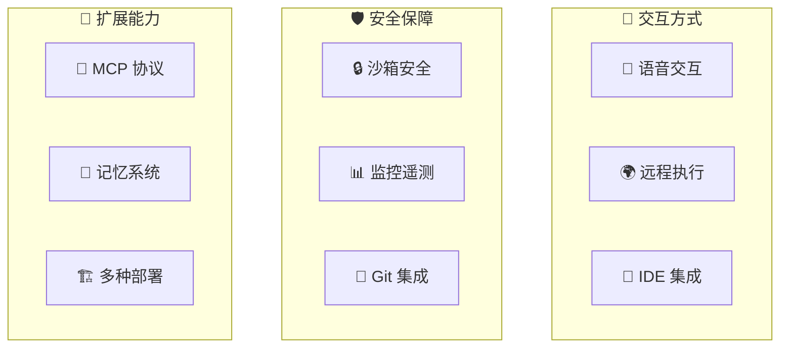

# Claude Code CLI 特殊功能模块架构分析

> 本文档深入分析 Claude Code CLI 中各特殊功能模块的架构设计与实现细节，涵盖语音交互、远程 Agent、IDE 桥接、服务器模式、沙箱安全、Git/GitHub 集成、MCP 协议、遥测监控、构建系统及第三方依赖管理。

---

## 简明图解



---

## 目录

1. [语音交互功能](#1-语音交互功能)
2. [远程 Agent 与远程执行架构](#2-远程-agent-与远程执行架构)
3. [IDE 桥接层 (Remote Control)](#3-ide-桥接层-remote-control)
4. [Server 模式 (Direct Connect)](#4-server-模式-direct-connect)
5. [沙箱安全机制](#5-沙箱安全机制)
6. [Git/GitHub 集成](#6-gitgithub-集成)
7. [MCP (Model Context Protocol) 实现](#7-mcp-model-context-protocol-实现)
8. [遥测与监控系统](#8-遥测与监控系统)
9. [Buddy 伴侣系统](#9-buddy-伴侣系统)
10. [内存目录管理 (Memdir)](#10-内存目录管理-memdir)
11. [上游代理 (Upstream Proxy)](#11-上游代理-upstream-proxy)
12. [原生 TypeScript 模块](#12-原生-typescript-模块)
13. [构建系统和打包流程](#13-构建系统和打包流程)
14. [第三方依赖管理](#14-第三方依赖管理)

---

## 1. 语音交互功能

**核心文件:** `src/voice/voiceModeEnabled.ts`

语音模式通过 claude.ai 的 `voice_stream` 端点实现实时语音交互，采用多层门控机制控制可用性。

### 1.1 门控架构

语音功能使用三层门控判断是否启用：

```
isVoiceModeEnabled() = hasVoiceAuth() && isVoiceGrowthBookEnabled()
```

| 函数 | 用途 | 实现细节 |
|------|------|----------|
| `isVoiceGrowthBookEnabled()` | 远程紧急开关 | 读取 GrowthBook 标志 `tengu_amber_quartz_disabled`，默认 `false`（允许新安装即时使用） |
| `hasVoiceAuth()` | 认证检查 | 需要 Anthropic OAuth token，不支持 API Key / Bedrock / Vertex / Foundry |
| `isVoiceModeEnabled()` | 运行时完整检查 | 组合上述两者，用于 `/voice` 命令和 ConfigTool |

### 1.2 编译时特性门控

语音模式受 Bun 编译时 `feature('VOICE_MODE')` 控制。当该特性被禁用时（如外部构建），`isVoiceGrowthBookEnabled()` 直接返回 `false`，相关代码从构建产物中被消除。

### 1.3 原生音频支持

**核心文件:** `vendor/audio-capture-src/index.ts`

音频采集通过原生 NAPI 模块实现，支持三个平台：

- **macOS (darwin):** 通过 CoreAudio 框架录音/播放，支持 TCC 麦克风权限查询
- **Linux:** 直接授权，无系统级麦克风权限 API
- **Windows (win32):** 通过注册表检查麦克风访问权限

关键 API：
- `startNativeRecording(onData, onEnd)` -- 开始录音，回调返回音频数据
- `stopNativeRecording()` -- 停止录音
- `startNativePlayback(sampleRate, channels)` -- 开始播放
- `microphoneAuthorizationStatus()` -- 查询麦克风授权状态（0=未确定, 2=拒绝, 3=授权）

模块加载采用三级回退策略：native-embed 路径 -> npm-install 布局 -> dev/source 布局。

---

## 2. 远程 Agent 与远程执行架构

**核心目录:** `src/remote/`

远程执行模块实现了 Claude Code Remote (CCR) 会话的客户端管理，通过 WebSocket 订阅远程会话消息并通过 HTTP POST 发送用户输入。

### 2.1 核心组件

#### RemoteSessionManager (`src/remote/RemoteSessionManager.ts`)

会话管理的核心类，协调三个通信层面：

```
RemoteSessionManager
  ├── WebSocket 订阅 (接收 CCR 消息)
  ├── HTTP POST (发送用户消息)
  └── 权限请求/响应流
```

**关键方法：**

| 方法 | 功能 |
|------|------|
| `connect()` | 通过 WebSocket 连接远程会话 |
| `sendMessage(content)` | 通过 HTTP POST 发送用户消息到 CCR |
| `respondToPermissionRequest(requestId, result)` | 响应 CCR 的权限请求 |
| `cancelSession()` | 发送中断信号取消当前远程请求 |
| `reconnect()` | 强制重连 WebSocket（容器关闭后恢复） |

**配置类型 `RemoteSessionConfig`：**
- `sessionId` -- 远程会话 ID
- `getAccessToken` -- OAuth token 获取器
- `orgUuid` -- 组织 UUID
- `viewerOnly` -- 纯观察者模式（`claude assistant` 使用）

#### SessionsWebSocket (`src/remote/SessionsWebSocket.ts`)

WebSocket 客户端，连接 CCR sessions API：

```
wss://api.anthropic.com/v1/sessions/ws/{sessionId}/subscribe?organization_uuid=...
```

**重连策略：**
- 基础延迟：2000ms
- 最大重连尝试：5 次
- 心跳间隔：30 秒 ping
- 4001 (session not found) 特殊处理：最多 3 次重试（压缩期间可能暂时找不到会话）
- 4003 (unauthorized) 立即放弃，不重连

**运行时兼容性：** 同时支持 Bun 原生 WebSocket 和 Node.js ws 包。

#### SDK 消息适配器 (`src/remote/sdkMessageAdapter.ts`)

将 CCR 后端发送的 SDK 格式消息转换为 REPL 内部 Message 类型：

| SDK 消息类型 | 转换目标 |
|-------------|---------|
| `SDKAssistantMessage` | `AssistantMessage` |
| `SDKPartialAssistantMessage` | `StreamEvent` |
| `SDKResultMessage` | `SystemMessage`（仅错误） |
| `SDKStatusMessage` | `SystemMessage`（如 "Compacting conversation..."） |
| `SDKToolProgressMessage` | `SystemMessage`（工具进度） |
| `SDKCompactBoundaryMessage` | `SystemMessage`（对话压缩边界） |

#### 权限桥接 (`src/remote/remotePermissionBridge.ts`)

处理远程会话中本地不存在的工具权限请求：

- `createSyntheticAssistantMessage()` -- 为远程权限请求创建合成 AssistantMessage
- `createToolStub()` -- 为本地未加载的工具（如远程 MCP 工具）创建最小化 Tool 桩

---

## 3. IDE 桥接层 (Remote Control)

**核心目录:** `src/bridge/`

桥接层实现了 Claude Code CLI 与 claude.ai Web 界面之间的双向通信，即 "Remote Control" 功能。允许用户从 Web 端发起会话，在本地机器上执行。

### 3.1 整体架构

```
claude.ai (Web)
    │
    ▼
Anthropic API (/v1/environments/bridge)
    │
    ▼
bridgeMain.ts (本地守护进程)
    ├── bridgeApi.ts (HTTP API 客户端)
    ├── bridgeMessaging.ts (消息路由)
    ├── replBridgeTransport.ts (传输层)
    ├── sessionRunner.ts (会话生成器)
    └── bridgeUI.ts (状态显示)
```

### 3.2 Bridge API 客户端 (`src/bridge/bridgeApi.ts`)

通过 REST API 与 Anthropic 后端通信：

| API 端点 | 方法 | 功能 |
|---------|------|------|
| `POST /v1/environments/bridge` | `registerBridgeEnvironment()` | 注册桥接环境 |
| `GET /v1/environments/{id}/work/poll` | `pollForWork()` | 轮询等待工作项 |
| `POST /v1/environments/{id}/work/{wid}/ack` | `acknowledgeWork()` | 确认接收工作项 |
| `POST /v1/environments/{id}/work/{wid}/stop` | `stopWork()` | 停止工作项 |
| `POST /v1/environments/{id}/work/{wid}/heartbeat` | `heartbeatWork()` | 心跳续期 |
| `DELETE /v1/environments/bridge/{id}` | `deregisterEnvironment()` | 注销环境 |
| `POST /v1/sessions/{id}/archive` | `archiveSession()` | 归档会话 |
| `POST /v1/sessions/{id}/events` | `sendPermissionResponseEvent()` | 发送权限响应 |

**安全措施：**
- `validateBridgeId()` -- 校验 ID 安全性，防止路径遍历注入
- `BridgeFatalError` -- 不可重试的致命错误（401/403/404/410）
- OAuth 401 自动刷新重试机制
- 可信设备令牌 (`X-Trusted-Device-Token`) 支持

### 3.3 消息处理 (`src/bridge/bridgeMessaging.ts`)

**核心功能：**

- **消息过滤 (`isEligibleBridgeMessage`):** 只转发 user/assistant 轮次和 slash-command 系统事件
- **回声消除 (`BoundedUUIDSet`):** 基于环形缓冲区的 FIFO 有界集合（O(capacity) 内存），防止收到自己发送的消息
- **标题提取 (`extractTitleText`):** 从用户消息中提取文本用于会话标题
- **控制请求处理 (`handleServerControlRequest`):** 响应服务端的 initialize/set_model/interrupt/set_permission_mode 控制请求

### 3.4 配置层 (`src/bridge/bridgeConfig.ts`)

桥接认证和 URL 解析集中管理：

- `getBridgeAccessToken()` -- 优先使用开发覆盖 (`CLAUDE_BRIDGE_OAUTH_TOKEN`)，回退到 OAuth keychain
- `getBridgeBaseUrl()` -- 优先使用开发覆盖 (`CLAUDE_BRIDGE_BASE_URL`)，回退到生产配置

### 3.5 会话生成模式 (`src/bridge/types.ts`)

`SpawnMode` 类型定义了三种会话工作目录策略：

| 模式 | 描述 |
|------|------|
| `single-session` | 单会话在 cwd 运行，会话结束时桥接拆除 |
| `worktree` | 持久化服务器，每个会话获得独立的 git worktree |
| `same-dir` | 持久化服务器，所有会话共享 cwd（可能互相干扰） |

### 3.6 主循环 (`src/bridge/bridgeMain.ts`)

桥接主模块协调整个 Remote Control 生命周期：

```
1. registerBridgeEnvironment() -- 注册环境
2. 循环: pollForWork() -- 轮询新工作
3. acknowledgeWork() -- 确认工作项
4. sessionSpawner.spawn() -- 启动子进程执行
5. heartbeatWork() -- 心跳续期
6. deregisterEnvironment() -- 优雅关闭
```

重连退避配置：连接初始 2s，上限 120s，放弃 10 分钟。

---

## 4. Server 模式 (Direct Connect)

**核心目录:** `src/server/`

Server 模式允许 Claude Code 以服务器形式运行，客户端通过 HTTP/WebSocket 直接连接。

### 4.1 会话创建 (`src/server/createDirectConnectSession.ts`)

```typescript
POST ${serverUrl}/sessions
Body: { cwd, dangerously_skip_permissions? }
Response: { session_id, ws_url, work_dir? }
```

使用 Zod 校验响应格式（`connectResponseSchema`）。

### 4.2 DirectConnectSessionManager (`src/server/directConnectManager.ts`)

WebSocket 客户端管理器，与远程 `RemoteSessionManager` 共享相似接口但实现不同：

**关键差异：**
- 消息格式匹配 `--input-format stream-json` 的 SDKUserMessage 格式
- 控制请求/响应通过相同 WebSocket 发送（非独立通道）
- 支持 `sendInterrupt()` 中断当前执行

### 4.3 服务器配置 (`src/server/types.ts`)

```typescript
type ServerConfig = {
  port: number          // 监听端口
  host: string          // 监听地址
  authToken: string     // 认证令牌
  unix?: string         // Unix socket 路径
  idleTimeoutMs?: number  // 分离会话空闲超时
  maxSessions?: number  // 最大并发会话数
  workspace?: string    // 默认工作区目录
}
```

**会话状态机：** `starting` -> `running` -> `detached` -> `stopping` -> `stopped`

**会话索引：** 持久化到 `~/.claude/server-sessions.json`，支持跨服务器重启恢复。

---

## 5. 沙箱安全机制

**核心文件:** `src/utils/sandbox/sandbox-adapter.ts`

沙箱系统基于 `@anthropic-ai/sandbox-runtime` 包，通过适配层与 Claude CLI 的设置系统、权限系统集成。

### 5.1 架构层次

```
Claude CLI 设置系统 (settings.json)
        │
        ▼
sandbox-adapter.ts (适配层)
        │
        ▼
@anthropic-ai/sandbox-runtime (沙箱运行时)
        │
        ├── 文件系统限制 (FsReadRestrictionConfig / FsWriteRestrictionConfig)
        ├── 网络限制 (NetworkRestrictionConfig)
        └── 违规检测 (SandboxViolationStore)
```

### 5.2 路径解析

适配层处理 Claude Code 特有的路径前缀约定：

| 前缀 | 含义 | 示例 |
|------|------|------|
| `//path` | 文件系统根绝对路径 | `//.aws/**` -> `/.aws/**` |
| `/path` | 相对于设置文件目录 | `/src/**` -> `${SETTINGS_DIR}/src/**` |
| `~/path` | 用户主目录 | 传递给 sandbox-runtime 处理 |
| `./path` | 相对路径 | 传递给 sandbox-runtime 处理 |

### 5.3 设置转换 (`convertToSandboxRuntimeConfig`)

将 Claude CLI 设置格式转换为 `SandboxRuntimeConfig`：

**文件系统控制：**
- 从权限规则中提取 `FileEditTool` / `FileReadTool` 的路径规则
- 始终允许写入当前目录和 Claude 临时目录
- **始终拒绝写入 `settings.json` 文件** -- 防止沙箱逃逸
- 阻止写入 `.claude/skills` 目录
- 支持策略管理的 `allowManagedReadPathsOnly` 模式

**网络控制：**
- 从 `WebFetchTool` 权限规则提取允许/拒绝域名
- 支持 `allowManagedDomainsOnly` -- 仅使用策略设置中的域名

### 5.4 UI 工具 (`src/utils/sandbox/sandbox-ui-utils.ts`)

提供 `removeSandboxViolationTags()` 函数清理错误消息中的 `<sandbox_violations>` 标签。

---

## 6. Git/GitHub 集成

### 6.1 Git 文件系统读取 (`src/utils/git/gitFilesystem.ts`)

**设计理念：** 避免生成 git 子进程，直接读取 `.git` 目录文件获取 git 状态。

#### 核心功能

| 函数 | 功能 |
|------|------|
| `resolveGitDir(startPath)` | 解析实际 .git 目录（支持 worktree/submodule） |
| `readGitHead(gitDir)` | 解析 `.git/HEAD` 获取当前分支或 detached SHA |
| `resolveRef(gitDir, ref)` | 解析 loose/packed ref 到 SHA |
| `getCommonDir(gitDir)` | 获取共享 git 目录（worktree 场景） |
| `isShallowClone()` | 检测浅克隆 |
| `getWorktreeCountFromFs()` | 统计 worktree 数量 |

#### 安全验证

```typescript
isSafeRefName(name)   // 防止路径遍历和参数注入
isValidGitSha(s)      // 只接受 40/64 位十六进制字符
```

允许列表字符集：`[a-zA-Z0-9/._+@-]`，拒绝所有 shell 元字符（`$`, `;`, `|`, `` ` `` 等）和 `..` 路径遍历。

#### GitFileWatcher 类

基于 `fs.watchFile` 的缓存失效系统：

```
监视文件:
  .git/HEAD           -- 分支切换、detached HEAD
  .git/config         -- remote URL 变更
  .git/refs/heads/<branch>  -- 当前分支新提交

缓存键:
  branch / head / remoteUrl / defaultBranch
```

特点：
- 分支切换时自动更新 ref 文件监视器
- 脏标记在异步计算前清除，防止竞态条件
- `waitForScrollIdle()` 延迟文件 I/O，避免与滚动竞争事件循环

### 6.2 Gitignore 管理 (`src/utils/git/gitignore.ts`)

- `isPathGitignored(filePath, cwd)` -- 通过 `git check-ignore` 检查文件是否被忽略
- `addFileGlobRuleToGitignore(filename)` -- 将文件模式添加到全局 gitignore (`~/.config/git/ignore`)

### 6.3 Git 配置解析 (`src/utils/git/gitConfigParser.ts`)

直接解析 `.git/config` INI 格式文件，提取 remote URL 等配置值。

### 6.4 GitHub 认证 (`src/utils/github/ghAuthStatus.ts`)

```typescript
getGhAuthStatus(): Promise<GhAuthStatus>
// 返回: 'authenticated' | 'not_authenticated' | 'not_installed'
```

使用 `Bun.which` 检测安装状态（无子进程），`gh auth token` 检测认证状态（仅读取本地配置，不发网络请求）。

---

## 7. MCP (Model Context Protocol) 实现

**核心目录:** `src/utils/mcp/`

MCP 实现分为三个子模块：日期时间解析、表单验证和插件集成。

### 7.1 日期时间解析 (`src/utils/mcp/dateTimeParser.ts`)

使用 Haiku 模型将自然语言日期/时间转换为 ISO 8601 格式：

```
"tomorrow at 3pm" -> "2025-10-15T15:00:00-07:00"
"next Monday"     -> "2025-10-20"
"in 2 hours"      -> "2025-10-14T12:30:00-07:00"
```

**实现流程：**
1. 收集当前日期时间、时区偏移、星期信息作为上下文
2. 构建系统提示指导 Haiku 解析规则（优先未来日期、不完整输入返回 "INVALID"）
3. 调用 `queryHaiku()` 执行解析
4. 基础合理性检查（必须以 4 位数字年份开头）

### 7.2 表单验证 (`src/utils/mcp/elicitationValidation.ts`)

为 MCP elicitation（表单收集）提供类型安全验证，支持：

**Schema 类型：**
- `string` -- 支持 minLength/maxLength 和格式验证（email/uri/date/date-time）
- `number` / `integer` -- 支持 min/max 范围
- `boolean` -- 强制转换
- `enum` -- 单选（支持 legacy `enum` 和新 `oneOf` 格式）
- `array` + items.enum -- 多选

**异步验证 (`validateElicitationInputAsync`):** 当同步验证失败且 schema 为 date/date-time 格式时，自动尝试自然语言日期解析。

### 7.3 MCP 插件集成 (`src/utils/plugins/mcpPluginIntegration.ts`)

从插件加载 MCP 服务器配置：

- 支持 MCPB 文件格式（DXT manifest）
- 自动下载、解压和转换 DXT manifest 到 MCP 配置
- 用户配置管理（`/plugin -> Manage plugins -> Configure`）
- 环境变量展开和用户配置变量替换

**MCP 工具命名约定:** `mcp__<server_name>__<tool_name>`

---

## 8. 遥测与监控系统

**核心目录:** `src/utils/telemetry/`

### 8.1 系统初始化 (`src/utils/telemetry/instrumentation.ts`)

基于 OpenTelemetry 的遥测框架，支持三种信号类型：

| 信号 | 导出器 | 配置变量 |
|------|--------|---------|
| Metrics | OTLP (gRPC/HTTP), Prometheus, Console, BigQuery | `OTEL_METRICS_EXPORTER` |
| Logs | OTLP (gRPC/HTTP), Console | `OTEL_LOGS_EXPORTER` |
| Traces | OTLP (gRPC/HTTP), Console | `OTEL_TRACES_EXPORTER` |

**关键决策：**
- 导出器按需动态导入（避免加载全部 6 个模块 ~1.2MB）
- 内部用户 (`USER_TYPE=ant`) 从 `ANT_OTEL_*` 前缀变量读取配置
- Stream-json 模式下自动剥离 console 导出器（避免破坏 SDK 消息通道）

#### BigQuery 指标导出 (`src/utils/telemetry/bigqueryExporter.ts`)

专用于 Anthropic 内部指标收集的导出器：

- 端点：`https://api.anthropic.com/api/claude_code/metrics`
- 导出间隔：5 分钟（降低 BigQuery 负载）
- 适用范围：API 客户（非 claude.ai 订阅者）、Claude for Enterprise/Teams 用户

### 8.2 事件日志 (`src/utils/telemetry/events.ts`)

```typescript
logOTelEvent(eventName, metadata)
```

特性：
- 单调递增序列号 (`event.sequence`) 保证事件排序
- 可选用户提示日志记录（`OTEL_LOG_USER_PROMPTS`）
- 默认 `<REDACTED>` 保护用户内容隐私
- 附加 `prompt.id` 到事件（但不附加到指标，避免无界基数）
- 支持工作区目录属性 (`workspace.host_paths`)

### 8.3 会话追踪 (`src/utils/telemetry/sessionTracing.ts`)

基于 OpenTelemetry Span 的工作流追踪：

**Span 类型层级：**
```
interaction (根 span，每次用户交互)
  ├── llm_request (LLM 请求)
  ├── tool (工具调用)
  │   ├── tool.blocked_on_user (等待用户权限)
  │   └── tool.execution (工具执行)
  └── hook (钩子执行)
```

实现细节：
- 使用 `AsyncLocalStorage` 存储当前 span 上下文
- `WeakRef` 管理非 ALS 存储的 span，允许 GC 回收
- 30 分钟 TTL 防止 span 泄漏
- 同时支持 OpenTelemetry span 和 Perfetto tracing

### 8.4 Perfetto 追踪

独立于 OTEL 的追踪系统，通过 `CLAUDE_CODE_PERFETTO_TRACE` 环境变量启用。

### 8.5 插件遥测 (`src/utils/telemetry/pluginTelemetry.ts`)

MCP 工具/插件相关的遥测事件记录。

### 8.6 关闭时刷新

所有遥测提供者在进程退出时使用带超时的 `forceFlush()`（默认 2s，可通过 `CLAUDE_CODE_OTEL_SHUTDOWN_TIMEOUT_MS` 配置）。

---

## 9. Buddy 伴侣系统

**核心目录:** `src/buddy/`

伴侣系统是一个带有 RPG 元素的虚拟宠物功能，通过用户 ID 确定性生成唯一宠物。

### 9.1 伴侣生成 (`src/buddy/companion.ts`)

**确定性生成：** 使用 Mulberry32 PRNG（种子 = hash(userId + salt)），保证同一用户始终获得相同伴侣。

| 属性 | 来源 | 示例值 |
|------|------|--------|
| `species` | 从 18 种物种中随机选取 | duck, goose, cat, dragon, octopus, owl, penguin... |
| `rarity` | 加权随机 (common:60, uncommon:25, rare:10, epic:4, legendary:1) | common, legendary |
| `eye` | 随机选取 | `·`, `✦`, `×`, `◉`, `@`, `°` |
| `hat` | common 无帽，其余随机 | crown, tophat, propeller, halo, wizard... |
| `shiny` | 1% 概率 | true/false |
| `stats` | 一个峰值属性 + 一个弱属性 + 其余散布 | DEBUGGING:85, PATIENCE:20, CHAOS:45... |

**数据分离：** `CompanionBones`（确定性部分，从 userId 重新生成）与 `CompanionSoul`（name, personality，存储在配置中）分离。用户无法通过编辑配置伪造稀有度。

### 9.2 伴侣提示 (`src/buddy/prompt.ts`)

将伴侣信息注入系统提示，告知模型：
- 有一个小宠物坐在用户输入框旁边
- 当用户直接称呼宠物名字时，气泡会回答
- 模型应该简短回应或保持安静

### 9.3 类型定义 (`src/buddy/types.ts`)

物种名称使用 `String.fromCharCode` 编码，避免触发构建产物中的敏感字符串检查（`excluded-strings.txt`）。

---

## 10. 内存目录管理 (Memdir)

**核心目录:** `src/memdir/`

基于文件系统的持久化记忆系统，让 Claude 在跨会话间保持上下文。

### 10.1 核心架构 (`src/memdir/memdir.ts`)

```
~/.claude/projects/<slug>/memory/
  ├── MEMORY.md          (索引入口点)
  ├── user_role.md       (记忆文件)
  ├── feedback_testing.md
  ├── team/              (团队记忆，feature('TEAMMEM'))
  └── logs/YYYY/MM/YYYY-MM-DD.md (助理日志模式)
```

**记忆类型（四类封闭分类）：**
- User -- 用户偏好和个人信息
- Feedback -- 反馈和纠正
- Project -- 项目上下文（非代码可推导的）
- Reference -- 参考资料

### 10.2 入口点管理

`MEMORY.md` 是索引入口点，受严格限制：
- 最大 200 行
- 最大 25,000 字节
- 超限时末尾附加警告，指导用户保持简洁

`truncateEntrypointContent()` 先按行截断，再按字节截断（在最后一个换行符处截断，不会切断行中间）。

### 10.3 记忆模式

**标准模式：** 两步保存 -- 写记忆文件 + 更新 `MEMORY.md` 索引

**助理日志模式 (`feature('KAIROS')`)：** 长期运行的助理会话使用追加式日志：
```
~/.claude/projects/<slug>/memory/logs/YYYY/MM/YYYY-MM-DD.md
```
每夜 `/dream` 技能将日志蒸馏为 `MEMORY.md` 和主题文件。

**团队记忆 (`feature('TEAMMEM')`)：** 支持共享团队记忆目录。

### 10.4 智能记忆检索 (`src/memdir/findRelevantMemories.ts`)

使用 Sonnet 模型根据用户查询选择最相关的记忆文件（最多 5 个）：

1. `scanMemoryFiles()` 扫描记忆目录获取文件头信息
2. 过滤已展示过的记忆 (`alreadySurfaced`)
3. 构建记忆清单 + 最近使用工具列表
4. 调用 `sideQuery()` 请求 Sonnet 选择相关记忆
5. 使用 JSON schema 强制输出结构化结果

**选择策略：** 只选择确定有帮助的记忆；如果最近使用了某工具，不选其使用文档但仍选其已知问题/注意事项。

---

## 11. 上游代理 (Upstream Proxy)

**核心目录:** `src/upstreamproxy/`

CCR 容器内的网络代理系统，为 agent 子进程（curl/gh/kubectl 等）提供透明 HTTPS 代理。

### 11.1 初始化流程 (`src/upstreamproxy/upstreamproxy.ts`)

```
1. 检查 CLAUDE_CODE_REMOTE + CCR_UPSTREAM_PROXY_ENABLED
2. 读取 /run/ccr/session_token
3. prctl(PR_SET_DUMPABLE, 0) -- 阻止 same-UID ptrace
4. 下载上游代理 CA 证书并与系统 CA 包合并
5. 启动本地 CONNECT->WebSocket 中继
6. 删除 token 文件（token 仅保留在堆内存中）
7. 设置 HTTPS_PROXY / SSL_CERT_FILE 环境变量
```

**安全措施：**
- `setNonDumpable()` -- 通过 Bun FFI 调用 `prctl(PR_SET_DUMPABLE, 0)`，防止 prompt 注入的 `gdb -p $PPID` 窃取 token
- Token 文件在中继就绪后立即删除
- 每步都容错（失败则禁用代理，不阻断会话）

### 11.2 CONNECT-over-WebSocket 中继 (`src/upstreamproxy/relay.ts`)

将标准 HTTP CONNECT 请求封装在 WebSocket 帧中转发到 CCR 上游代理端点：

```
curl/gh/kubectl --CONNECT--> localhost:0 (relay)
                               │
                               ▼ WebSocket
                            CCR upstreamproxy endpoint
                               │
                               ▼ MITM TLS + 注入凭证
                            真实上游服务器
```

**协议：** 使用手工编码的 ProtoBuf（`UpstreamProxyChunk { bytes data = 1; }`），单字段消息仅需 10 行编码逻辑，避免 protobufjs 运行时依赖。

**NO_PROXY 列表：** 包括 localhost、RFC1918、IMDS 范围，以及 Anthropic API、GitHub、npm/PyPI/crates.io/golang.org 包注册表。

**运行时兼容：** Bun 使用 `Bun.listen` TCP 服务器 + 原生 WebSocket，Node.js 使用 `net.createServer` + ws 包。Bun 需要手动处理 write backpressure（部分写入尾部排队），Node.js 内部缓冲。

---

## 12. 原生 TypeScript 模块

**核心目录:** `src/native-ts/`

Rust NAPI 原生模块的纯 TypeScript 重写，消除原生依赖。

### 12.1 文件索引 (`src/native-ts/file-index/index.ts`)

对标 Rust nucleo 库的模糊文件搜索：

**类 `FileIndex`：**
- `loadFromFileList(fileList)` -- 去重并索引路径，异步构建位图
- `search(query, limit)` -- 模糊搜索，返回 `SearchResult[]`

**评分系统（仿 fzf-v2 / nucleo）：**
```
SCORE_MATCH = 16
BONUS_BOUNDARY = 8      // 单词边界匹配
BONUS_CAMEL = 6         // 驼峰匹配
BONUS_CONSECUTIVE = 4   // 连续匹配
BONUS_FIRST_CHAR = 8    // 首字符匹配
PENALTY_GAP_START = 3   // 间隔起始惩罚
PENALTY_GAP_EXTENSION = 1  // 间隔延续惩罚
```

特点：含 "test" 的路径受 1.05x 评分惩罚，非测试文件排名更高。

### 12.2 颜色差异 (`src/native-ts/color-diff/index.ts`)

纯 TypeScript 实现的颜色差异计算算法。

### 12.3 Yoga 布局 (`src/native-ts/yoga-layout/index.ts`)

Facebook Yoga 布局引擎的 TypeScript 移植（83KB），用于终端 UI 的 flexbox 布局计算。包含完整的枚举定义 (`enums.ts`)。

---

## 13. 构建系统和打包流程

**核心目录:** `scripts/`

### 13.1 主构建脚本 (`scripts/build.mjs`)

提供不依赖 Bun 运行时的 esbuild 构建方案（最佳努力）：

**四阶段构建：**

| 阶段 | 操作 | 说明 |
|------|------|------|
| Phase 1 | `cp src/ -> build-src/` | 保留原始源码不变 |
| Phase 2 | 源码转换 | `feature('X')` -> `false`，`MACRO.X` -> 字面量，移除 `bun:bundle` 导入 |
| Phase 3 | 创建入口包装器 | `entry.ts` -> `import './src/entrypoints/cli.tsx'` |
| Phase 4 | 迭代打桩+打包 | 最多 5 轮：esbuild 打包 -> 收集缺失模块 -> 创建桩 -> 重试 |

**esbuild 配置：**
```
--platform=node --target=node18 --format=esm
--packages=external --external:bun:*
--sourcemap
```

### 13.2 源码预处理 (`scripts/prepare-src.mjs`)

Phase 2 转换的详细实现：

- 替换 `feature('X')` 为 `false`
- 替换 MACRO 常量（VERSION, BUILD_TIME, FEEDBACK_CHANNEL 等）
- 移除 `bun:bundle` 导入
- 移除 `global.d.ts` 类型导入

### 13.3 模块桩生成 (`scripts/stub-modules.mjs`)

自动为缺失模块创建空桩：

- `.txt/.md/.json` 文件 -> 空文件或 `{}`
- `.ts/.tsx/.js` 模块 -> `export default {}; export const __stub = true;`

### 13.4 类型桩 (`stubs/`)

| 文件 | 用途 |
|------|------|
| `stubs/bun-bundle.ts` | `feature()` 始终返回 `false` |
| `stubs/macros.ts` | 声明全局 `MACRO` 类型 |
| `stubs/macros.d.ts` | TypeScript 全局声明 |
| `stubs/global.d.ts` | 全局类型声明 |

---

## 14. 第三方依赖管理

### 14.1 Vendor 目录 (`vendor/`)

包含需要特殊处理的原生模块源码包装器：

| 模块 | 功能 | 加载策略 |
|------|------|---------|
| `audio-capture-src/` | 音频采集/播放 NAPI 绑定 | 三级回退：native-embed -> npm 安装 -> dev 布局 |
| `image-processor-src/` | 图像处理（兼容 sharp API） | 懒加载，首次调用时 dlopen |
| `modifiers-napi-src/` | 修改器 NAPI 绑定 | 按需加载 |
| `url-handler-src/` | URL 处理 NAPI 绑定 | 按需加载 |

`image-processor-src` 提供 `sharp()` 工厂函数兼容 sharp API（resize/jpeg/png/webp/toBuffer），底层调用 macOS CoreGraphics/ImageIO 原生模块。

### 14.2 Tools 目录 (`tools/`)

外部工具桩定义：

| 工具 | 文件 | 说明 |
|------|------|------|
| `OverflowTestTool/` | `OverflowTestTool.js` | 溢出测试工具 |
| `TerminalCaptureTool/` | `prompt.js` | 终端截屏工具 |
| `TungstenTool/` | `TungstenTool.js` | Tungsten 工具 |
| `VerifyPlanExecutionTool/` | `constants.js` | 计划验证工具 |
| `WorkflowTool/` | `constants.js` | 工作流工具 |

这些均为轻量级桩文件，实际实现在内部构建中通过 feature gate 注入。

### 14.3 More Right (`src/moreright/useMoreRight.tsx`)

扩展权限功能的 React Hook 桩：

```typescript
export function useMoreRight(_args): {
  onBeforeQuery: async () => true,   // 查询前钩子（始终通过）
  onTurnComplete: async () => {},    // 轮次完成钩子（空操作）
  render: () => null,                // 渲染（无输出）
}
```

实际实现为内部专有功能，外部构建使用此空桩。

### 14.4 Bash 解析器 (`src/utils/bash/`)

纯 TypeScript 实现的 bash 解析器，生成 tree-sitter-bash 兼容 AST：

**核心模块：**
- `bashParser.ts` -- 词法分析器 + 递归下降语法解析器（50ms 超时 + 50,000 节点上限防 DoS）
- `ast.ts` -- AST 节点遍历和操作
- `parser.ts` -- 高层解析接口
- `ParsedCommand.ts` -- 命令解析结果
- `heredoc.ts` -- Here Document 支持
- `shellQuote.ts` / `shellQuoting.ts` -- Shell 引用处理
- `prefix.ts` -- 命令前缀解析
- `registry.ts` -- 命令注册表
- `treeSitterAnalysis.ts` -- AST 分析工具

**验证：** 通过 3449 个输入的黄金测试语料库（由 WASM 解析器生成）验证正确性。

---

## 总结

Claude Code CLI 的特殊功能模块展现了以下架构特点：

1. **编译时特性门控：** 通过 Bun 的 `feature()` 内联函数实现零开销的功能开关，外部构建替换为 `false` 实现 tree-shaking

2. **运行时兼容性：** 关键模块（WebSocket、TCP 服务器）同时支持 Bun 和 Node.js 运行时

3. **安全纵深防御：** 沙箱（文件系统/网络限制）+ Git ref 名称验证 + Bridge ID 校验 + prctl 反调试

4. **优雅降级：** 原生模块不可用时回退到纯 TypeScript 实现（file-index、yoga-layout、bash parser）

5. **通信模式统一：** 远程会话（CCR）、桥接（Remote Control）、服务器模式（Direct Connect）共享 SDKMessage 消息格式和 control_request/control_response 权限协议

6. **内存效率：** 环形缓冲区去重（BoundedUUIDSet）、WeakRef span 管理、懒加载原生模块
